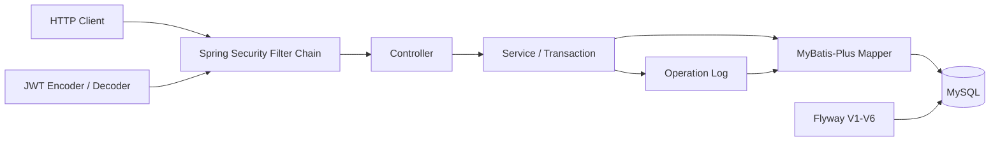

# AI Ticket Platform

基于 Spring Boot 的 AI 工单平台后端。当前版本完成了工单基础业务、认证授权、身份关联、指派与操作日志；AI 分类、RAG 和 Agent 能力仍属于 Roadmap。

## 目录

- [项目能力](#项目能力)
- [技术栈](#技术栈)
- [架构概览](#架构概览)
- [角色权限](#角色权限)
- [核心业务规则](#核心业务规则)
- [本地运行](#本地运行)
- [API 快速索引](#api-快速索引)
- [测试概览](#测试概览)
- [详细文档](#详细文档)
- [项目边界与-roadmap](#项目边界与-roadmap)

## 项目能力

- 用户注册，用户名统一按小写保存；
- BCrypt 密码哈希，数据库不保存明文密码；
- 用户登录并签发 HS256 JWT Access Token；
- Spring Security OAuth2 Resource Server Bearer 认证；
- USER、AGENT、ADMIN 请求级授权；
- 创建工单并将可信 JWT `sub` 绑定到 `creator_user_id`；
- 我的工单条件分页与 AGENT、ADMIN 全局条件分页；
- USER 工单详情对象级所有权校验；
- `OPEN → IN_PROGRESS → RESOLVED → CLOSED` 状态流转；
- ADMIN 首次指派或重新指派工单给 AGENT；
- 状态和处理人旧值条件更新，识别并发冲突；
- 状态变更、处理人变更追加式操作日志；
- 业务 UPDATE 与日志 INSERT 同事务原子提交；
- Flyway V1～V6 数据库演进；
- Validation、Mockito、MockMvc 与真实 MySQL 分层测试。

## 技术栈

| 技术 | 当前版本或来源 |
| --- | --- |
| Java | 21；本轮测试运行时为 21.0.9 |
| Spring Boot | 4.1.0 |
| Spring MVC | Spring Framework 7.0.8 |
| Spring Security / OAuth2 Resource Server / Crypto | 7.1.0 |
| MyBatis-Plus | 3.5.17 |
| MySQL | Compose 镜像 `mysql:8.4.11` |
| MySQL Connector/J | 9.7.0 |
| Flyway | 12.4.0；schema version 6 |
| Jakarta Validation / Hibernate Validator | 3.1.1 / 9.1.0.Final |
| JUnit Jupiter | 6.0.3 |
| Mockito | 5.23.0 |
| Maven | 项目使用 Maven；本轮系统 Maven 为 3.9.11 |
| Docker Compose | 仓库提供 `compose.yaml`；本轮环境为 v5.1.4 |

版本来自 `pom.xml`、Maven dependency tree、Compose 镜像和本轮执行环境，不将本机工具版本视为仓库锁定版本。

## 架构概览



生产接口只暴露 DTO，不直接返回 Entity。Controller 负责 HTTP 边界，Service 负责业务规则、对象所有权和事务，Mapper 负责 MyBatis-Plus 数据访问。

## 角色权限

| 能力 | USER | AGENT | ADMIN |
| --- | ---: | ---: | ---: |
| 创建工单 | 是 | 是 | 是 |
| 查询我的工单 | 是 | 是 | 是 |
| 查看自己的工单详情 | 是 | 是 | 是 |
| 查看任意工单详情 | 否 | 是 | 是 |
| 全局分页 | 否 | 是 | 是 |
| 更新状态 | 否 | 是 | 是 |
| 指派处理人 | 否 | 否 | 是 |

补充边界：

- USER 查询他人工单返回 404，而不是 403，避免暴露资源是否存在；
- AGENT、ADMIN 调用 `/api/tickets/mine` 时仍只返回自己创建的工单；
- `creator_user_id IS NULL` 的历史工单不属于任何 USER，只允许 AGENT、ADMIN 通过全局权限查看；
- `creatorName` 是展示文本，不参与授权判断；授权依据是 JWT `sub` 与 `creator_user_id`。

## 核心业务规则

### 状态流转

```text
OPEN → IN_PROGRESS → RESOLVED → CLOSED
```

不允许跳跃、反向、相同状态更新，`CLOSED` 没有后继状态。

### 指派

- 只有 ADMIN 可以指派；
- 目标用户必须存在且角色为 AGENT；
- 支持首次指派和从一个 AGENT 重新指派给另一个 AGENT；
- 重复指派给当前处理人返回 HTTP 409 / 应用码 40904；
- 当前不支持取消指派，也不支持 AGENT 主动领取。

### 并发与事务

状态更新通过旧状态条件防止覆盖：

```sql
WHERE id = ? AND status = ?
```

指派通过旧处理人条件防止覆盖：

```sql
WHERE id = ? AND assignee_user_id = ?
```

首次指派使用 `assignee_user_id IS NULL`。项目没有 version 字段、悲观锁或分布式锁。

状态或指派条件 UPDATE 成功后，同一个 `@Transactional` 方法同步 INSERT 操作日志；任一写入失败都会回滚本次业务操作。

## 本地运行

### 前置要求

- JDK 21；
- 可用的 Maven；
- Docker 与 Docker Compose；
- 本地 3307 端口可用。

### 1. 准备数据库环境变量

复制 `.env.example` 为 `.env`，在本机设置数据库普通用户密码和 root 密码。`.env` 已被 Git 忽略。

### 2. 启动 MySQL

```powershell
docker compose up -d mysql
docker compose ps
```

等待 `ai-ticket-mysql` 显示为 `healthy`。

### 3. 准备本地 Spring 配置

复制：

```text
src/main/resources/application-local.example.yml
```

为：

```text
src/main/resources/application-local.yml
```

只在本地文件中填写与 `.env` 对应的数据库密码。该文件已被 Git 忽略。

### 4. 配置 JWT 密钥

设置 `JWT_SECRET_BASE64` 环境变量。其 Base64 解码结果至少为 32 字节，不要提交真实值。

```powershell
$env:JWT_SECRET_BASE64 = "<your-base64-secret>"
```

### 5. 启动应用

```powershell
mvn spring-boot:run
```

默认端口为 8080，Flyway 会在启动时校验并迁移到当前 schema version 6。

### 6. 健康检查与测试

```powershell
Invoke-RestMethod http://localhost:8080/actuator/health
mvn test
```

当前 PowerShell 环境使用系统 Maven；仓库中的 Maven Wrapper 不作为本文档验证命令。

## API 快速索引

| 方法 | 路径 | 说明 |
| --- | --- | --- |
| POST | `/api/auth/register` | 注册 USER |
| POST | `/api/auth/login` | 登录并获取 Access Token |
| GET | `/api/auth/me` | 读取当前 JWT 身份 |
| POST | `/api/tickets` | 创建工单 |
| GET | `/api/tickets` | AGENT、ADMIN 全局条件分页 |
| GET | `/api/tickets/mine` | 查询当前用户创建的工单 |
| GET | `/api/tickets/{id}` | 按 ID 查询并执行对象级授权 |
| PATCH | `/api/tickets/{id}/status` | AGENT、ADMIN 更新状态 |
| PATCH | `/api/tickets/{id}/assignee` | ADMIN 指派 AGENT |
| GET | `/actuator/health` | 健康检查 |
| GET | `/actuator/info` | Actuator 应用信息（当前配置已暴露） |

除注册、登录和健康检查外，接口使用：

```http
Authorization: Bearer <access-token>
```

详细请求、响应和错误码见 [API 契约](docs/api_contract.md)。

## 测试概览

本轮在健康的真实 MySQL 8.4.11 容器上执行：

```powershell
mvn test
```

结果：

```text
Tests run: 329
Failures: 0
Errors: 0
Skipped: 0
BUILD SUCCESS
```

329 个测试实例包含 DTO Validation、Service 单元测试、standalone MockMvc、Mapper/MySQL 持久化、HTTP 全链路、Spring Security 认证授权、条件更新和事务原子性测试；它们并不全部是端到端测试。

## 详细文档

- [项目架构](docs/project_architecture.md)
- [API 契约](docs/api_contract.md)
- [安全、并发与事务设计](docs/security_and_transaction_design.md)
- [测试证据](docs/testing_evidence.md)
- [P0～P7 阶段复盘](docs/p7_project_stage_review.md)
- `docs/p1_create_ticket_module_review.md` 至 `docs/p4_ticket_status_transition_review.md`：历史阶段学习复盘。

## 项目边界与 Roadmap

当前尚未实现：

- 操作日志查询接口；
- 分配给我的工单列表；
- 取消指派和主动领取；
- 用户停用；
- Refresh Token、登出、Token 撤销和密钥轮换；
- Redis 缓存、登录限流、接口限流与幂等；
- 消息队列与通知；
- 多租户隔离；
- AI 工单分类、优先级建议和回复草稿；
- RAG、Tool Calling、Agent 与人工确认流程；
- 压力测试、生产部署与容灾验证。

这些内容是规划，不属于当前已完成功能。
