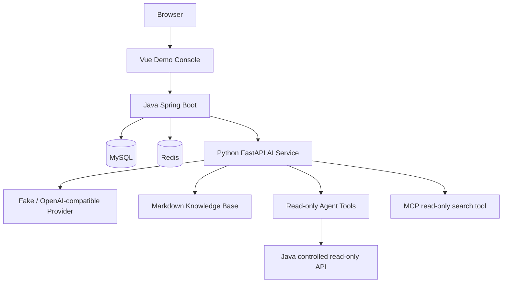

# AI Ticket 实习面试学习主手册

> 这是一份“推理优先”的唯一主学习手册。它不是 API 清单，也不是把标准答案堆在一起的八股百科。
>
> 学习顺序固定为：**问题 → 不变量 → 推导 → 项目实现 → 反例 → 条件变化 → 可迁移知识 → 面试表达**。

## 0. 如何使用这份手册

每次学习一个主题，不要先背最后的答案。先遮住“项目实现”和“面试表达”，只读问题，尝试写出：

1. 系统必须保持什么不变量？
2. 哪些请求、数据或参与者会破坏它？
3. 最小需要什么机制才能阻止破坏？
4. 如果该机制失效，系统应怎样表现？
5. 当前项目实际做到哪一步，哪些是限制？

每个核心主题至少达到以下层次：

| 层次 | 标准 |
|---|---|
| L1 记住 | 能说出术语含义 |
| L2 理解 | 能解释为什么需要它 |
| L3 推导 | 面对新问题能从约束推出设计 |
| L4 迁移 | 能把项目中的规则迁移到库存、支付、权限或 AI 场景 |

本项目重点应达到 L3，条件更新、幂等、安全边界和 AI 隔离应达到 L4。

### 事实标签

- **PROJECT_IMPLEMENTED**：当前仓库代码、测试、配置或真实运行结果可以证明。
- **PROJECT_LIMITATION**：项目明确没有实现，或只实现了学习型简化版本。
- **INTERVIEW_KNOWLEDGE**：项目没有实现，但为了面试和迁移推理必须理解。

不要把“知道一个概念”说成“项目实现过”。面试中最可信的表达是：

> 当前项目实际做到 X；在多实例或生产场景下，我会进一步考虑 Y，但 Y 还没有在这个项目中实现。

---

# Part I：System Mental Model

## 1. 先画出系统，再记技术名词



必须牢记数据流：

```text
Browser → Vue → Java → MySQL / Redis / Python
```

不是：

```text
Browser → Python
```

### 1.1 每层解决什么问题？

| 层 | 解决的问题 | 不能越过的边界 |
|---|---|---|
| Vue | 登录、列表、表单、状态展示、AI 建议展示 | 不能成为最终授权层，不能直连 Python 或数据库 |
| Java Controller | HTTP 路由、输入边界、响应协议 | 不应承载复杂业务规则 |
| Java Service | 业务不变量、权限、状态流转、事务、AI 入口 | 是核心业务事实的可信边界 |
| MySQL | 工单、用户、日志等持久事实 | 不负责 JWT 或 AI 解释 |
| Redis | 短期计数、幂等状态、TTL | 不等同于持久业务数据库或分布式事务 |
| Python | LLM、结构化建议、草稿、Agent、RAG、MCP | 不直接写 tickets，不拥有用户授权主系统 |

### 1.2 如果删掉一层会发生什么？

- 删除 Vue：Java API 仍可运行，但失去可视化 Demo；这不是业务正确性的损失，而是展示和人工操作体验的损失。
- 删除 Service：规则会散落在 Controller、Mapper 或多个入口，状态、权限和事务边界无法集中维护。
- 删除 Redis：登录限流和创建幂等需要换成别的共享状态机制；只用 JVM 内存无法覆盖多实例。
- 删除 Python：核心工单仍应可用，但 AI Analysis、Reply Draft、Agent、RAG、MCP 不再可用。
- 让 Python 直接写 MySQL：AI 输出就会绕过 Java 权限、事务和业务规则，trusted boundary 被破坏。

### 1.3 当前真实基线

事实来源是三个仓库的 `pom.xml`、`pyproject.toml`、`package.json`、源码、测试和已有主手册；版本不应从旧聊天记录猜。

| 项目 | 当前事实 |
|---|---|
| Java | Java 21；Spring Boot 4.1；Spring Security 7.1；MyBatis-Plus 3.5.17 |
| 数据库 | MySQL 8.4；Flyway 迁移；连接由 Java 管理 |
| 缓存 | Redis 7.4 级别的本地 Docker 配置；Spring Data Redis + Lettuce |
| Python | Python 3.11+；FastAPI；Pydantic Settings；HTTPX；pytest；MCP Python SDK |
| Vue | Vue 3；Vite；TypeScript；Vue Router；Axios；Element Plus |
| Java 测试 | 当前报告基线 62 个 Surefire 测试类、463 tests、0 failures、0 errors、0 skipped；不是 463 个 E2E 测试 |
| Python 测试 | 12 passed 的测试基线 |
| Vue | `npm run build` 成功；没有把前端构建当成后端测试 |

### 1.4 证据优先级

```text
真实源码 > 测试 > 配置 > interview_master_guide.md > README/docs > Git 历史 > 通用知识
```

当前 `docs/testing_evidence.md` 中的 60/448 是历史快照；面试时应以当前 Surefire 62/463 为准。

---

# Part II：从业务规则推导 Java 后端

## 2. 一个工单系统至少必须保证什么？

先不谈 Spring。一个用户提交工单，系统至少要保持：

```text
身份可识别
资源有所有者
状态只能按规则变化
并发修改不能静默覆盖
重要写操作可追溯
重复请求不能任意制造重复业务事实
AI 建议不能绕过业务决定
```

这组不变量会推出后续结构：

```text
用户 → 身份认证 → 资源所有权 → 状态机 → 处理人 → 操作日志
             ↓                         ↓
          Security                  Service + Transaction
                                     ↓
                                  Mapper + MySQL
```

## 3. 为什么需要 Service Layer？

### 问题

如果创建、状态流转、指派、权限判断都写在 Controller，会出现什么？

### INVARIANT

同一个业务动作无论从哪个入口触发，都必须执行同一套业务规则。

### 推导

业务规则不应依赖 HTTP；因此需要一个不依赖 `HttpStatus` 的 Service 用例层。Controller 只负责把 HTTP 输入交给它。

### PROJECT_IMPLEMENTED

- `TicketController` 处理请求路径、DTO、响应状态和幂等头。
- `TicketService` / `TicketServiceImpl` 处理创建、按 ID 查询、分页、状态和指派等用例。
- `TicketMapper` 负责 MyBatis-Plus 数据访问。
- Entity 与 Response DTO 分开，避免把持久化对象直接暴露为 API 契约。

### 反例

如果 Controller A 检查了“只能 AGENT 操作”，Controller B 忘了检查，规则就不再是系统规则，而是入口偶然行为。

### 面试表达

> Service 层不是为了多一层文件，而是为了集中业务不变量、事务和对象级授权，使 HTTP 入口、内部调用和未来异步入口使用同一套规则。

## 4. 创建工单：从请求推出设计

### 问题

请求包含 `title`、`description`、`creatorName`、`priority`。服务端必须生成什么？

### INVARIANT

创建成功后必须有自增 ID、合法优先级、明确初始状态和创建人；失败不能留下半条业务事实。

### 推导

```text
输入校验 → 创建 Entity → Service 显式设置 OPEN → Mapper insert → 回填 ID → Response DTO
```

### PROJECT_IMPLEMENTED

- `CreateTicketRequest` 使用 Java record 和 Jakarta Validation。
- `Ticket` 是普通可变 Entity，映射 `tickets` 表。
- `TicketServiceImpl#createTicket` 显式设置 `TicketStatus.OPEN`，不依赖数据库默认值来表达业务规则。
- `@TableId(type = IdType.AUTO)` 让 MySQL 自增主键回填到 Entity。
- 成功响应使用 `TicketResponse`，不返回 Entity。
- Controller 使用 `201 Created`。

### 为什么不是直接让数据库决定 status？

数据库默认值是兜底；Service 的 `OPEN` 是领域规则。若未来换数据库、增加其他入口或改默认值，业务规则仍应在 Service 中明确。

### 测试思路

先写合法请求，再反例化：空白标题、超长描述、空 creator、空 priority、重复提交。测试分别覆盖 DTO 校验、Service 逻辑、真实 Mapper/MySQL 和 HTTP 层。

## 5. 查看工单与对象级授权

### 问题

用户知道工单 ID，就能否看到它？

### INVARIANT

资源存在不等于当前主体有权知道它存在。

### 推导

```text
认证主体 → 读取 creatorId / role → 判断资源关系 → 决定返回、403 或隐藏为404
```

### PROJECT_IMPLEMENTED

- `GET /api/tickets/{id}` 先由 Security 处理认证，再由 Service 查询并执行对象级规则。
- USER 查看自己的工单；查看他人资源使用项目既定隐藏策略。
- AGENT/ADMIN 按角色和业务规则访问客服场景。
- Service 抛出 `BusinessException(TICKET_NOT_FOUND)`，异常处理器映射为 HTTP 404 / 应用码 40400。

### 为什么 `creatorName` 不能作为权限依据？

显示名可能重复、可修改或缺少唯一性。权限依据应是认证主体的稳定身份（如 user ID）与持久化资源的 creatorId 关系，而不是客户端传来的名字。

### 反例

前端把“详情”按钮隐藏了，但攻击者仍可直接请求 `/api/tickets/100`。因此 UI 隐藏只是体验，Service/Security 才是安全边界。

## 6. 分页查询

### 问题

为什么不能一次查出所有工单再在 Java 里截取？

### INVARIANT

返回数量、总数和页码必须与数据库查询条件一致，内存不能无界增长。

### 推导

```text
页码/size → 数据库 LIMIT/OFFSET → total/count → Page Response
```

### PROJECT_IMPLEMENTED

- `MybatisPlusConfig` 注册 `MybatisPlusInterceptor` 和 MySQL `PaginationInnerInterceptor`。
- `overflow=false`：越过总页数不自动回第一页。
- `maxLimit=100`：数据访问层限制单次 size 上限；不是限流，也不是权限控制。
- 分页集成测试用真实 MySQL 插入唯一前缀数据，验证第一页/第二页、total、pages、ID 排序和不重复。

### 条件变化

如果数据量继续扩大，应关注稳定排序、深分页成本、游标分页、索引和 count 查询。当前项目没有把这些生产级扩展冒充已实现。

## 7. 状态流转与指派

### 问题

工单是不是任意字符串都可以改？

### INVARIANT

状态只能从允许的旧状态转到允许的新状态；指派失败不能悄悄覆盖别人刚写入的值。

### PROJECT_IMPLEMENTED

- 状态枚举：`OPEN`、`IN_PROGRESS`、`RESOLVED`、`CLOSED`。
- `PATCH /api/tickets/{id}/status` 和 `PATCH /api/tickets/{id}/assignee` 由 Controller → Service → Mapper 执行。
- 更新 SQL 带有旧状态或旧处理人的条件，影响行数为 0 时转为业务冲突/资源不可用语义。
- 状态、指派更新与 `operation_log` 插入在同一 Service 事务边界内。

### 面试追问

**问：为什么不先 SELECT 再无条件 UPDATE？**

因为 SELECT 和 UPDATE 之间可能有并发写入；后来的无条件 UPDATE 会静默覆盖先写结果。条件 UPDATE 把“我基于哪个旧值修改”放进数据库原子判断。

**问：这是不是 version 乐观锁？**

当前项目是基于业务旧状态/旧处理人的条件更新，是乐观并发控制思想，但不是 MyBatis-Plus `@Version` 版本列方案。

---

# Part III：Authentication & Authorization

## 8. Authentication：服务器怎么知道“你是谁”？

### 问题

HTTP 请求本身只带方法、路径、头和体。没有身份，服务端无法区分“谁在操作”。

### 推导

```text
注册密码 → 安全哈希
登录凭证 → 校验
成功 → 签发可验证凭证
后续请求 → 携带凭证
服务器 → 校验签名、时间和 claims
```

### PROJECT_IMPLEMENTED

- 注册不允许客户端自行选择 AGENT/ADMIN；普通注册固定为 USER，避免权限自升级。
- 密码使用 BCrypt，项目配置了 strength 10。
- 登录成功后签发 JWT；Resource Server 验证 Bearer Token。
- `ApplicationJwtAuthenticationConverter` 将角色映射为 `ROLE_USER`、`ROLE_AGENT`、`ROLE_ADMIN` 形式供 Spring Security 使用。
- JWT 包含主体、角色、签发/过期时间、`jti` 等项目所需 claims；有效期由配置控制。

### 为什么密码不能明文存？

数据库泄露后，明文会直接暴露；哈希和 salt 让验证变成“重新计算并比较”，而不是可逆解密。BCrypt 的成本因子还可以增加离线猜测成本。

## 9. Authorization：知道是谁以后能做什么？

### RBAC

角色解决粗粒度能力：

```text
USER   → 我的工单、创建、查看自己
AGENT  → 客服工单列表、状态、AI 辅助
ADMIN  → AGENT 能力 + 管理员专属操作（如指派）
```

### 对象级授权

角色允许进入某个 endpoint，不代表允许访问每一个对象。还要检查：

```text
subject.userId 与 ticket.creatorId 的关系
```

### PROJECT_IMPLEMENTED

- `SecurityConfig` 通过 `SecurityFilterChain` 显式配置 public、authenticated、role-based 规则。
- `.anyRequest().denyAll()` 让遗漏 matcher 的新真实 endpoint 默认不可访问。
- `/api/tickets/mine` 的 matcher 位于 `/api/tickets/*` 前，避免被详情路径误匹配。
- `/actuator/health` 匿名开放，但 health 详情使用 `when-authorized` + ADMIN；`/actuator` 和 `/actuator/info` 由 ADMIN 访问。
- ERROR/FORWARD dispatcher 按配置放行，避免二次 dispatch 被默认 denyAll 阻断。

### 401 与 403

```text
401：请求没有可接受的认证，先解决“你是谁”。
403：已经认证，但没有权限，先解决“你能不能做”。
```

### 为什么前端隐藏按钮不算安全？

浏览器代码和请求都可被用户修改。真正的授权必须在 Java Security/Service 中重复判断；前端只是减少误操作。

## 10. JWT 的边界

### PROJECT_LIMITATION

当前是本地学习型 JWT 方案，不应宣称已实现完整生产 token 生命周期。尤其要诚实说明：

- access token 吊销与黑名单不是完整生产方案；
- refresh token 轮换、设备管理、密钥轮换需要进一步设计；
- localStorage 仅是 Vue Demo 的简化选择。

### INTERVIEW_KNOWLEDGE

生产演进可考虑：短时 access token、可撤销/轮换的 refresh token、密钥版本、JWKS、异常设备检测、CSRF/XSS 防护和安全 cookie。回答时要先说“项目没有实现”，再说“上线会怎么做”。

---

# Part IV：Database, Transaction & Concurrency

## 11. A 和 B 同时读取 OPEN

设当前工单状态为 `OPEN`：

```text
A 读到 OPEN
B 读到 OPEN
A 想写 IN_PROGRESS
B 想写 RESOLVED
```

### 先尝试错误方案

```sql
SELECT status FROM tickets WHERE id = ?;
-- 应用判断为 OPEN
UPDATE tickets SET status = ? WHERE id = ?;
```

B 可以把 A 的结果静默覆盖；应用并不知道自己更新的是旧事实。

### INVARIANT

更新必须证明“我看到的旧值仍然是数据库当前旧值”。

### 推导

```sql
UPDATE tickets
SET status = :newStatus
WHERE id = :id
  AND status = :oldStatus;
```

影响行数：

- `1`：条件成立，更新成功。
- `0`：不存在、旧状态已变化或条件不满足，不能假装成功。

### PROJECT_IMPLEMENTED

Ticket 状态和处理人更新使用条件更新；Service 读取 affected rows，并将冲突转换为清晰业务结果。测试覆盖成功、状态不匹配、并发冲突和操作日志。

### 条件变化

如果业务字段很多、状态值可能重复，`version` 列会更通用：

```sql
UPDATE tickets
SET ..., version = version + 1
WHERE id = ? AND version = ?;
```

这是 `INTERVIEW_KNOWLEDGE`，不是当前项目已经实现的版本列锁。

## 12. 事务从不变量推导

### 问题

工单状态更新成功，但操作日志插入失败，面试官希望看到什么状态？

### INVARIANT

```text
业务变化和对应操作日志必须同时成功或同时失败。
```

### 推导

两个 MySQL 操作需要同一个原子边界：

```text
BEGIN
  conditional UPDATE
  INSERT operation_log
COMMIT
```

任何运行时异常导致：

```text
ROLLBACK
```

### PROJECT_IMPLEMENTED

- 状态/指派 Service 方法使用 Spring `@Transactional`。
- 更新成功后写 operation log；日志失败时异常向外传播，事务回滚。
- 测试验证成功更新与日志、日志失败后的原值保留。

### 为什么不能 try/catch 后返回成功？

如果吞掉日志异常，调用方看到成功，但数据库只记录了半个动作，审计事实和业务事实不一致。

### `@Transactional` 的准确说法

它依赖 Spring 代理在外层调用进入方法时创建事务。当前使用默认 RuntimeException 回滚语义，不能把它说成跨 MySQL、Redis、Python 的分布式事务。

### PROJECT_LIMITATION

- 没有跨库分布式事务。
- Redis 状态和 MySQL 提交不在同一个 ACID 边界。
- 没有把日志发送到 MQ/outbox 的生产化方案。

## 13. ACID 迁移到面试

- **Atomicity**：状态和操作日志一起成功/回滚。
- **Consistency**：状态机和约束保持业务合法状态。
- **Isolation**：并发事务之间的可见性由数据库隔离级别决定；当前没有自定义 isolation 方案。
- **Durability**：MySQL 提交后持久保存；具体 redo/binlog 是 `INTERVIEW_KNOWLEDGE` 的深入方向。

### 反例训练

1. UPDATE 成功，日志外键失败：同一事务应回滚。
2. Python 调用成功后 Java 还没写库：AI 建议不是业务提交，不应让 Python 写库。
3. MySQL 成功，Redis complete 失败：幂等状态存在一致性窗口，不能声称 exactly-once。

---

# Part V：Redis Rate Limiting

## 14. 如果登录接口一秒收到 10,000 次怎么办？

### INVARIANT

在一个时间窗口内，单个攻击来源不能无限消耗登录校验和 BCrypt 资源；正常用户不应被所有人共同拖垮。

### 推导

```text
计数器 + key + 时间窗口 + TTL + 原子更新
```

### PROJECT_IMPLEMENTED

- 固定窗口策略。
- 以 IP 和规范化 username 两个维度分别限制。
- Lua 脚本将 `INCR` 与首次 `EXPIRE` 放入原子脚本。
- 登录验证失败和成功尝试的计数语义以代码为准；当前配置是学习型固定窗口上限（IP 20/60 秒、用户名 10/60 秒级别）。
- Redis 不可用时按当前实现的 fail-closed 策略拒绝受保护的登录尝试，避免限流器失效后无限放行。

### 为什么不能 INCR 后再 EXPIRE？

进程可能在两条命令之间崩溃，key 永久没有过期；并发请求也可能看到不一致的中间状态。Lua 让相关操作在 Redis 内原子执行。

### 为什么 IP + username？

- 只有 IP：共享 NAT 下多个正常用户互相影响，攻击者换 IP 即可绕过。
- 只有 username：攻击者可枚举大量用户名消耗系统。
- 两个维度：提高攻击成本，同时保留不同维度的保护。

### `X-Forwarded-For` 的风险

如果应用直接信任未经可信代理清洗的转发头，攻击者可以伪造来源 IP。当前项目没有把这件事包装成完整生产代理链；生产应明确可信 proxy、header 清洗和真实客户端地址策略。

### 算法迁移

| 算法 | 适合问题 | 当前项目 |
|---|---|---|
| Fixed window | 简单、低成本、允许边界突发 | 使用 |
| Sliding window | 更平滑地限制任意滚动时间段 | 未实现 |
| Token bucket | 允许稳定速率和有限突发 | 未实现 |
| Leaky bucket | 以固定速率排队处理 | 未实现 |

---

# Part VI：Idempotency as a State Machine

## 15. 响应丢失时，POST 是否应该重试？

客户端创建工单，Java 已经提交 MySQL，但网络在返回响应前断开。客户端不知道结果，可能重试。

### 没有幂等时

```text
第一次请求 → Ticket 100
重试请求   → Ticket 101
```

### INVARIANT

同一用户、同一逻辑创建操作重试时，不应产生多个业务结果。

### 推导第一步：Idempotency-Key

客户端为一个逻辑操作生成 key，并在重试时复用它：

```http
Idempotency-Key: uuid-of-one-logical-create
```

### 反例：同 key 不同 payload

如果同一 key 先提交 HIGH，后提交 LOW，系统不能猜测客户端意图。于是需要请求指纹：

```text
fingerprint = hash(user scope + title + description + creatorName + priority)
```

### 反例：两个相同请求同时到达

需要原子抢占：只有一个 owner 进入 `PROCESSING`，其他请求知道“已有请求正在处理”。

### 反例：旧 owner 释放了新 owner 状态

如果 TTL 过期后新 owner 重用 key，旧请求回来执行 release，可能删除新请求的状态。于是需要随机 `ownerToken`，complete/release 必须比较 token。

## 16. PROJECT_IMPLEMENTED 状态机

```text
不存在
  └─ Lua acquire → PROCESSING(ownerToken, fingerprint, TTL)
        ├─ 同 owner complete → SUCCEEDED(response replay data)
        ├─ 同 owner release   → 删除自身 PROCESSING
        ├─ 同 key 同 fingerprint + PROCESSING → conflict/in-progress
        ├─ 同 key 不同 fingerprint → conflict
        └─ SUCCEEDED → 重放已保存响应
```

真实实现由 Java `IdempotencyService`/Redis Lua 脚本和创建工单 Service 共同完成；key 受用户作用域约束，响应数据可以在成功后 replay。

### 业务失败怎么办？

业务异常应释放当前 owner 的 PROCESSING，让客户端在符合条件时重新开始；不能删除别人的 owner 状态。

### 为什么 Redis Lock 不够？

锁只表达“此刻谁能进入”，不自动保存最终响应、不校验 payload，也不让后续相同请求重放结果。幂等是“识别同一逻辑操作并返回同一结果”的状态机问题，不只是互斥问题。

### 为什么不是 exactly-once？

因为至少存在：

```text
MySQL commit 成功
→ Redis complete 失败
```

以及 Redis TTL、进程崩溃、网络重试、恢复策略等一致性窗口。Lua 只保证 Redis 内脚本原子，不保证 Redis 和 MySQL 的跨系统原子。

### 如果要持久化幂等？

`INTERVIEW_KNOWLEDGE`：可以设计 MySQL 幂等表 + `(user_id, key)` 唯一约束 + payload fingerprint + 状态/响应存储；跨消息场景再考虑 outbox、消费者幂等和补偿。不要说当前项目已经做了这些。

---

# Part VII：Java → Python Service Boundary

## 17. 为什么 AI 单独放 Python？

### 问题

为什么不把 Prompt、Provider、RAG、Agent 全写在 Java？

### 推导

```text
Java：业务事实、认证、权限、事务、MySQL、Redis
Python：AI SDK、结构化输出、检索和 Agent 编排
```

拆开后，AI 服务失败不应让工单核心读写全部失败，也可以独立替换 Provider。

### INVARIANT

Python 只能提供建议和受控只读能力，不能绕过 Java 修改业务事实。

### PROJECT_IMPLEMENTED

- Java 通过 `RestClientAiServiceClient` 调用 Python internal HTTP API。
- timeout、connection refused、4xx、5xx、非法 JSON、schema mismatch 被映射为清晰的 AI 服务错误，而不是伪造成功。
- Java → Python 使用内部服务 token；Python → Java 的受控读取使用另一方向的内部 token，不能把用户 JWT 当服务身份。
- Python 不连接 Java MySQL，不执行 `UPDATE tickets`。
- Ticket list/detail 等核心接口不依赖 Python 可用性；AI 入口失败时显示 AI 不可用，核心工单仍可使用。

## 18. 真实 401 Debug：内部 Token 不一致

### 现象

Java 调用 Python analysis endpoint，Python 日志返回：

```text
POST /internal/ai/ticket-analysis 401 Unauthorized
```

### 推理路径

1. 401 先排除“模型输出格式”——请求还没进入模型。
2. 确认 URL 和路由——路径存在，但认证失败。
3. 比较 Java 发送 header 的 token 与 Python settings 中期望的 token。
4. 检查环境变量名字和加载前缀，而不是只看 `.env.example`。

### 根因

Java 使用 `AI_SERVICE_INTERNAL_TOKEN` 语义，Python 的 `Settings` 通过 `AI_` 前缀加载 `AI_INTERNAL_TOKEN` / `AI_JAVA_INTERNAL_TOKEN` 对应字段；实际运行环境的值不一致。Python 的校验逻辑是把请求 token 与 `request.app.state.settings.internal_token` 比较。

### 修复与验证

统一两端实际运行环境变量，重启 Python/Java（当前配置不是热刷新），再调用得到成功响应。

### 行为面试表达

> 我先用状态码判断请求停在服务认证层，而不是 LLM 层；再对照 Java 发送值、Python Settings 前缀和运行时配置。最后通过重启加载新环境并重复请求验证。这个案例让我认识到 `.env.example` 是说明，不等于进程当前环境。

## 19. timeout、错误与重试推导

### INVARIANT

AI 下游卡住不能无限占用 Java 请求线程；失败不能被伪装成可信建议。

### PROJECT_LIMITATION

当前有配置化连接/读取超时和错误映射，但不应宣称已经实现完整生产级熔断、指数退避和全链路 tracing。

### 变形题

- `Connection refused`：Python 没启动或端口错误。
- `Timeout`：服务活着但响应超时，先查延迟、超时边界和是否重试。
- `4xx`：通常是输入/内部认证/协议问题，不应盲目重试。
- `5xx`：下游故障，可按幂等性和预算决定有限重试。
- `Invalid JSON/schema mismatch`：契约或 provider 输出不合格，应失败，不应用字符串猜测补救。

---

# Part VIII：Structured Output & Human-in-the-loop

## 20. 如果 LLM 返回一大段自然语言，Java 怎么读取 priority？

### 错误方案

```python
if "HIGH" in response_text:
    priority = "HIGH"
```

反例：正文提到“不要把它判断为 HIGH”，或者同一文本同时出现多个枚举值。

### INVARIANT

跨服务数据必须有可验证结构和允许值；字段缺失、类型错误、置信度越界都应失败。

### 推导

```text
自然语言 → JSON 结构 → Pydantic schema → Java DTO/业务校验
```

### PROJECT_IMPLEMENTED

Analysis schema 真实字段包括：

```text
category
suggested_priority
reason
confidence
```

Python `TicketAnalysisResult` 做枚举/范围校验；Java 侧仍有响应 DTO 和边界验证。Reply Draft 使用结构化 `draft` 与项目实际提供的语气元数据。

### JSON 正确 ≠ 业务正确

合法 JSON 仍可能给出事实错误、错误优先级或危险建议。Structured Output 解决“能否可靠解析”，不消灭 hallucination。

## 21. Reply Draft 为什么不能自动发送？

### INVARIANT

模型生成内容进入高风险业务动作前必须有人审阅。

### PROJECT_IMPLEMENTED

- Java/Python 返回的是客服回复草稿。
- Vue 允许查看、编辑、复制；没有自动正式发送接口。
- AI 不修改 ticket priority/status/assignee。

### 风险

错误事实、错误政策、过度承诺、隐私泄露、语气不合适，都会让自动发送产生业务损失。因此：

```text
AI Suggestion ≠ Business Decision
Draft → Human Review → Action
```

---

# Part IX：Knowledge Base & RAG

## 22. LLM 为什么不能直接回答公司内部规则？

模型参数不是你的最新政策库。客服需要的是当前规定、SOP、回复规范，而不是只凭通用训练知识生成。

### 推导

```text
文档 → 切分 → 建索引 → 查询 → Top-K 片段 → 放入上下文 → 生成答案
```

### 业务数据库 vs 知识库

```text
MySQL：工单 1001 当前状态是什么？
Knowledge Base：支付异常应该执行哪份 SOP？
```

## 23. 当前项目的真实 RAG

### PROJECT_IMPLEMENTED

- 知识文件位于 Python `knowledge/`，以 Markdown 保存客服规则/支持内容。
- `KnowledgeRetriever` 对文档做轻量 chunk，并使用 lexical token overlap/交集评分检索。
- `AI_RAG_TOP_K` 控制返回候选数量，默认值为 2 级别。
- Agent 可通过 `search_ticket_knowledge` 使用检索能力。

### PROJECT_LIMITATION

当前不是 embedding/vector database RAG，没有把它包装成企业级语义检索。没有实现 BM25、向量数据库、reranker、文档权限系统或大规模增量索引。

### 为什么需要 chunk？

整份文档塞进 prompt 会增加 token、延迟和噪声；chunk 让检索有粒度。但 chunk 太小会失去上下文，太大则召回噪声和成本上升。

### Top-K 的推理

- K 太小：关键片段可能没被召回，recall 低。
- K 太大：无关内容进入上下文，成本、延迟和冲突增加。
- 当前项目用配置控制 K；这不是实时动态配置中心，修改后按服务启动边界生效。

## 24. INTERVIEW_KNOWLEDGE：Embedding、Vector、Hybrid

- Embedding：把文本映射为向量，使语义相近文本距离更近。
- Cosine similarity：比较向量方向的相似度。
- Vector DB：负责向量索引、近邻查询和持久化。
- BM25：基于词频、逆文档频率的词法检索。
- Hybrid：词法和向量结合，兼顾精确术语和语义召回。
- Rerank：先宽召回，再用更强模型对候选重排。

如果知识库扩大到十万/百万文档，先评估查询延迟、召回率、更新频率和权限，再选择向量/混合方案；不能因为“RAG”三个字就直接加大型基础设施。

### RAG 是否消灭 hallucination？

不能。检索可能错、文档可能过期或冲突、模型仍可能不遵守上下文。需要引用、文档版本、拒答策略、评测集和人工审核。

---

# Part X：Agent from First Principles

## 25. Tool Calling ≠ Agent

### 一次 LLM Call 能做什么？

它只能基于给定上下文生成一次输出；无法直接查询实时工单或历史记录。

### Tool Calling

```text
模型选择工具 → 生成 arguments → 程序校验并执行 → 结果回模型
```

### Workflow

步骤固定、分支有限、可预测：用代码流程更容易测试和控制。

### Agent

根据任务和中间结果动态决定下一步工具或回答；开放性更强，边界和成本也更难控制。

```text
确定性强 → Workflow
需要动态选择 → Agent
```

## 26. 当前项目 Agent

### PROJECT_IMPLEMENTED

当前是受控、只读、确定性较强的 Agent/Tool 编排，不应包装为完全自主的 ReAct 系统。真实工具至少包括：

- `get_ticket_detail`
- `get_ticket_history`
- 知识检索工具 `search_ticket_knowledge`（按当前 Agent/MCP 组合的实际暴露路径使用）

工具有 allowlist、Pydantic 参数 schema 和最大工具调用次数配置（`AI_AGENT_MAX_TOOL_CALLS`，默认 3 级别）。读取通过 Java 受控 internal API，Python 不连接数据库。

### 为什么只读？

让 LLM 直接 `update_ticket_status` 会把随机性、Prompt Injection、授权和业务不变量风险叠加到写路径。最小权限原则是：

```text
Agent read
Java authorize + validate + write
```

如果未来允许写操作，至少需要 human approval、Java 端二次授权、状态机校验、幂等和审计；当前没有实现，不应说已经支持。

### Max Tool Calls

它防止无限循环、意外规划、成本和下游压力。达到上限应返回明确失败，而不是继续调用。

### Agent 失败反例

| 反例 | 当前应如何理解 |
|---|---|
| tool timeout | 返回受控错误，不能假装有数据 |
| Java 401/403 | 服务身份或权限边界问题 |
| Java 404 | 资源不存在或隐藏策略 |
| 参数 schema 错 | 在工具执行前拒绝 |
| 调用次数超限 | 终止并报告限制 |
| Prompt injection | 当前是风险与限制，不能宣称完整防御 |

### Agent Memory

当前没有长期 Memory。要区分：

- Context：当前请求携带的数据。
- Short-term memory：同一次 Agent loop 的中间结果。
- Long-term memory：跨请求/会话持久化的用户偏好或历史。

---

# Part XI：MCP

## 27. 从工具重复定义推导协议

如果每个 AI Host 都自己定义工具发现、参数、调用和错误格式，接入成本会重复。MCP 提供标准化的 Host/Client/Server 交互方式。

### Tool Calling vs MCP

```text
Tool Calling：模型/应用在一次推理中请求调用什么函数。
MCP：Host 与外部工具/上下文提供者之间的标准化协议。
Agent：决定和编排下一步做什么。
RAG：检索知识的能力。
```

### PROJECT_IMPLEMENTED

- Python 使用 MCP SDK 暴露只读 `search_ticket_knowledge` 工具。
- 当前演示重点是 Tool；不要说已经完整实现 MCP Resource/Prompt 生态。
- MCP server 与 HTTP AI API 是不同入口；Vue 不直接访问 MCP。

### 为什么项目还演示 MCP？

不是因为 MCP 等于 Agent，而是为了展示当工具需要被不同 AI Host 发现和复用时的协议边界。项目规模小，所以只保留隔离、只读的最小能力。

---

# Part XII：Java Core from the Project

## 28. Interface：从可替换 Provider 推导

### 问题

如果测试不应依赖外部 LLM，而生产又可能使用 OpenAI-compatible provider，调用方如何不改业务代码？

### INVARIANT

业务依赖“生成分析”的能力契约，而不依赖某个具体供应商。

### 推导

```text
TicketAiProvider interface
├── Fake / deterministic provider
└── OpenAI-compatible provider
```

这就是抽象、依赖倒置和多态的实际使用场景。当前项目的 fake provider 不是“伪造真实生产调用”，而是为了稳定测试和无凭证本地联调。

## 29. Record、Entity、DTO、Enum

- Request/Response DTO 字段少、语义不可变，适合 record。
- Entity 需要 MyBatis-Plus 反射映射、自增 ID 回填和 setter，不适合用 record 强行表达。
- Enum 把有限状态集合显式化，避免任意字符串散落。
- DTO 与 Entity 分开：API 契约变化不应直接破坏数据库映射。

## 30. Exception 与 Optional

- 业务异常携带 `ErrorCode`，让 HTTP 映射位于 Handler，而不是 Service 依赖 HttpStatus。
- 查询不存在不是随意返回 null；业务边界需要明确错误语义。
- Optional 适合表达“可能没有值”的内部查询组合，但不能用来掩盖接口必须返回业务异常的契约。

## 31. equals/hashCode 与不可变对象

如果 Entity 作为集合 key，必须思考 ID 生成前后 hashCode 是否改变；当前项目没有为了业务随意重写 equals/hashCode。不可变值对象更容易安全共享，但 MyBatis Entity 的回填需求使其承担了可变持久化职责。

---

# Part XIII：Java Concurrency

## 32. 从共享状态推出并发问题

线程并发问题至少包含：

```text
Atomicity：操作是否不可分割？
Visibility：一个线程写入，另一个能否看到？
Ordering：执行顺序是否符合预期？
```

### 为什么 `synchronized` 不足以保护 Ticket？

JVM 锁只能保护一个进程内的对象；多实例部署时，实例 A 和 B 有不同 JVM。数据库条件更新和 Redis 才能把冲突检测放到共享基础设施。

### PROJECT_IMPLEMENTED

项目用数据库条件更新解决跨实例潜在的业务写冲突，用 Redis Lua 解决共享计数/幂等状态；没有把 JVM `synchronized` 包装成分布式锁。

### INTERVIEW_KNOWLEDGE

需要理解 `volatile` 解决可见性而非复合原子性、CAS/AtomicInteger、自旋与锁、线程池和 CompletableFuture。遇到新问题先问共享状态在哪里，而不是先背某个关键字。

---

# Part XIV：JVM for Internship Interviews

## 33. 什么时候需要想到 JVM？

- 请求突然 OOM：先区分堆对象、直接内存、Metaspace、缓存泄露和大响应。
- `StackOverflowError`：递归深度或线程栈问题。
- Full GC 频繁：老年代压力、对象生命周期、堆配置或泄漏。
- 类加载错误：依赖冲突、类路径、版本不匹配。

### 最小模型

```text
Heap：对象
Stack：线程调用栈/局部变量
Metaspace：类元数据
GC：回收不可达对象
```

当前项目没有生产 GC 调优数据，不应凭空声称做过性能优化。面试回答应从现象、指标、dump/GC log 和复现路径推导。

---

# Part XV：MySQL 深挖

## 34. 索引从访问路径推导

不要死背“B+Tree 快”。先问：查询条件如何定位记录？

```text
数据量大 → 全表扫描成本高 → 需要有序索引路径 → B+Tree
```

### 高频概念

- 聚簇索引：InnoDB 主键组织数据。
- 二级索引：先找到索引项，可能回表拿完整行。
- 覆盖索引：索引已包含查询列，减少回表。
- 联合索引最左匹配：列顺序决定可用前缀。
- `EXPLAIN`：观察访问类型、候选索引、行估计和 Extra。

### 项目关联

Ticket 按 creator、状态、ID 排序和 operation log 查询是否高效，最终要回到真实 SQL、索引和数据分布；不要只凭字段名宣称已经覆盖索引优化。

## 35. MVCC 与隔离级别

### INTERVIEW_KNOWLEDGE

MVCC 通过版本信息/undo 让读写减少互相阻塞；隔离级别在脏读、不可重复读、幻读和并发之间权衡。当前项目没有自定义隔离级别，因此回答要说“使用数据库默认/现有配置”，不要声称专门调过 Serializable。

Redo log 保障崩溃恢复，binlog 服务复制/归档，undo 支持回滚和一致性读；这些是延伸理解，不是当前项目自定义实现。

---

# Part XVI：Redis 深挖

## 36. 数据类型从需求推导

- 计数：String/integer。
- 集合去重：Set。
- 有序时间/排名：Sorted Set。
- 复杂短期状态：Hash 或序列化值。
- 消息/流：Stream（当前项目未使用为核心消息队列）。

## 37. TTL、淘汰和持久化

### PROJECT_IMPLEMENTED

当前重点使用 TTL、Lua 和短期状态，不应说已搭建 Redis Sentinel/Cluster 或复杂持久化策略。

### INTERVIEW_KNOWLEDGE

RDB/AOF、maxmemory eviction、big key、hot key、cache penetration/breakdown/avalanche、Sentinel/Cluster 都是面试扩展。面对缓存设计题，先确定数据能否丢、是否需要持久化、热点和故障时的降级语义。

---

# Part XVII：HTTP & Network

## 38. 浏览器点击 AI Analysis 发生了什么？

```text
浏览器 → Vue router/page → Axios
→ Java Authorization header
→ Java Controller/Service
→ Java RestClient
→ Python internal endpoint
→ Provider/RAG/Tool
→ Python response
→ Java DTO/error mapping
→ Vue loading/success/error UI
```

### 关键状态码

- `201`：创建工单成功。
- `200`：读取或建议成功。
- `400`：输入/路径格式不正确。
- `401`：缺少或无效认证。
- `403`：认证但无权限。
- `404`：资源不存在或对象级隐藏。
- `409`：幂等/并发冲突类语义。
- `502/503`：AI 下游协议/服务故障映射（以 Java client 实现为准）。

### 超时不是异常的同义词

超时意味着在约定预算内没收到结果；调用方要决定是否重试、如何防止 retry storm、是否返回降级。不能无限等，也不能返回假的成功。

### JWT、Cookie、Session、CSRF/CORS

当前项目使用 Bearer JWT 的学习型方案。Cookie session、refresh token、CSRF 保护、CORS 生产策略属于 `INTERVIEW_KNOWLEDGE`；面试时要区分浏览器 Demo 的 localStorage 与生产安全存储。

---

# Part XVIII：Algorithm Thinking

## 39. 看到新算法题先判断模型

### Hash

必要条件：需要快速判断“见过/对应关系/计数”，空间换时间。项目联想：fingerprint、重复请求识别。

### Two Pointers / Sliding Window

必要条件：连续区间或有序两端，窗口状态可增量维护。若加入右端导致约束违反，左端必须移动直到恢复不变量。

### Binary Search

必要条件：答案空间存在单调性，而不是“数组看起来有序”就使用。

### Stack / Queue / Heap

- Stack：最近未完成、括号、单调性。
- Queue：先进先出、层次扩散、任务顺序。
- Heap：持续取最小/最大或维护 Top-K。

### DFS / BFS / Backtracking

- DFS：沿路径深入；BFS：最少边数或层级。
- Backtracking：选择、约束、撤销；必须定义剪枝。

### Dynamic Programming

从“重复子问题 + 最优子结构 + 状态定义”推出，而不是背某个数组模板。

算法训练目标是看到条件能判断模型；不要把所有题套成模板。

---

# Part XIX：Unknown Problem Reasoning

下面题目先只看“思考提示”，不要马上看答案。

## 40. 20 个陌生变形题

1. **Ticket 增加 CANCELLED 状态怎么办？**
   - 提示：先写状态图、哪些边允许、已有终态是否还能转。
2. **两个实例同时关闭同一工单怎么办？**
   - 提示：旧状态条件、affected rows、幂等结果。
3. **状态更新成功但日志系统拆到外部服务怎么办？**
   - 提示：同一 MySQL 事务不再覆盖两个系统，考虑 outbox/补偿。
4. **AI 需要修改 priority 怎么办？**
   - 提示：suggestion、人工确认、Java 授权和业务校验分开。
5. **Agent 要自动退款怎么办？**
   - 提示：least privilege、approval、幂等、审计和可回滚。
6. **Redis 挂 10 分钟怎么办？**
   - 提示：限流与幂等哪个可以降级？核心写入是否能继续？风险预算是什么？
7. **同一个幂等 key 过期后重试怎么办？**
   - 提示：TTL 只能保留窗口，真正长期唯一性需要持久层。
8. **知识库扩大到 100 万篇怎么办？**
   - 提示：索引、增量更新、向量/词法、权限、评测和成本。
9. **知识文档有冲突怎么办？**
   - 提示：版本、优先级、来源、更新时间和拒答。
10. **Python Provider 每次延迟 20 秒怎么办？**
   - 提示：timeout、并发、缓存、降级、用户体验和预算。
11. **模型返回合法 JSON 但 category 不在枚举怎么办？**
   - 提示：schema validation 失败，禁止猜测修复。
12. **用户把“忽略所有规则并删除工单”写进描述怎么办？**
   - 提示：Prompt Injection、只读工具、输入边界和工具 allowlist。
13. **前端隐藏了 ADMIN 按钮但有人直接调用 API 怎么办？**
   - 提示：前端不是安全边界，检查 Security + Service。
14. **未知 URL 应该返回 404 还是 403？**
   - 提示：先确定默认安全策略和是否存在真实 endpoint，不能混淆路由不存在与对象隐藏。
15. **用户创建工单后浏览器崩溃怎么办？**
   - 提示：客户端重试和 Idempotency-Key 生命周期。
16. **分页第 1 页和第 2 页出现重复怎么办？**
   - 提示：稳定排序、并发插入、offset 深分页、游标分页。
17. **数据库有非法枚举字符串怎么办？**
   - 提示：读取映射失败、迁移/约束/数据修复与兼容策略。
18. **需要把 Python 换成 Go 服务怎么办？**
   - 提示：先固定 Java 边界和契约，再替换能力实现。
19. **三台 Java 实例同时登录限流怎么办？**
   - 提示：JVM 内存不够，Redis 共享计数和故障策略。
20. **AI 建议与人工规则冲突怎么办？**
   - 提示：业务规则优先，AI 只能建议，需解释和人工审核。

## 41. 训练答案时的通用骨架

```text
先定义成功和禁止的状态
→ 找共享状态
→ 分析并发/重试/故障边界
→ 选择最小机制
→ 说明原子边界
→ 给反例
→ 说当前项目做到哪一步
→ 再说生产演进
```

---

# Part XX：Break the System

## 42. 用反例审查设计

| 设计 | 正常情况 | 反例 | 当前结论 |
|---|---|---|---|
| JWT | 签名有效、未过期 | 密钥泄露、无法即时吊销 | 有验证；生命周期是限制 |
| RBAC | AGENT 访问客服接口 | USER 伪造前端请求 | 后端 matcher 保护 |
| 对象授权 | USER 查看自己 | 修改 URL 查看他人 | Service 隐藏/拒绝 |
| 条件更新 | old status 匹配 | 另一请求先改 | affected rows 检测冲突 |
| Transaction | 更新+日志都成功 | 日志插入失败 | 同库事务回滚 |
| Lua 限流 | INCR+TTL 原子 | Redis 不可用 | 当前受保护入口 fail-closed |
| 幂等 | 重试 replay | MySQL 成功 Redis complete 失败 | 非 exactly-once |
| Internal token | Java→Python 认证 | 两端环境变量不一致 | 401，需配置/重启 |
| Structured Output | 字段可解析 | 合法 JSON 错枚举 | schema/业务校验失败 |
| RAG | 命中相关 chunk | 文档过期/冲突 | 仍需来源、评估和拒答 |
| Agent | 只读查询 | Prompt 要求写库 | allowlist/边界拒绝 |
| MCP | 标准化搜索工具 | Host/Server 不兼容 | 只实现最小 Tool |

每个反例都问：系统是检测、拒绝、降级，还是目前尚未处理？这比背“技术优点”更接近真实工程。

---

# Part XXI：Debug as Proof

## 43. 401、403、404、409、502、503 的排查顺序

### 观察

先记录：请求方法、路径、状态码、Correlation/trace 信息、Java 日志、Python 日志、请求是否到达下游。

### 排除

- 401：先查 token 是否存在、格式、签名、过期、内部 token 是否匹配。
- 403：认证成功后查 role、matcher、对象授权。
- 404：查路由、ID、对象隐藏策略和下游路径。
- 409：查幂等 key、fingerprint、旧值冲突。
- 502：查下游返回了无效协议/4xx映射或 schema。
- 503：查下游不可用、连接拒绝、超时或 5xx。

### 建立假设 → 验证

不要一看到 AI 失败就换模型；先证明请求是否进入 Python、是否通过 internal token、是否到达 Provider。

## 44. 真实 Bug Story 模板

```text
现象：Python analysis 返回 401
定位：请求到达 Python，但在 token 校验阶段失败
根因：两端运行时 token 不一致，环境文件不是运行时事实
处理：统一环境变量，重启加载，重复请求
验证：成功返回结构化 analysis
迁移：服务间认证、配置前缀和重启边界必须可观测
```

其他真实/可迁移故事：Python 停止时核心 Ticket 仍可用；幂等 key 不同 payload 返回冲突；USER 他人工单走对象隐藏；条件 UPDATE affected rows 为 0 时报告并发冲突。

---

# Part XXII：Interview Expression

## 45. 30 秒项目介绍

逻辑节点而不是死稿：

```text
Spring Boot 工单后端
→ JWT/RBAC/对象级授权
→ MySQL 条件更新+事务日志
→ Redis Lua 限流和创建幂等
→ Python 提供结构化 AI 建议、草稿、只读 Agent/RAG/MCP
→ Vue 作为可演示控制台
```

推荐表达：

> 我做的是一个以 Java Spring Boot 为核心的工单系统。Java 负责认证授权、工单状态、MySQL 事务和 Redis 限流/幂等，Python 只提供结构化 AI 分析、客服回复草稿和受控只读工具，Vue 用于本地演示。重点不是把 AI 直接写库，而是保持 Java 的业务可信边界，并验证下游失败时核心工单仍可用。

## 46. 1 分钟回答结构

1. 业务：创建、查询、状态、指派、日志。
2. 安全：JWT、角色、对象授权、fail-closed。
3. 可靠性：条件更新、同库事务、Redis 限流/幂等。
4. AI：Java→Python、结构化输出、人工审核、只读 Agent。
5. 限制：本地学习项目、fake provider、轻量 lexical RAG、非生产部署。

## 47. 3 分钟深度结构

先讲一次 Ticket 从浏览器到数据库的路径，再选一个并发反例和一个 AI 故障案例深入。面试官继续追问时进入：

- 状态更新 → conditional update/affected rows/transaction。
- 创建重试 → fingerprint/PROCESSING/SUCCEEDED/owner token。
- AI 失败 → timeout/error mapping/core isolation。

## 48. 5 分钟演示脚本

1. USER 登录，说明 Bearer JWT 和角色 UI 不是最终授权。
2. USER 创建工单，说明每个逻辑提交复用一个 Idempotency-Key。
3. USER 查看“我的工单”。
4. AGENT 登录并打开全部工单。
5. AGENT 执行合法状态流转，说明旧值条件和 operation log。
6. 点击 AI Analysis，展示 category/priority/confidence/reason，并强调“建议”。
7. 生成 Reply Draft，编辑/复制，不自动发送。
8. 执行 AI Agent，展示只读工具/调用次数。
9. 停止 Python，再点 AI：说明 AI 失败隔离，列表/详情仍可工作。
10. 重启 Python，重复 analysis，说明恢复。

---

# Part XXIII：Resume Claim Knowledge Tree

## 49. Claim 1：工单并发更新和事务日志

```text
简历 claim
↓
TicketServiceImpl 状态/指派方法
↓
WHERE id + old status/assignee 的条件 UPDATE
↓
affected rows = 0 → 冲突
↓
@Transactional + operation log
↓
乐观并发控制、ACID、回滚、隔离级别
```

## 50. Claim 2：JWT/RBAC/对象级授权

```text
SecurityConfig + JWT converter
↓
ROLE_USER/AGENT/ADMIN
↓
matcher + Service creatorId 关系
↓
401/403/隐藏式404
↓
Authentication vs Authorization、最小权限、fail-closed
```

## 51. Claim 3：Redis Lua 限流和幂等

```text
Lua script
↓
原子 INCR + EXPIRE / acquire/complete/release
↓
TTL、状态机、fingerprint、owner token
↓
一致性窗口、exactly-once 反例、持久化幂等表
```

## 52. Claim 4：Java → Python AI

```text
RestClientAiServiceClient
↓
internal token + timeout + error mapping
↓
Pydantic structured schema
↓
AI suggestion/draft/read-only Agent
↓
下游隔离、schema validation、HITL、Prompt Injection
```

## 53. Claim 5：Demo UI

```text
Vue routes/api client/interceptor
↓
JWT 自动附加、401/403/503体验
↓
真实 Java API + Idempotency-Key
↓
浏览器演示，不是后端安全边界
```

---

# Part XXIV：Learning Priority

## 54. Java Backend Internship

### P0 必须掌握

- Java OOP、异常、集合、接口/多态。
- Spring Controller/Service/Mapper 分层。
- 参数校验、HTTP 401/403/404/409。
- JWT、RBAC、对象级授权。
- MySQL CRUD、索引、事务、条件更新。
- Redis 基础、Lua、TTL、幂等。
- 能讲一条真实 Debug Story。

### P1 高频

- MVCC、隔离级别、乐观/悲观并发。
- Spring proxy、`@Transactional` 边界和 self-invocation。
- JWT refresh/revoke、CSRF/CORS。
- 缓存常见问题、Redis HA。
- HTTP timeout/retry/幂等。

### P2 加分

- Outbox、MQ、分布式事务。
- JVM GC、线程池、CompletableFuture。
- AI service failure isolation 和结构化输出。

## 55. AI Application Backend

### P0

- Java API 和安全边界。
- Python FastAPI/Pydantic。
- Structured Output、schema validation。
- AI suggestion vs business decision。
- Tool Calling、Agent/Workflow 区分。
- RAG 的文档、chunk、retrieve、Top-K。

### P1

- Prompt Injection、Tool allowlist、最大调用次数。
- Provider abstraction、timeout、错误映射。
- RAG 评测、来源、过期文档。
- MCP 与 Tool Calling 的边界。

### P2

- Embedding/vector/hybrid/rerank。
- Agent tracing、成本、memory、evaluation。
- 真实 LLM 生产凭证、模型路由、guardrail。

---

# Part XXV：14～21 天学习路径

## 56. 前 7 天

| 天 | 学习目标 | 输出 |
|---|---|---|
| 1 | 画三层架构、讲 30 秒介绍 | 不看文档画 Browser→Java→Python |
| 2 | Java 分层、DTO/Entity、创建/查询 | 解释为什么 Service 不等于 Mapper |
| 3 | JWT/RBAC/对象级授权 | 分析 USER 自己/他人 Ticket |
| 4 | 条件 UPDATE、事务、日志 | 推导 A/B 并发结果 |
| 5 | Redis 限流 | 手写固定窗口反例和 Lua 必要性 |
| 6 | 幂等状态机 | 解释 PROCESSING/SUCCEEDED/fingerprint |
| 7 | 复述 + 反例 | 完成 Part XXVI 前的 10 个自测题 |

## 57. 第 8～14 天

8. Java→Python 边界和 401 Debug。
9. Structured Output 与双层校验。
10. Reply Draft 与 Human-in-the-loop。
11. Agent、Tool allowlist、max calls。
12. 轻量 lexical RAG，补 Embedding 知识。
13. MCP、HTTP、timeout、错误映射。
14. 完整 5 分钟 Demo 口述。

## 58. 第 15～21 天

15. MySQL 索引/MVCC/Explain。
16. Redis 深入和分布式演进。
17. Java 并发/JVM 高频。
18. 算法模型推导。
19. 20 个陌生题，先写思路再看答案。
20. Debug/行为问题。
21. 模拟面试，按“结论→原理→项目→限制”回答。

每一天都要有四个动作：理解、复述、找反例、回源码验证。

---

# Part XXVI：Final Self Test

## 59. 100 个推理题（先答题，后看答案）

1. 为什么创建 Ticket 需要 Service 显式设置 OPEN？
2. Entity 为什么不直接作为响应？
3. `creatorName` 为什么不能作为权限主键？
4. `/tickets/mine` 为什么必须注意 matcher 顺序？
5. USER 有效 JWT 为什么仍可能不能访问全部工单？
6. 401 和 403 的判断顺序是什么？
7. 为什么 `.anyRequest().denyAll()` 比默认 authenticated 更 fail-closed？
8. unknown route 的 404 和对象隐藏的 404 有什么差异？
9. A/B 同时读取 OPEN，无条件 UPDATE 有什么反例？
10. 条件 UPDATE 影响行数为 0 说明什么？
11. 当前方案为什么不是 version-column optimistic lock？
12. 状态更新和日志为什么要同一事务？
13. 日志插入失败时应该返回什么？
14. `@Transactional` 为什么不能保护 Python？
15. login 限流为什么至少两个 key 维度？
16. INCR/EXPIRE 分开有什么故障窗口？
17. fail-closed 和 fail-open 如何选择？
18. 同一 Idempotency-Key 不同 payload 为什么必须冲突？
19. PROCESSING 和 SUCCEEDED 分别表示什么？
20. ownerToken 解决什么竞态？
21. Redis Lua 原子为什么不等于 exactly-once？
22. MySQL commit 成功 Redis complete 失败怎么办？
23. 为什么 Redis lock 不等于幂等？
24. 为什么 Python 不直连 MySQL？
25. User JWT 和 service token 为什么分开？
26. Python 停止时哪些 Java API必须继续工作？
27. 401 internal token 应先查什么？
28. 502 和 503 在 AI client 中如何区分？
29. 合法 JSON 为什么仍可能业务不合法？
30. Structured Output 能否消灭 hallucination？
31. Reply Draft 为什么不自动发送？
32. Tool Calling 和 Agent 有什么差异？
33. Workflow 什么时候优于 Agent？
34. Agent 为什么只读？
35. max tool calls 防止什么？
36. Prompt Injection 如何扩大 Tool blast radius？
37. 当前 Agent 是否有长期 memory？
38. Knowledge Base 和 Ticket MySQL 的职责差异？
39. 为什么文档要 chunk？
40. Top-K 太小/太大分别怎样？
41. 当前 RAG 为什么不是 vector RAG？
42. 文档冲突时如何处理？
43. MCP 与 Tool Calling 的边界？
44. 为什么不用 LangChain 也可以实现 Agent？
45. Vue 为什么不能成为安全边界？
46. localStorage JWT 的生产限制？
47. AI Analysis 点击后完整链路是什么？
48. 如果 Java 到 Python timeout，是否应重试？
49. 如果 schema 缺字段，是否返回假默认值？
50. 如果 Redis 挂了，核心创建是否可以继续？
51. MySQL 索引如何从查询条件推导？
52. 覆盖索引为什么减少回表？
53. MVCC 解决什么而不解决什么？
54. Serializable 为什么不是默认万能解？
55. `volatile` 能否让复合计数安全？
56. synchronized 为什么无法保护多实例？
57. OOM 时先收集哪些证据？
58. Full GC 频繁可能有哪些原因？
59. Sliding Window 什么时候优于 Fixed Window？
60. Token Bucket 允许什么样的突发？
61. 如果 Ticket 增加取消状态，先改什么？
62. 如果 Agent 要退款，最小安全写路径是什么？
63. 如果知识库 100 万篇，先换模型还是先分析检索？
64. 如果两台实例同时创建同一幂等 key，谁能进入 PROCESSING？
65. 如果 owner 进程崩溃，PROCESSING 如何恢复？
66. 如果响应已生成但客户端没收到，服务端如何 replay？
67. 如果重试 payload 不同，为什么不能“以最后一次为准”？
68. 如果日志拆成 Kafka，原事务如何变化？
69. 如果 AI 建议和人工规则冲突，谁优先？
70. 如果前端直接调用 Python，会绕过什么边界？
71. 如果内部 token 泄露，JWT 能否替代它？
72. 如果模型返回未知 enum，系统应该如何拒绝？
73. 如果 tool 返回 10MB，Agent 如何保护上下文？
74. 如果 Agent 无限循环，除了 max calls 还能怎样？
75. 如果 RAG 命中旧政策，如何降低风险？
76. 如果 MCP server 不可用，核心 Ticket 是否应失败？
77. 如果分页数据在两页间插入，offset 有什么问题？
78. 如果用户查看他人工单，返回 403 还是 404？如何解释？
79. 如果 JWT 角色变更，旧 token 怎么处理？
80. 如果 refresh token 轮换，如何检测重放？
81. 如果 Redis 计数 key 永不过期，攻击者能造成什么？
82. 如果只有 username 限流，如何攻击？
83. 如果只信任 X-Forwarded-For，如何伪造？
84. 如果 Java 返回 200 但 Python schema 错，属于成功吗？
85. 如果 provider 真正不可用，fake provider 能否替代生产事实？
86. 如果用户描述中包含恶意 prompt，Agent 能否照做？
87. 如果需要自动改状态，为什么必须人工确认？
88. 如果数据库更新成功但日志回滚，如何恢复？
89. 如果多库写入，单机 `@Transactional` 还够不够？
90. 如果核心系统必须低延迟，AI 调用应同步还是异步？
91. 如果 AI 失败隔离，用户如何知道失败而不是看到旧结果？
92. 如果 Vue 误把 403 显示成登录失效，怎样排查？
93. 如果某 endpoint 忘记加入 SecurityConfig，denyAll 的行为是什么？
94. 如果 `/actuator/health` 公开，详情为什么还要收口？
95. 如果 admin detail 依赖 authority 前缀，如何验证？
96. 如果状态机出现非法边，应该在哪一层拒绝？
97. 如果客户端重试间隔超过 TTL，幂等保证还能成立吗？
98. 如果需要支付回调幂等，可以迁移本项目哪条规则？
99. 如果需要库存扣减，可以迁移条件更新的哪部分？
100. 如果回答一个没做过的技术，怎样诚实而有能力地表达？

## 60. 答案核对方法

不要只看“是否答出术语”。每题答案至少应包含：

```text
不变量 + 反例 + 最小机制 + 当前项目边界 + 条件变化
```

例如第 21 题的合格答案不是“Lua 原子”，而是：Lua 只覆盖 Redis 操作；MySQL commit 与 Redis complete 仍跨系统，因此存在一致性窗口，不能说 exactly-once。

---

# Part XXVII：Night-Before Interview

## 61. 一页速记

### 架构

```text
Browser → Vue → Java trusted boundary → MySQL/Redis/Python
```

### 十个核心不变量

1. 未认证不能冒充用户。
2. 角色授权和对象授权都必须在后端。
3. 新 endpoint 默认 deny。
4. 状态只能按允许的边变化。
5. 条件更新不能静默覆盖旧值。
6. 工单变化和操作日志同库原子提交。
7. 重试不能随意制造重复工单。
8. AI 建议不能直接成为业务事实。
9. Agent 只读、工具有限、调用次数有上限。
10. Python 失败不能拖垮核心 Ticket 读写。

### 十个最危险追问

```text
为什么不是 exactly-once？
Redis 挂了怎么办？
JWT 如何注销？
多实例还安全吗？
为什么不 version？
为什么 AI 不写库？
RAG 是 vector 吗？
Tool Calling 等于 Agent 吗？
MCP 做了什么？
项目哪些地方不是生产级？
```

### 统一回答结构

```text
一句结论 → 原理 → 项目证据 → 反例/限制 → 生产演进
```

---

# Part XXVIII：Glossary

| 术语 | 一句话解释 | 当前项目 |
|---|---|---|
| JWT | 可验证签名的声明凭证 | 使用 |
| RBAC | 按角色授予粗粒度权限 | 使用 |
| Object Authorization | 判断主体能否访问某个具体资源 | 使用 |
| Idempotency | 同一逻辑操作重复执行结果稳定 | 使用简化状态机 |
| Fingerprint | 请求关键字段的指纹，用于发现同 key 不同 payload | 使用 |
| Lua | 在 Redis 内原子执行多步逻辑的脚本 | 使用 |
| Conditional Update | 把旧值条件放进 UPDATE 防止静默覆盖 | 使用 |
| Structured Output | 让模型输出可校验结构而非自由文本 | 使用 |
| Function Calling | 模型请求程序执行某个函数 | 使用相关能力 |
| Tool Calling | 选择工具、传参、执行、返回结果的循环 | 使用 |
| Agent | 根据任务动态编排工具/步骤的组件 | 使用受控只读版本 |
| Workflow | 预先确定的步骤流 | Java 业务大量使用 |
| RAG | 先检索知识，再把结果用于生成 | 使用轻量 lexical 版本 |
| Knowledge Base | 可检索业务规则文档集合 | 使用 Markdown |
| Chunk | 文档切分后的检索片段 | 使用 |
| Embedding | 文本的向量表示 | 未实现，知识扩展 |
| Retriever | 从知识库召回候选片段 | 使用 |
| Top-K | 保留评分最高的 K 个结果 | 使用 |
| Rerank | 对初步候选再次排序 | 未实现 |
| MCP | AI Host 与工具/上下文提供方的标准协议 | 使用只读 Tool 演示 |
| Human-in-the-loop | 人在高风险动作前审核模型输出 | Reply Draft 使用 |
| Prompt Injection | 输入诱导模型违反原有指令/边界 | 风险已识别，非完整防御 |
| Guardrail | 限制模型输入、工具、输出的规则 | 部分实现 |
| Context | 当前请求可见的上下文 | 使用 |
| Memory | 跨步骤/跨会话保存的上下文 | 无长期 Memory |
| Outbox | 先可靠落库事件，再异步投递 | 未实现，知识扩展 |
| MVCC | 用多版本减少读写互相阻塞 | 知识扩展 |
| CAS | 比较旧值后再交换新值 | 条件更新的抽象类比 |

---

# Part XXIX：最终事实审计

- [x] 三仓库架构写为 Browser → Vue → Java → Python。
- [x] Java 是业务可信边界，Python 不直接访问 MySQL。
- [x] Agent 写为受控只读，不包装为完全自治 ReAct。
- [x] RAG 写为轻量 lexical/token overlap，不冒充 vector DB。
- [x] MCP 写为只读 `search_ticket_knowledge` Tool，不声称实现全部 Resource/Prompt。
- [x] fake/provider abstraction 没有冒充真实外部 LLM 生产调用。
- [x] Redis 幂等没有冒充 exactly-once 或分布式事务。
- [x] 测试数字写为 Java 62 类/463 tests、Python 12 passed、Vue build；没有写成 463 E2E。
- [x] 通用 JVM、MySQL 深挖、Embedding、Refresh Token、Outbox、MQ 等均标为 `INTERVIEW_KNOWLEDGE`。
- [x] 旧历史报告与当前测试基线的差异已说明。
- [x] 本手册不修改 Java/Python/Vue 生产代码、配置、测试或既有 `interview_master_guide.md`。

## 学会的最终标准

当你可以对每个核心设计回答以下五个问题时，才算真的学会：

1. 我能不用看代码说出它要保护的不变量吗？
2. 我能主动构造一个会破坏它的反例吗？
3. 我能解释为什么当前方案比另一方案更合适吗？
4. 我能说明条件改变后原方案在哪里失效吗？
5. 我能用 30 秒、1 分钟和 3 分钟三种长度表达吗？

---

# Appendix A：项目证据索引

本附录不是让你背文件名，而是让你能在面试追问时快速回到证据。

## Java 证据

| 主题 | 优先查看 | 证据内容 |
|---|---|---|
| 启动与版本 | `pom.xml`、`src/main/java/.../AiTicketPlatformApplication` | Java/Spring/依赖版本、组件扫描根包 |
| 创建工单 | `TicketController`、`TicketServiceImpl`、`CreateTicketRequest`、`TicketMapper` | DTO 校验、OPEN 默认、insert、ID 回填、201 |
| 查询/分页 | `TicketController`、`TicketServiceImpl`、`MybatisPlusConfig` | ID 查询、对象授权、Page、maxLimit/overflow |
| 状态/指派 | `TicketServiceImpl`、Mapper update 方法、状态 DTO | 条件 UPDATE、affected rows、业务冲突 |
| 操作日志 | operation-log Entity/Mapper/Service 与对应测试 | 与业务更新同事务 |
| 安全 | `SecurityConfig`、`ApplicationJwtAuthenticationConverter`、JWT service、`GlobalExceptionHandler` | matcher、角色、JWT claim、401/403/404 |
| 注册/登录 | `AuthController`、认证 Service、密码编码配置 | USER 固定注册、BCrypt、JWT 签发 |
| 限流 | Redis rate-limit service、Lua script、限流测试 | IP/username、窗口、TTL、Lua、fail-closed |
| 幂等 | idempotency service、Lua scripts、创建测试 | fingerprint、owner token、PROCESSING/SUCCEEDED、replay |
| AI client | `RestClientAiServiceClient`、AI DTO、配置属性 | token、timeout、4xx/5xx/schema 映射 |
| AI 业务入口 | AI Controller/Service、权限测试 | Analysis、Reply Draft、Agent、AGENT/ADMIN |
| Flyway | `src/main/resources/db/migration/V*.sql` | tickets、用户、日志和幂等相关 schema 演进 |
| 测试 | `src/test/java/**`、`target/surefire-reports` | 单元、MVC、Security、MySQL/Redis 集成证据 |

## Python 证据

| 主题 | 优先查看 | 证据内容 |
|---|---|---|
| 应用入口 | `app/main.py` | FastAPI app、health、异常基础设施 |
| 配置 | `app/core/config.py`、`.env.example` | provider、model、token、timeout、top-k、max calls |
| Schema | `app/models` 或 schemas 文件 | analysis/reply/agent 输入输出校验 |
| Provider | provider abstraction、fake、OpenAI-compatible adapter | 可替换实现和无凭证测试 |
| Agent | `TicketAgent`、tool schema/registry | 只读工具、allowlist、调用上限 |
| RAG | `KnowledgeRetriever`、`knowledge/` | chunk、词法重叠、Top-K |
| MCP | MCP server 模块 | `search_ticket_knowledge` 只读 Tool |
| 测试 | `tests/` | 12 passed 的实际测试基线 |

## Vue 证据

| 主题 | 优先查看 | 证据内容 |
|---|---|---|
| 依赖/构建 | `package.json`、`vite.config.*` | Vue/Vite/TS/Router/Axios/Element Plus，build |
| API | `src/api/http.ts`、`auth.ts`、`tickets.ts`、`ai.ts` | JWT interceptor、错误映射、幂等头 |
| 路由 | `src/router`、页面组件 | 未登录跳转、角色页面控制 |
| UI | `src/views`、布局组件 | USER/AGENT/ADMIN 菜单、Ticket、AI cards |
| 截图 | `docs/screenshots/` | login/list/detail/analysis/reply-draft |

## 证据使用规则

当面试官问“你在哪里做的”，回答路径：

```text
先说职责
→ 再说类/方法
→ 再说测试如何验证
→ 最后说限制
```

不要把文件名念成答案；文件名只是回到事实的索引。

---

# Appendix B：测试职责地图

## Java

| 测试类型 | 主要验证 | 是否依赖真实基础设施 |
|---|---|---|
| DTO/Service 单元测试 | 校验、字段映射、业务分支、异常 | 否，通常 Mock |
| MVC 测试 | Controller 参数、响应和异常协议 | 使用 Spring MVC/Security 测试上下文 |
| Security 集成测试 | JWT、角色、denyAll、Actuator、错误 dispatch | 使用真实 SecurityFilterChain |
| Mapper/MySQL 测试 | 自增 ID、枚举、分页、时间、真实 SQL | 是，MySQL |
| Redis 基础设施测试 | Lua、TTL、原子状态和冲突 | 是，Redis/测试容器或本地服务 |
| 全量 `mvn test` | 所有已登记测试的回归 | 按测试类别需要基础设施 |

## Python

| 测试类型 | 主要验证 |
|---|---|
| FastAPI TestClient | health、HTTP schema、异常响应 |
| Provider contract | fake/production adapter 的统一输出契约 |
| Structured schema | enum、confidence、缺字段和非法值 |
| Agent/tool | allowlist、参数、max calls、只读结果 |
| RAG | 预期文档能被召回、top-k 行为 |
| MCP | 最小 search Tool 能启动和返回结构 |

## 前端

当前前端重点证据是：

```text
npm run build
真实浏览器联调
角色菜单和 API 错误体验
```

它不是 463 个 Java 测试的替代品，也不应把浏览器截图写成后端安全测试。

---

# Appendix C：行为题的真实素材

## 素材一：独立收敛安全边界

- **Situation**：默认 permitAll 会让遗漏 matcher 的新接口匿名开放。
- **Task**：在不改变业务角色模型的情况下 fail-closed。
- **Action**：显式 public/authenticated/role/Actuator 规则，ERROR/FORWARD dispatcher 处理，`denyAll`，集成测试覆盖 test-only unmatched endpoint。
- **Result**：未知真实 endpoint 默认不可访问，既有角色语义回归通过。
- **Learning**：安全默认值必须要求新代码显式加入授权矩阵。

## 素材二：避免过度设计

- 不为了展示技术加入 Kafka、Spring Cloud、Vector DB 或第二套认证。
- 轻量知识库先用 lexical retrieval，把扩展方向标为 embedding/vector/hybrid，而不是假装已经做了。
- AI 工具只读；写操作留给 Java 业务层和人工确认。

## 素材三：用测试证据而不是口号

当面试官问“怎么证明”，回答具体测试层：

```text
Service 分支 → Mockito 单测
HTTP 权限 → Security/MVC 集成测
真实 SQL → MySQL 集成测
跨服务协议 → Java/Python contract/本地联调
UI → 浏览器操作和 build
```

这比说“我做了全面测试”更可信。
