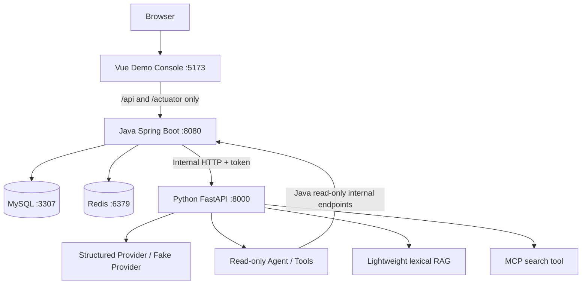

# AI Ticket 项目面试复盘总手册

> 目标：仅依据当前三个仓库的真实代码、测试和文档，准备 Java 后端与 AI 应用后端实习面试。
>
> 本手册不是新的实现计划，也不是通用八股百科。凡是项目事实，都会标明代码证据；凡是没有实现的内容，会明确标注为 PROJECT_LIMITATION 或 INTERVIEW_KNOWLEDGE。

## 使用方式

建议先读第 1、2、3、6、7、10、11、16、20、25 节，再按面试岗位阅读专项问题。

回答项目问题时使用四步：

1. 先用一句话给结论；
2. 再解释原理；
3. 再指向项目中的类、方法或测试；
4. 最后主动说明局限和生产演进方向。

事实标签：

- PROJECT_IMPLEMENTED：当前仓库真实实现并有代码或测试证据。
- PROJECT_LIMITATION：当前明确没有实现，或只有简化版本。
- INTERVIEW_KNOWLEDGE：为面试准备的扩展知识，不代表项目已经实现。

# 1. Project Ground Truth

## 1.1 三个仓库

| 项目 | 路径 | GitHub | 定位 |
| --- | --- | --- | --- |
| Java | D:/Project/java-backend-learning/ai-ticket-platform | github.com/zc2777038647/ai-ticket-platform | 可信业务后端 |
| Python | D:/Project/java-backend-learning/ai-ticket-ai-service | github.com/zc2777038647/ai-ticket-ai-service | AI capability service |
| Vue | D:/Project/java-backend-learning/ai-ticket-web | github.com/zc2777038647/ai-ticket-web | 独立 Demo Console |

三个项目是同级、独立 Git repository，不是嵌套仓库。

## 1.2 技术版本

### Java

| 技术 | 真实版本或来源 |
| --- | --- |
| Java | 21 |
| Spring Boot | 4.1.0 |
| Spring Framework | 7.0.8 |
| Spring Security / OAuth2 Resource Server | 7.1.0 |
| MyBatis-Plus | 3.5.17 |
| MySQL Compose 镜像 | mysql:8.4.11 |
| MySQL Connector/J | 9.7.0 |
| Redis Compose 镜像 | redis:7.4-alpine |
| Spring Data Redis | 4.1.0 |
| Lettuce | 7.5.2.RELEASE |
| Flyway | 12.4.0 |
| Jakarta Validation | 3.1.1 |
| Hibernate Validator | 9.1.0.Final |
| JUnit Jupiter | 6.0.3 |
| Mockito | 5.23.0 |
| MyBatis-Plus 分页依赖 | mybatis-plus-jsqlparser 3.5.17 |

证据：Java pom.xml、README.md、docs/testing_evidence.md、compose.yaml。

### Python

| 技术 | 真实版本约束 |
| --- | --- |
| Python | >= 3.11 |
| FastAPI | >= 0.115, < 1.0 |
| Uvicorn | >= 0.32, < 1.0 |
| Pydantic Settings | >= 2.6, < 3.0 |
| HTTPX | >= 0.27, < 1.0 |
| MCP Python SDK | >= 1.0, < 2.0 |
| pytest | >= 8.3, < 9.0 |

证据：ai-ticket-ai-service/pyproject.toml。

### Vue

| 技术 | package.json 真实依赖 |
| --- | --- |
| Vue | ^3.5.42 |
| Vite | ^8.3.0 |
| TypeScript | ~6.0.2 |
| Vue Router | ^5.3.1 |
| Axios | ^1.20.0 |
| Element Plus | ^2.14.6 |
| vue-tsc | ^3.3.11 |

证据：ai-ticket-web/package.json。

## 1.3 测试事实

### Java

真实基线：

- 62 个 Surefire test classes；
- Tests run: 463；
- Failures: 0；
- Errors: 0；
- Skipped: 0；
- BUILD SUCCESS。

这 463 个测试实例包含单元测试、Validation、standalone MVC、Spring Security、MySQL 集成、Redis 集成、HTTP 全链路和 AI HTTP 客户端边界测试，不是 463 个端到端测试。

代表性测试：

- SecurityHardeningIntegrationTest；
- TicketAuthorizationIntegrationTest；
- TicketOwnershipIntegrationTest；
- LoginRateLimitHttpIntegrationTest；
- CreateTicketIdempotencyHttpIntegrationTest；
- TicketOperationAtomicityIntegrationTest；
- RestClientAiServiceClientTest；
- TicketPaginationIntegrationTest。

### Python

真实结果：

    12 passed

测试覆盖：

- health；
- internal token；
- fake structured analysis；
- reply draft；
- provider invalid output；
- RAG top-k；
- Agent tool allowlist；
- MCP HTTP contract；
- provider mode configuration。

### Vue

真实验证：

    npm run build

结果：

- vue-tsc 类型检查通过；
- Vite production build 成功；
- 1663 modules transformed；
- Vite 给出 bundle 大于 500 KB 的 warning，但构建成功。

Vue 当前没有单独的 Vitest 测试脚本，主要验证方式是 TypeScript build、真实后端联调和浏览器操作。

## 1.4 当前 Git 状态

本手册生成前审计到的状态：

| 仓库 | Branch | HEAD | Working tree | Upstream |
| --- | --- | --- | --- | --- |
| Java | master | 84fddcc | clean | 0 ahead / 0 behind |
| Python | master | 2d312df | clean | 0 ahead / 0 behind |
| Vue | master | d3fec27 | clean | 0 ahead / 0 behind |

# 2. Architecture

## 2.1 总体架构

必须记住：

    Browser → Java → Python

而不是：

    Browser → Python

## 2.2 Java 为什么是 trusted business boundary

PROJECT_IMPLEMENTED：

Java 负责：

- 用户注册、登录和 JWT；
- Spring Security 认证和角色授权；
- ticket 所有权判断；
- 工单创建、查询、分页、状态流转和指派；
- MySQL 事务和操作日志；
- Redis 登录限流和创建幂等；
- 调用 Python 前的业务授权；
- AI 建议最终返回给客户端。

Python 负责：

- AI 分析建议；
- 人工审核回复草稿；
- 受控只读 Agent；
- 本地知识库检索；
- MCP 演示；
- provider abstraction。

Python 没有 Java MySQL 凭证，也不直接 UPDATE tickets。AI 结果不能直接改变 priority、status 或 assignee。

## 2.3 30 秒项目介绍

我做的是一个 Java + Python 的智能工单平台。Java 负责注册登录、JWT 三角色授权、工单分页、状态流转、管理员指派、MySQL 事务日志，以及 Redis Lua 登录限流和有限窗口创建幂等；USER 的工单所有权在 Service 层再次校验。AI 能力由同级 FastAPI 服务提供，包含结构化分析建议、人工审核回复草稿、只读 Agent、轻量 RAG 和 MCP，浏览器始终只访问 Java。当前 Java 有 463 个测试实例通过，Python 有 12 个测试通过，Vue Demo 可真实联调。

## 2.4 3 分钟项目介绍

项目解决的是客服工单从创建到处理的基本闭环。Java 采用 Controller、Service、Mapper 分层，MyBatis-Plus 访问 MySQL，Flyway V1 到 V6 管理 users、tickets 和 ticket_operation_logs 的演进。

认证方面，注册用 BCrypt 保存密码哈希，登录签发两个小时有效期的 HS256 JWT。Spring Security Resource Server 验证 JWT，Converter 将 role 转成 ROLE_USER、ROLE_AGENT 或 ROLE_ADMIN。请求级规则控制接口能否调用，Service 再用 JWT sub 和 creator_user_id 做对象级授权，所以 USER 不能仅因为知道 ID 就读取别人的工单。

状态更新不是简单的先 SELECT 再无条件 UPDATE，而是把读取到的旧状态放入 WHERE 条件。指派同理，把旧处理人放入条件；affected rows 为 0 时返回冲突。业务 UPDATE 成功后在同一个 MySQL transaction 中插入操作日志，日志失败会回滚工单修改。

Redis 当前承担两个明确职责。登录按 remoteAddr 和规范化用户名分别使用固定窗口 Lua 限流，默认 IP 每 60 秒 20 次、用户名每 60 秒 10 次。创建工单使用用户作用域的 Idempotency-Key、请求指纹、ownerToken 和 PROCESSING/SUCCEEDED 状态，成功请求在 TTL 内重放 TicketResponse。因为 Redis 和 MySQL 不是同一事务，所以明确不称为 exactly-once。

AI 不是 Java 业务状态的替代者。Java 先查票并执行权限，再通过内部 token 调 Python。Python 使用 Pydantic 做结构化输出，提供 analysis、reply draft、read-only Agent、词法 RAG 和 MCP。Python 停止时，工单列表和详情仍可用，只有 AI endpoint 返回明确的 503 类业务错误。Vue 只负责展示和操作，不是最终安全边界。

## 2.5 10 分钟深度介绍路线

建议按以下顺序自然展开：

1. 先讲工单业务和三张核心表；
2. 讲 JWT、RBAC 和对象级授权；
3. 讲状态/指派条件 UPDATE；
4. 讲日志与事务回滚；
5. 讲 Redis Lua 限流；
6. 讲 Redis 创建幂等及一致性窗口；
7. 讲 Java→Python 内部 HTTP 和故障隔离；
8. 讲 Structured Output、Reply Draft；
9. 讲 Agent、RAG、MCP 的职责区别；
10. 最后打开 Vue Demo，演示 USER、AGENT、Python 停止和恢复。

每段都主动说局限，不给没有测试证据的 QPS、exactly-once 或生产部署结论。

## 2.6 API 快速索引

### Java public/business API

| 方法 | 路径 | 权限 | 作用 |
| --- | --- | --- | --- |
| POST | /api/auth/register | public | 注册普通 USER |
| POST | /api/auth/login | public | 登录、签发 JWT、登录限流 |
| GET | /api/auth/me | authenticated | 从 JWT 读取当前身份 |
| POST | /api/tickets | authenticated | 创建工单，启用时需要 Idempotency-Key |
| GET | /api/tickets/mine | authenticated | 当前用户自己的工单 |
| GET | /api/tickets | AGENT/ADMIN | 全局条件分页 |
| GET | /api/tickets/{id} | authenticated | 按 ID 查询，USER 做所有权过滤 |
| PATCH | /api/tickets/{id}/status | AGENT/ADMIN | 合法状态流转 |
| PATCH | /api/tickets/{id}/assignee | ADMIN | 指派 AGENT |
| POST | /api/tickets/{id}/ai-analysis | AGENT/ADMIN | AI 分析建议 |
| POST | /api/tickets/{id}/ai-reply-draft | AGENT/ADMIN | 回复草稿 |
| POST | /api/tickets/{id}/ai-agent | AGENT/ADMIN | 受控只读 Agent |
| GET | /actuator/health | public | 基本健康状态 |
| GET | /actuator/info | ADMIN | Actuator 信息 |
| GET | /actuator | ADMIN | Actuator links |

### Java internal AI API

| 方法 | 路径 | 调用方 |
| --- | --- | --- |
| GET | /internal/ai/tickets/{id} | Python tool client |
| GET | /internal/ai/tickets/{id}/history | Python tool client |

这些路径在 SecurityFilterChain 中 permitAll，但 Controller 仍要求 X-Internal-AI-Token。它们不是浏览器业务 API。

### Python internal AI API

| 方法 | 路径 | 作用 |
| --- | --- | --- |
| GET | /health | 服务健康检查 |
| POST | /internal/ai/ticket-analysis | 结构化分析 |
| POST | /internal/ai/ticket-reply-draft | 回复草稿 |
| POST | /internal/ai/agent | Agent |
| POST | /internal/mcp/search | MCP/RAG HTTP 合同 |

Python internal API 需要 X-Internal-AI-Token。

# 3. Ticket Business

## 3.1 数据模型

核心表：

- users：用户、BCrypt password_hash、display_name、role；
- tickets：title、description、creator_name、creator_user_id、assignee_user_id、priority、status、created_at、updated_at；
- ticket_operation_logs：ticket_id、operator_user_id、operation_type、before_value、after_value、created_at。

Flyway：

- V1 创建 tickets；
- V2 将旧状态映射为 OPEN、IN_PROGRESS、RESOLVED、CLOSED，并修改默认值；
- V3 创建 users；
- V4 增加 creator_user_id 外键和索引；
- V5 增加 assignee_user_id 外键和索引；
- V6 创建操作日志表。

Entity 证据：

- Ticket；
- UserAccount；
- TicketOperationLog。

MyBatis-Plus Mapper：

- TicketMapper；
- UserAccountMapper；
- TicketOperationLogMapper。

## 3.2 创建工单

调用链：

    POST /api/tickets
    → Security JWT
    → TicketController.createTicket
    → CreateTicketIdempotencyCoordinator
    → Redis acquire
    → TicketServiceImpl.createTicket
    → TicketMapper.insert
    → MySQL
    → Redis complete
    → TicketResponse

TicketServiceImpl.createTicket 做这些事情：

1. 检查可信 creatorUserId；
2. 将请求字段复制到 Ticket；
3. creatorUserId 来自 JWT sub，不信任请求体中的 creatorName；
4. 显式设置 status = OPEN；
5. 调用 Mapper insert；
6. 校验影响行数为 1；
7. 校验自增 ID 已回填；
8. 映射为 TicketResponse。

面试表达：

> creatorName 是展示文本，creatorUserId 才是授权身份。请求可以提供 creatorName，但不能通过它获得工单所有权。

测试证据：

- TicketCreationIntegrationTest；
- CreateTicketIdempotencyHttpIntegrationTest；
- TicketServiceImplTest；
- TicketMapperIntegrationTest。

## 3.3 按 ID 查询与对象级授权

Controller 接收 id 和 JWT 身份。

Service 分支：

- USER：查询 id = ticketId 且 creator_user_id = requesterUserId；
- AGENT/ADMIN：按 id 查询；
- 查不到时统一抛 TICKET_NOT_FOUND。

USER 查询别人的工单表现为 404，而不是 403，用于隐藏资源是否存在。这个 404 是对象级隐藏策略，不应和未知 URL 的 404 混淆。

代码证据：

- TicketController.getTicketById；
- TicketServiceImpl.getTicketById；
- TicketOwnershipIntegrationTest；
- TicketAuthorizationIntegrationTest。

## 3.4 我的工单与全局分页

TicketPageQuery 支持：

- page；
- size；
- status；
- priority；
- creatorName；
- keyword。

Service：

- pageMyTickets 强制 creator_user_id = JWT sub；
- pageTickets 供 AGENT/ADMIN 使用；
- status 和 priority 使用条件过滤；
- keyword 在 title、description 上做 LIKE；
- created_at、id 倒序；
- MyBatis-Plus Page 和 PaginationInnerInterceptor 完成分页。

这说明“AGENT/ADMIN 可以全局分页”不代表他们调用 mine 时可以看到其他人的 mine 数据；mine 仍按 creator_user_id 限制。

## 3.5 状态流转

真实状态机：

    OPEN → IN_PROGRESS → RESOLVED → CLOSED

TicketStatus.canTransitionTo 只允许相邻状态：

- OPEN 只能到 IN_PROGRESS；
- IN_PROGRESS 只能到 RESOLVED；
- RESOLVED 只能到 CLOSED；
- CLOSED 没有后继状态。

非法跳跃、反向或重复状态返回 INVALID_TICKET_STATUS_TRANSITION。

## 3.6 指派

只有 ADMIN 可以指派。

Service 顺序：

1. 查询工单；
2. 查询目标用户；
3. 目标用户必须存在；
4. 目标用户角色必须是 AGENT；
5. 相同处理人直接返回 TICKET_ALREADY_ASSIGNED；
6. 首次指派条件是 assignee_user_id IS NULL；
7. 重新指派条件是旧 assignee_user_id；
8. affected rows 为 0 返回冲突；
9. 写 ASSIGNEE_CHANGED 日志；
10. 返回 TicketAssignmentResponse。

当前没有 AGENT 列表 API，Vue Demo 使用管理员输入真实 AGENT 用户 ID。这是 PROJECT_LIMITATION，不是前端伪造用户管理。

## 3.7 操作日志

TicketOperationType 目前包括：

- STATUS_CHANGED；
- ASSIGNEE_CHANGED。

日志记录：

- 操作者 JWT sub；
- 工单 ID；
- 操作类型；
- before value；
- after value；
- created_at。

指派时 operator_user_id 是 ADMIN，不是被指派的 AGENT。

## 3.8 业务面试问答

### Q：为什么 Controller 不直接调用 Mapper？

推荐回答：

Controller 只处理 HTTP 边界、Validation 和认证主体。Service 统一承载状态机、对象级授权、条件更新、事务和日志。Controller 直接 Mapper 会让权限和一致性规则分散，测试也难以复用。

追问：

- 如果多个入口都能更新状态怎么办？
- 如果日志插入失败怎么办？

危险回答：

> Controller 简单，直接调用 Mapper 性能更好。

### Q：为什么不直接返回 Entity？

推荐回答：

Entity 是持久化模型，DTO 是接口契约。返回 DTO 可以避免暴露 creator_user_id、assignee_user_id 或未来新增字段，也让数据库结构和 HTTP 结构解耦。

### Q：为什么状态更新要先读再条件更新？

推荐回答：

先读用于判断状态机和构造日志；真正写入时把旧状态放入 WHERE，确保读到的旧值仍然成立。SELECT 负责业务判断，条件 UPDATE 负责并发竞争下的最后确认。

### Q：为什么日志和业务 UPDATE 要一个事务？

推荐回答：

状态已经改成功但日志失败，会产生没有审计记录的业务变更。放在同一 MySQL transaction 中，日志失败会回滚状态或指派。这个事务不包含 Redis，也不等于跨存储事务。

### Q：为什么没有取消指派和主动领取？

推荐回答：

当前业务范围只冻结了 ADMIN 指派和重新指派，没有扩展领取模型。它是边界取舍，不是说领取功能不可能实现。

# 4. Authentication & Authorization

## 4.1 Authentication 与 Authorization

- Authentication：你是谁；
- Authorization：你能做什么；
- JWT：把已签发身份以签名 token 传给后续请求；
- RBAC：按角色授权；
- Object-level authorization：按具体资源所有权授权。

项目同时需要两层：

    SecurityFilterChain → 请求级角色
    TicketService       → 具体 ticket 的对象级授权

## 4.2 注册与密码

AuthServiceImpl.register：

- username 转小写；
- displayName trim；
- PasswordEncoder 使用 BCrypt strength 10；
- 数据库保存 password_hash；
- 注册固定为 USER；
- 重复用户名转 USERNAME_ALREADY_EXISTS。

注册接口不接收 role，因此普通用户不能通过注册请求创建 ADMIN 或 AGENT。

## 4.3 JWT 签发

JwtTokenServiceImpl 使用：

- HS256；
- issuer = ai-ticket-platform；
- Access Token TTL = PT2H；
- secret 来源是 JWT_SECRET_BASE64；
- 解码后至少 32 字节；
- NimbusJwtEncoder。

实际 claims：

- iss；
- sub：用户 ID；
- iat；
- exp；
- jti；
- username；
- role。

## 4.4 JWT 校验和 Authority

JwtConfig 使用 NimbusJwtDecoder 和：

- 默认 issuer/time validator；
- ApplicationJwtValidator。

ApplicationJwtValidator 额外检查：

- sub 是正数 Long；
- username 非空；
- role 是合法 UserRole；
- jti 非空。

ApplicationJwtAuthenticationConverter：

    role = AGENT
    → ROLE_AGENT

同时将 Authentication.getName() 设为 JWT sub。Controller 将这个可信 subject 传给 Service。

## 4.5 401 与 403

401：

- 没有 token；
- token 过期；
- 签名错误；
- claims 无效；
- 登录凭据错误。

403：

- 身份有效；
- 但角色不满足接口规则。

项目错误协议：

- authentication required：HTTP 401 / 40101；
- invalid credentials：HTTP 401 / 40100；
- authorization denied：HTTP 403 / 40300。

## 4.6 SecurityFilterChain

当前重要规则：

- POST /api/auth/register：permitAll；
- POST /api/auth/login：permitAll；
- GET /actuator/health：permitAll；
- GET /api/auth/me：authenticated；
- POST /api/tickets：authenticated；
- GET /api/tickets/mine：authenticated；
- GET /api/tickets：AGENT/ADMIN；
- GET /api/tickets/*：authenticated；
- PATCH status：AGENT/ADMIN；
- PATCH assignee：ADMIN；
- AI 三个业务接口：AGENT/ADMIN；
- GET /actuator/info 和 /actuator：ADMIN；
- ERROR/FORWARD dispatcher：permitAll；
- anyRequest：denyAll。

SecurityHardeningIntegrationTest 真实验证：

- 未匹配 test-only endpoint：匿名 401，USER/AGENT/ADMIN 403；
- health 匿名、USER、AGENT 只返回基本 status；
- ADMIN health 能看到 components；
- info/root 只允许 ADMIN；
- ERROR dispatch 不因为 denyAll 产生二次安全失败。

## 4.7 Actuator

application.yml：

- Web exposure 只包含 health、info；
- health show-details = when-authorized；
- roles = ADMIN。

这不是“所有 Actuator 公开”。匿名 health 只看到基本状态，ADMIN 才能看到详细组件。

## 4.8 面试问题

### Q：RBAC 和对象级授权有什么区别？

推荐回答：

RBAC 解决“这个角色能否调用接口”；对象级授权解决“调用者能否访问这一个资源”。项目中 GET ticket detail 对 USER 先经过 authenticated，再在 Service 中追加 creator_user_id = JWT sub。

### Q：为什么前端隐藏按钮不算安全？

推荐回答：

浏览器代码和按钮都可被用户修改。Java SecurityFilterChain 和 Service 才是可信边界，前端隐藏按钮只改善体验。

### Q：为什么注册不能选 ADMIN？

推荐回答：

角色是权限边界，不能让匿名用户通过请求体自授予高权限。ADMIN/AGENT 应通过受控运维流程或后台管理创建。

### Q：JWT 修改角色后为什么通常要重新登录？

推荐回答：

角色已经写进已签发 token。修改数据库角色不会自动修改旧 token，除非服务端每次请求实时查库或引入撤销机制。当前项目使用 claims，因此没有即时撤销和角色热变更。

### Q：JWT 怎么注销？

当前项目没有服务端 logout、Refresh Token 或 token revoke list。客户端可以删除 token，但已签发 token 在过期前仍可能有效。

这部分标记为 PROJECT_LIMITATION；Refresh Token、jti denylist、密钥轮换属于 INTERVIEW_KNOWLEDGE。

# 5. MySQL, Transaction & Concurrency

## 5.1 条件 UPDATE

状态更新的核心语义：

    UPDATE tickets
    SET status = targetStatus
    WHERE id = ticketId
      AND status = oldStatus

指派的核心语义：

- 首次：id = ticketId AND assignee_user_id IS NULL；
- 重新指派：id = ticketId AND assignee_user_id = oldAssignee。

affected rows：

- 1：当前请求赢得条件更新；
- 0：旧值已变化，返回冲突；
- 其他值：内部异常。

## 5.2 并发例子

A 和 B 都读取 OPEN：

1. A 请求 OPEN → IN_PROGRESS；
2. B 请求 OPEN → RESOLVED；
3. A 的 UPDATE 匹配一行；
4. B 的 UPDATE 因 status 已不是 OPEN，匹配 0 行；
5. B 返回 TICKET_STATUS_CONFLICT。

没有条件 UPDATE 时，B 可能覆盖 A，形成 silent overwrite。

## 5.3 这是不是乐观锁？

准确回答：

它是基于旧值条件的乐观并发控制思想，但不是通用 version-column 乐观锁。项目没有 version 字段，也没有 MyBatis-Plus optimistic locker plugin。状态字段和 assignee 字段分别作为业务前置条件。

## 5.4 事务边界

状态更新：

    Ticket UPDATE
    → STATUS_CHANGED log INSERT
    → commit

指派：

    Ticket UPDATE
    → ASSIGNEE_CHANGED log INSERT
    → commit

TicketServiceImpl.updateTicketStatus 和 assignTicket 都使用 @Transactional。

TicketOperationAtomicityIntegrationTest 通过不存在的 operator_user_id 触发日志外键失败，验证：

- 状态回滚为 OPEN；
- 处理人回滚为 NULL；
- 没有日志残留。

## 5.5 MySQL 与 Flyway

为什么使用 Flyway：

- 迁移有版本；
- 启动时按顺序应用；
- V1 不被直接修改；
- V2 负责旧 status 数据转换和列定义；
- V3-V6 逐步增加用户、外键、处理人和日志。

数据库级约束：

- tickets/users/logs 自增主键；
- username 唯一；
- creator_user_id 和 assignee_user_id 外键；
- operation log 关联 ticket/operator；
- status、creator、assignee 有索引；
- 外键使用 RESTRICT，避免静默删除历史业务。

## 5.6 MySQL isolation level

当前代码没有显式设置事务 isolation level，使用数据库/连接默认值。

面试回答：

Isolation level 影响并发读写可见性、脏读、不可重复读和幻读；条件 UPDATE 仍然需要，因为事务隔离不能替代业务旧值条件。若业务对冲突语义更复杂，可以比较 version、SELECT FOR UPDATE 或更高隔离级别。

## 5.7 多实例问题

当前状态更新的条件 UPDATE 和 MySQL transaction 可以在多实例之间共享数据库正确性；但 Redis 幂等要求所有实例访问同一个可靠 Redis。项目没有真实多实例部署测试，也没有 Sentinel/Cluster 验证。

不要说项目已经验证了多实例高并发。

# 6. Redis Rate Limiting

## 6.1 当前实现

RedisLoginRateLimiter 对登录请求分别检查：

- IP bucket；
- normalized username bucket。

默认配置：

- IP：60 秒最多 20 次；
- username：60 秒最多 10 次。

用户名规范化：

- trim；
- Locale.ROOT 小写。

IP 来源：

- HttpServletRequest.getRemoteAddr；
- 当前不信任 X-Forwarded-For，因为没有可信代理配置。

## 6.2 Lua 为什么必要

fixed_window_rate_limit.lua 在一个 Redis 脚本内：

1. 读取当前计数；
2. 第一次请求 SET 计数 1 并设置 EXPIRE；
3. 后续 INCR；
4. 超限读取 TTL；
5. 返回剩余等待秒数。

如果用客户端分两步执行 INCR 和 EXPIRE，中间进程崩溃或网络断开，可能留下永不过期计数。Lua 让单个 key 的检查、递增和 TTL 处理在 Redis 内部原子完成。

注意：两个维度是两个 key，不是一个共同原子事务。

## 6.3 计数策略

成功和失败登录都计数，避免攻击者通过大量成功登录绕过请求频率限制。

JSON 格式错误和 DTO Validation 在进入 AuthController 前失败，因此不调用限流器，不计数。

Controller 先检查 IP，再检查 username。如果 username 超限，本次请求可能已经消耗 IP 额度。

## 6.4 Redis 故障

当前是 fail-closed：

- Lua 执行异常；
- Redis 连接失败；
- 脚本返回非法结果；

都会阻止 AuthService.login 继续执行，最终转成服务器错误。

优点：Redis 故障不会被利用来绕过限流。

代价：Redis 不可用时正常用户也无法登录。

## 6.5 与其他算法比较

当前实现只有 fixed window。

- Sliding window：边界更平滑，但存储和计算更复杂；
- Token bucket：适合允许短时 burst 并控制长期速率；
- Leaky bucket：输出更平滑，但可能增加排队延迟；
- Fixed window：实现简单、容易解释，边界处可能出现双窗口突发。

INTERVIEW_KNOWLEDGE：这些算法可用于方案比较，但项目没有实现它们。

## 6.6 面试题

### Q：为什么 IP + username 双维度？

IP 防止单个来源打爆服务，username 防止攻击者通过多个 IP 反复攻击同一账户。两者互补，也都可能误伤共享 NAT 或代理后的用户，因此生产上需要可信代理和更精细的策略。

### Q：为什么不直接锁账户？

当前需求是请求频率保护，不是失败次数锁定。锁账户可能造成账户枚举和拒绝服务风险，应该另行设计解锁和通知。

### Q：为什么 Redis 故障不 fail-open？

项目把登录保护作为安全边界，选择宁可暂时拒绝登录，也不让故障自动取消保护。这个取舍依赖业务可用性要求。

# 7. Idempotency

## 7.1 为什么创建工单需要幂等

用户可能：

- 双击提交；
- 浏览器重试；
- 移动网络重复发送；
- 客户端不知道第一次请求是否已到达。

如果每次都直接 INSERT，可能创建重复工单。Idempotency-Key 把“同一个逻辑创建操作”与具体 HTTP 重试区分开。

## 7.2 实际状态

Redis Hash 当前状态：

- PROCESSING；
- SUCCEEDED。

PROCESSING 保存：

- state；
- fingerprint；
- ownerToken。

SUCCEEDED 保存：

- state；
- fingerprint；
- response；
- 不再保留 ownerToken。

没有独立 FAILED 或 EXPIRED 状态。业务失败时由正确 owner release；TTL 到期表现为 key 消失。

## 7.3 Key 作用域

Redis key 由：

- JWT sub；
- trim 后的 Idempotency-Key；
- key prefix；
- SHA-256 摘要；

生成。

不同用户即使使用相同客户端 key，也会得到不同 Redis key。

这样客户端不能通过请求体伪造 creatorUserId，也不会和其他用户冲突。

## 7.4 请求指纹

CreateTicketRequestFingerprint 对四个创建字段做长度编码后 SHA-256：

- title；
- description；
- creatorName；
- priority。

使用字段名和 UTF-8 字节长度，避免简单字符串拼接的分隔符歧义。

## 7.5 Lua 状态转换

acquire：

- key 不存在：写 PROCESSING、fingerprint、ownerToken 和 processing TTL；
- 同 fingerprint + PROCESSING：返回 IN_PROGRESS 和 Retry-After；
- 不同 fingerprint：返回 PAYLOAD_MISMATCH；
- SUCCEEDED：返回成功响应；
- owner 不由 acquire 直接替换。

complete：

- 检查 state；
- 检查 fingerprint；
- 检查 ownerToken；
- 改为 SUCCEEDED；
- 保存 response；
- 删除 ownerToken；
- 设置 success TTL。

release：

- 只有 PROCESSING、相同 fingerprint、相同 owner 才能删除；
- stale owner 不能删除新记录；
- SUCCEEDED 不能被 release。

## 7.6 完整例子

客户端第一次提交：

    Key = checkout-2026-001
    Payload = title=A, priority=HIGH
    Redis = ACQUIRED / PROCESSING
    MySQL = 插入一张 ticket
    Redis = SUCCEEDED + TicketResponse

同 key、同 payload 重试：

    Redis = SUCCEEDED
    直接反序列化原 TicketResponse
    不再调用 TicketService
    不再插入第二张 ticket

同 key、不同 payload：

    fingerprint 不同
    返回 HTTP 409 / 40907
    不覆盖原结果

请求仍在处理中：

    Redis = PROCESSING
    返回 HTTP 409 / 40906
    携带 Retry-After

业务失败：

    Service 抛 RuntimeException
    当前 owner 尝试 release
    原业务异常继续抛出

Service 已成功但 Redis complete 失败：

    MySQL 可能已经提交
    Redis 可能仍是 PROCESSING
    不主动 release
    防止立即重试造成第二次插入
    但 TTL 到期或 Redis 丢失后仍有重复窗口

## 7.7 为什么不是 exactly-once

它不是 exactly-once，因为：

- Redis 与 MySQL 不共享事务；
- MySQL commit 后到 Redis complete 之间可能崩溃；
- Redis 数据可能丢失；
- TTL 到期后没有 MySQL 持久化记录证明 key 已使用；
- 当前没有数据库唯一幂等约束。

准确说法：

> 当前方案提供 Redis 有效窗口内的并发协调、payload 冲突识别和成功响应重放，不提供永久防重或跨存储 exactly-once。

## 7.8 为什么不用 Redis 分布式锁

锁只说明当前谁可以执行，不天然保存请求指纹、成功响应、TTL 重放语义，也无法解决 MySQL commit 和 Redis state 之间的一致性窗口。当前需要的是状态机，不是简单互斥锁。

## 7.9 真正持久化幂等的演进

INTERVIEW_KNOWLEDGE / PROJECT_LIMITATION：

可以考虑：

1. 独立 MySQL idempotency_records 表；
2. user scope + client key 唯一约束；
3. PROCESSING/SUCCEEDED 持久化；
4. 成功响应和 ticket 创建放入同一数据库事务；
5. Outbox 只在还要发布外部事件时考虑；
6. 处理超时、恢复和人工修复策略。

这不是当前实现。

# 8. Java-Python AI Boundary

## 8.1 为什么拆 Python

Java 擅长：

- 业务模型；
- 事务；
- 权限；
- MySQL；
- Redis；
- 统一错误协议。

Python 方便：

- FastAPI；
- Pydantic schema；
- AI provider adapter；
- RAG；
- Agent；
- MCP SDK。

拆分是能力边界，不是为了堆“微服务”名词。当前规模仍然是两个同级本地项目，不应宣传为成熟生产微服务平台。

## 8.2 Java 侧调用

RestClientAiServiceClient：

- 读取 app.ai 配置；
- 组装 JSON；
- 添加 X-Internal-AI-Token；
- 使用配置的 base URL；
- 使用 read timeout；
- 处理 HTTP status；
- Jackson 解析响应；
- 转成 Java AI DTO。

错误映射：

- Python 4xx → AI_RESPONSE_INVALID / 50200；
- Python 5xx → AI_SERVICE_UNAVAILABLE / 50300；
- connection refused、IOException、InterruptedException → 50300；
- JSON 解析失败、schema 映射失败 → 50200；
- AI 未启用 → 50300。

Java 先调用 TicketService.getTicketById 完成角色和对象级授权，再把最小必要字段发给 Python。

## 8.3 Python 侧内部接口

routes.py 统一要求：

    X-Internal-AI-Token == request.app.state.settings.internal_token

不匹配返回 HTTP 401。

Python 的 JavaTicketToolClient 调用 Java：

- GET /internal/ai/tickets/{id}；
- GET /internal/ai/tickets/{id}/history；
- 添加 Java internal token；
- HTTP 失败或 JSON/模型验证失败转 JavaToolError。

这是两个方向的不同 token：

- Java → Python：AI_SERVICE_INTERNAL_TOKEN / Python internal_token；
- Python → Java：AI_JAVA_INTERNAL_TOKEN / Java internal-token 配置。

不要把用户 JWT 直接当作 Python 的内部授权事实。

## 8.4 AI 故障隔离

Python 停止时：

- GET ticket list 不需要 Python；
- GET ticket detail 不需要 Python；
- 创建、状态和指派不需要 Python；
- 只有显式 AI endpoint 返回 AI_SERVICE_UNAVAILABLE。

这保证 AI capability 不会取代 Java 核心业务正确性。

## 8.5 真实 Internal Token 401 Debug Case

现象：

    Java 调用 /internal/ai/ticket-analysis
    Python 日志：401 Unauthorized

定位：

1. 检查 Python routes.py 的 require_internal_token；
2. 发现它比较的是 request.app.state.settings.internal_token；
3. 检查 Python 的 AI_INTERNAL_TOKEN；
4. 检查 Java application.yml 的 AI_SERVICE_INTERNAL_TOKEN；
5. 发现两端环境变量或本地配置不一致；
6. 统一本地开发 token；
7. 修改环境变量后重启两个进程；
8. 再次调用 AI endpoint，验证 200。

关键点：

- .env.example 只有占位符；
- Java 使用 app.ai.internal-token；
- Python 使用 AI_INTERNAL_TOKEN；
- 配置修改需要重启，因为 Settings 被缓存且应用启动时创建 provider/tool；
- 不能把真实 token 写入聊天、README 或 Git。

行为面试表达：

> 我没有把 401 当成 Python 模型失败，而是先沿着 Java HTTP client、请求头、Python token dependency 和应用启动配置逐层定位。最后确认是两个方向配置名不同导致的内部认证不一致，统一配置并重启后恢复。这个过程让我区分了用户 JWT 和服务间 token，也确认了配置修改的重启边界。

## 8.6 AI 失败面试题

### Q：为什么 Python 挂了不能返回假的成功？

因为假成功会把 AI 不可用伪装成可信业务结论，可能误导客服。项目返回明确 503/业务错误，把 AI availability 和 ticket correctness 分开。

### Q：为什么 Java 不直接把模型调用写在 Service 里？

当前选择是把 AI provider、Pydantic schema、RAG 和 Agent 留在 Python，同时让 Java 只负责授权、字段边界、超时和错误协议。以后换 provider 不应影响 ticket domain。

# 9. Structured Output

## 9.1 真实 schema

Python Pydantic：

TicketAnalysisResult：

- category；
- suggested_priority；
- reason；
- confidence，范围 0 到 1。

TicketReplyDraftResult：

- draft；
- tone。

Java DTO 对应：

- AiAnalysisResponse；
- AiReplyDraftResponse。

## 9.2 为什么不用纯文本解析

禁止这种逻辑：

    if "HIGH" in response_text:
        priority = HIGH

因为：

- 文本可能包含否定；
- 语言和格式不稳定；
- 字段缺失难以发现；
- enum 拼写错误可能被静默接受；
- 不能稳定做版本兼容。

OpenAICompatibleTicketAiProvider 要求 JSON object，并使用 Pydantic model_validate 校验字段、枚举、长度和 confidence 范围。

## 9.3 JSON 与 schema validation 的区别

JSON 只说明语法上是对象，不说明：

- category 是否非空；
- suggestedPriority 是否合法；
- confidence 是否在 0 到 1；
- draft 是否有长度边界；
- 是否多了禁止字段。

项目 ApiModel 配置 extra=forbid，Pydantic model 负责结构和业务边界。

## 9.4 Java 为什么还要校验

Python 是一个服务边界，Java 不应假定上游永远正确。Java Jackson DTO 映射失败会进入 AI_RESPONSE_INVALID。双层验证降低错误 payload 穿透到浏览器的风险。

## 9.5 Structured Output 能消除 hallucination 吗？

不能。

它约束格式和字段类型，不保证事实正确、政策正确或建议适合当前业务。仍然需要：

- Java 业务权限；
- 人工审核；
- 知识来源；
- 领域规则；
- 失败兜底；
- 评估和审计。

# 10. AI Reply Draft

## 10.1 功能边界

Reply Draft 只生成客服草稿：

- 不自动发送；
- 不写正式回复；
- 不修改 ticket；
- 页面允许人工编辑和复制；
- UI 标注 Human-in-the-loop。

## 10.2 为什么必须人工确认

模型可能：

- 编造订单或政策；
- 承诺不存在的时效；
- 误解用户问题；
- 使用不合适的语气；
- 泄露不应披露的信息。

因此：

    AI 生成 draft
    → 人工核对事实、政策和语气
    → 人工决定是否发送

面试回答：

> AI suggestion is not business decision. Draft is not sent message.

# 11. Agent Engineering

## 11.1 什么是 Agent

可以拆成四层：

- LLM call：一次模型生成；
- Structured Output：模型输出受 schema 约束；
- Tool Calling：模型或程序选择并调用工具；
- Agent：围绕目标、工具、状态和终止条件进行多步编排。

当前项目的 Agent 是轻量、确定性较强的工具编排，不是开放式自主系统。

## 11.2 Tool Calling 的基本循环

典型过程：

1. 接收目标；
2. 决定需要什么工具；
3. 生成参数；
4. 应用校验参数；
5. 执行工具；
6. 把结果返回给模型/编排器；
7. 继续回答或停止。

工具执行永远应在程序控制下，不应让模型直接访问数据库。

## 11.3 Workflow 与 Agent

确定性强的流程使用 Workflow：

- 固定步骤；
- 固定分支；
- 易测试；
- 可预测延迟。

开放决策或工具选择才考虑 Agent：

- 需要根据 query 选择工具；
- 可能多步获取上下文；
- 终止条件必须明确。

Agent 不一定更高级。它引入不确定性、成本、延迟和安全面。

## 11.4 当前项目 Agent

真实代码：Python TicketAgent。

允许工具集合：

- get_ticket_detail；
- get_ticket_history。

JavaTicketToolClient 通过 Java internal read-only endpoints 读取数据。

当前 run 流程：

1. 先读 ticket detail；
2. query 包含 history、log、日志或历史时，再读 history；
3. 使用 KnowledgeRetriever 获取 RAG sources；
4. 生成 answer、sources、tool_calls；
5. 返回 AgentResponse。

AgentResponse：

- answer；
- sources；
- tool_calls。

## 11.5 为什么工具只读

项目禁止 Agent 写操作，因为写操作会同时涉及：

- LLM 不确定性；
- prompt injection；
- 业务权限；
- 状态机；
- 审计；
- 错误回滚；
- blast radius。

当前边界：

    Agent read
    Java authorize and write

即使以后加入写工具，也应由 Java Service 再次授权、校验业务状态，并要求人工审批。

## 11.6 Allowlist 与 schema

TicketAgent 使用固定 allowlist。Python schemas.py 使用：

- PositiveInt；
- max_length；
- blank validator；
- Pydantic model。

这防止：

- 调用未声明的工具；
- ticket_id 为负数；
- query 为空或过长；
- 工具参数直接透传任意 SQL。

## 11.7 Max Tool Calls

AI_AGENT_MAX_TOOL_CALLS 默认 3。

它用于防止：

- 无限循环；
- 工具反复调用；
- 延迟失控；
- 下游 Java 压力；
- token 和费用失控。

当前代码在达到上限时抛 RuntimeError，并由 API 转 422。

注意：当前 Agent 是确定性逻辑，并不是完整 ReAct 无限循环；max tool calls 是 loop guard。

## 11.8 Agent failure handling

当前已经覆盖或实现：

- Java tool HTTP 失败 → JavaToolError → Python 503；
- query 为空/过长 → Pydantic 422；
- ticket schema 无效 → Pydantic 校验失败；
- tool-call limit 到达 → 422；
- Python internal token 错误 → 401；
- Java 受控 internal endpoint 404/401/其他 HTTP 错误 → JavaToolError。

PROJECT_LIMITATION：

- 没有完整 tracing；
- 没有 token/cost 统计；
- 没有长期 Agent memory；
- 没有写工具审批 UI；
- 没有独立 Agent evaluation dataset；
- 没有多 Agent。

## 11.9 Prompt Injection

当前安全措施：

- Java 先做用户授权；
- Python 只拿最小字段；
- tool allowlist；
- Pydantic 参数约束；
- Java internal token；
- read-only tools；
- max tool calls。

当前未完整实现：

- prompt injection classifier；
- untrusted content 标记；
- tool result sanitization pipeline；
- policy engine；
- sandbox；
- human approval workflow。

这些属于 INTERVIEW_KNOWLEDGE / 生产演进。

## 11.10 Agent Observability

当前 response 有：

- tool_calls 次数；
- source metadata；
- answer。

当前没有：

- trace/span；
- 每个工具的耗时；
- token usage；
- provider cost；
- tool success rate；
- correlation ID；
- structured audit log。

面试要诚实说“当前返回了工具调用数量和 sources，但没有完整生产级 Agent tracing”。

## 11.11 Agent Memory

区分：

- Context：当前请求传入的信息；
- Short-term memory：当前运行中的历史工具结果；
- Long-term memory：跨请求、跨会话持久化的用户/任务记忆。

当前项目：

- 有 ticket detail/history 作为工具上下文；
- 有当前 run 的局部结果；
- 没有长期 Agent Memory。

不要把 Java operation log 或 RAG knowledge file 说成 Agent memory。

# 12. Knowledge Base & RAG

## 12.1 知识库是什么

知识库是相对稳定、可检索的业务知识，例如：

- 退款规则；
- 支付异常 SOP；
- 账户排查；
- 优先级指导；
- 客服回复规范。

它和业务数据库不同。

MySQL：

    Ticket 1001 当前状态是什么？

Knowledge Base：

    支付异常应该怎样处理？

## 12.2 当前项目知识库

目录：

    ai-ticket-ai-service/knowledge/ticket_support.md

内容包含：

- Account and login；
- Priority guidance；
- Reply guidance；
- Security guidance。

这是小型示例知识库，不是企业知识平台。

## 12.3 当前 RAG 类型

KnowledgeRetriever：

1. 加载 knowledge/*.md；
2. 按空行切分 chunk；
3. 使用正则 token；
4. 计算 query token 与 chunk token 的交集；
5. 按 overlap 降序排序；
6. 返回 source 和 snippet；
7. 使用 top_k 截断。

这是轻量 lexical overlap retrieval。

它不是：

- embedding retrieval；
- vector database；
- semantic search；
- BM25 完整实现；
- reranker。

必须准确说：

> 当前项目是轻量词法检索 RAG 演示，不是向量数据库 RAG。

## 12.4 Chunk 为什么需要

整篇文档全部塞给模型会导致：

- token 浪费；
- 无关内容混入；
- 重点被稀释；
- latency 上升；
- prompt 更难控制。

chunk 让检索结果更接近具体问题，但 chunk 太小会丢语义，太大又降低精度。

当前实现按空行切分，简单可解释，但没有语义分段、重叠窗口或文档版本管理。

## 12.5 Top-K

AI_RAG_TOP_K 默认 2。

top_k 太小：

- 可能 recall 不足；
- 漏掉关键规则。

top_k 太大：

- 噪声增加；
- token 增加；
- latency 增加；
- 模型更难聚焦。

Python 测试 test_rag_top_k_changes_number_of_results 真实验证 top_k=1 和 top_k=3 的结果数量行为。

## 12.6 Embedding 是什么

INTERVIEW_KNOWLEDGE：

Embedding 把文本映射为向量，使语义相近的内容在向量空间中更接近。常见检索使用 cosine similarity 或内积，再配合 vector index。

当前项目没有 embedding 模型，也没有 Milvus、Pinecone、Weaviate、Elasticsearch 等 vector DB。

## 12.7 BM25、Hybrid、Rerank

INTERVIEW_KNOWLEDGE：

- BM25：基于词频、逆文档频率和长度归一化的 lexical retrieval；
- Vector retrieval：语义相似检索；
- Hybrid：词法和向量互补；
- Rerank：对候选结果使用更强模型重新排序。

如果知识库扩大到十万篇文档，当前实现需要升级为：

1. 文档 ingestion pipeline；
2. chunk 元数据和权限；
3. embedding/index；
4. hybrid candidate retrieval；
5. rerank；
6. freshness 和删除同步；
7. retrieval evaluation；
8. source citation 和访问控制。

## 12.8 RAG 失败模式

- retrieval miss；
- query 和文档词汇不一致；
- chunk 切断上下文；
- stale document；
- 文档互相冲突；
- 检索到了错误权限范围的文档；
- 检索正确但模型仍然编造。

RAG 不能消灭 hallucination。它只改善可用上下文，仍需要引用、规则、模型约束和人工判断。

# 13. Agent + RAG

两者不是同一个概念：

- RAG：knowledge retrieval capability；
- Agent：decision/orchestration capability。

当前语义可以表示为：

    Agent
      ↓
    需要知识上下文
      ↓
    KnowledgeRetriever.search
      ↓
    source + snippet
      ↓
    AgentResponse.sources

当前代码中 TicketAgent 固定读取 ticket detail，再按 query 条件读取 history，并调用 RAG。它不是由自由模型动态选择任意 SQL 工具。

面试回答：

> RAG 解决“去哪里找知识”；Agent 解决“在目标下选择哪些工具并如何组织结果”。一个系统可以只有 RAG 没有 Agent，也可以有 Agent 调用非 RAG 工具。

# 14. MCP

## 14.1 当前 MCP 实现

app/services/mcp_server.py：

- 使用官方 Python MCP SDK；
- 创建 FastMCP；
- 暴露 search_ticket_knowledge；
- 只读；
- 返回 source 和 snippet；
- 默认 stdio transport。

同时 HTTP routes.py 的 /internal/mcp/search 提供 RAG HTTP 合同测试。

## 14.2 Tool Calling 与 MCP

Tool Calling：

- 模型或应用决定调用哪个函数；
- 参数由 schema 约束；
- 当前系统执行函数并返回结果。

MCP：

- Host/Client 与外部工具或上下文提供者之间的标准化协议；
- 提供工具发现和调用约定；
- 不等于 Agent 框架；
- 不等于模型本身。

本项目使用 MCP 是为了演示标准化工具协议，同时保留核心 Agent 的受控 Python adapter，不把 MCP 侵入 Java 业务写路径。

## 14.3 当前没有实现的 MCP 能力

当前主要暴露 Tool：

    search_ticket_knowledge

不要声称已经完整实现：

- MCP Resources；
- MCP Prompts；
- 企业级 MCP registry；
- 多租户 MCP authorization；
- 生产级 MCP observability。

这些是 INTERVIEW_KNOWLEDGE 或未来演进。

# 15. Vue Demo

## 15.1 为什么补 Vue

Vue 不是项目核心业务层，而是：

- GitHub showcase；
- 简历截图；
- 面试现场操作；
- 真实 API 联调；
- 角色差异和 AI 故障隔离演示。

核心安全仍然在 Java。

## 15.2 页面与角色

页面：

- /login；
- /register；
- /tickets/mine；
- /tickets/create；
- /tickets；
- /tickets/:id。

USER：

- 我的工单；
- 创建工单；
- 自己工单详情；
- 不显示 AI 和全部工单入口。

AGENT：

- 全部工单；
- 状态流转；
- AI analysis；
- reply draft；
- read-only Agent。

ADMIN：

- AGENT 能力；
- 处理人指派。

## 15.3 Axios 与路由守卫

src/api/http.ts：

- base URL 默认使用 /；
- Vite 代理转发 /api 和 /actuator；
- request interceptor 添加 Bearer token；
- 401 清理 localStorage 并回登录页；
- 503 显示 AI 服务暂时不可用；
- ApiError 保留 HTTP status 和应用 code。

src/router/index.ts：

- 未登录跳 /login；
- /tickets 只允许 AGENT/ADMIN；
- 前端 role guard 只是体验层；
- Java Security 才是最终授权。

## 15.4 Idempotency-Key 前端处理

TicketCreateView.vue：

- 一次逻辑 payload 生成一个 UUID；
- 请求失败时复用同 key；
- payload 改变后生成新 key；
- submit loading 时阻止重复点击。

## 15.5 Vue 的限制

- localStorage token 只适用于本地 Demo；
- 当前 TicketResponse 没有 assignee/时间字段，页面显示“响应未提供”；
- 没有 AGENT 列表 API，ADMIN 输入 AGENT ID；
- 没有前端数据库；
- 没有前端 Vitest 测试；
- fake provider 不是真实外部 LLM；
- Element Plus bundle 有体积 warning。

# 16. Interview Demo Script

## 16.1 五分钟流程

### 1. USER 登录

说：

> 先用普通 USER 登录。菜单是前端根据角色展示的，但真正的权限仍由 Java Security 和 Service 判断。

### 2. USER 创建工单

填写标题、描述和优先级。

说：

> 创建请求会携带 Idempotency-Key。前端重试同一逻辑请求会复用 key，后端用 Redis 状态机避免正常重复创建。

展示：

- 创建成功；
- 我的工单；
- 工单详情；
- USER 没有 AI 操作。

### 3. AGENT 登录

说：

> AGENT 可以查看全局工单，并推进状态，但不能指派处理人。

展示：

- 全部工单；
- OPEN → IN_PROGRESS；
- 非法跳转由后端状态机拒绝。

### 4. AI Analysis

说：

> Java 先做 AGENT/ADMIN 权限和 ticket 查询，再调用 Python。Python 返回结构化建议，Java 不把它当作业务决定。

展示：

- category；
- suggestedPriority；
- confidence；
- reason。

### 5. Reply Draft

说：

> 这是人工审核草稿，不会自动发送。客服可以编辑、复制，最终是否发送由人决定。

### 6. Agent

说：

> Agent 只能使用受控只读工具，当前包括 get_ticket_detail 和 get_ticket_history，并有 max tool calls 限制。

展示：

- answer；
- sources；
- tool_calls。

### 7. Python 故障隔离

停止 Python。

说：

> AI capability 不可用时，Java 核心 ticket list/detail 仍然可用；AI endpoint 返回明确错误，不返回假的成功。

点击 AI 分析，展示 warning。

再次打开工单列表，证明核心业务正常。

### 8. Python 恢复

重启 Python，再次调用 AI 分析，展示恢复。

## 16.2 追问跳转

- 问安全：跳第 4 节；
- 问并发：跳第 5 节；
- 问幂等：跳第 6 节；
- 问 AI 边界：跳第 7～10 节；
- 问 RAG：跳第 11～12 节；
- 问 MCP：跳第 13 节；
- 问项目限制：跳第 18 节。

# 17. Resume Claim Evidence Map

## Claim 1：工单业务、条件更新和事务日志

证据：

- 代码：src/main/java/com/xiaoyang/aiticketplatform/service/impl/TicketServiceImpl.java；
- 方法：updateTicketStatus、assignTicket、appendOperationLog；
- SQL 语义：LambdaUpdateWrapper 匹配旧 status/旧 assignee；
- 数据库：V6__create_ticket_operation_logs_table.sql；
- 测试：TicketOperationAtomicityIntegrationTest、TicketOperationLoggingHttpIntegrationTest、TicketStatusUpdateIntegrationTest、TicketAssignmentIntegrationTest。

为什么重要：

- 体现业务规则不只停留在 Controller；
- 体现并发冲突和审计一致性；
- 有真实 MySQL 回滚证据。

## Claim 2：JWT、RBAC、对象级授权

证据：

- SecurityConfig.java；
- JwtConfig.java；
- JwtTokenServiceImpl.java；
- ApplicationJwtValidator.java；
- ApplicationJwtAuthenticationConverter.java；
- TicketServiceImpl.getTicketById；
- TicketOwnershipIntegrationTest；
- TicketAuthorizationIntegrationTest；
- SecurityHardeningIntegrationTest。

为什么重要：

- 同时覆盖 authentication、request-level authorization、object-level authorization；
- 明确区分 401 和 403；
- USER 隐藏他人工单。

## Claim 3：Redis Lua 限流和创建幂等

证据：

- redis/fixed_window_rate_limit.lua；
- RedisLoginRateLimiter.java；
- LoginRateLimitKeyGenerator.java；
- redis/create_ticket_idempotency_acquire.lua；
- redis/create_ticket_idempotency_complete.lua；
- redis/create_ticket_idempotency_release.lua；
- CreateTicketIdempotencyCoordinator.java；
- RedisCreateTicketIdempotencyStore.java；
- LoginRateLimitHttpIntegrationTest；
- CreateTicketIdempotencyHttpIntegrationTest。

为什么重要：

- 不是只写了 RedisTemplate；
- 有 Lua 原子性、TTL、状态机、fingerprint 和 replay；
- 文档明确不夸大 exactly-once。

## Claim 4：Java→Python AI boundary

证据：

- RestClientAiServiceClient.java；
- AiServiceProperties.java；
- application.yml；
- Python app/api/routes.py；
- Python app/core/config.py；
- Python app/services/tools.py；
- RestClientAiServiceClientTest；
- Python test_health_and_api.py。

为什么重要：

- 有内部 token；
- 有超时和错误映射；
- Java owns business truth；
- Python 故障不影响核心 ticket 业务。

## Claim 5：Structured Output、Agent、RAG、MCP

证据：

- Python models/schemas.py；
- providers.py；
- agent.py；
- tools.py；
- rag.py；
- mcp_server.py；
- test_rag_and_agent.py；
- test_mcp.py；
- test_provider_config.py。

为什么重要：

- Structured Output 有实际 Pydantic 校验；
- Agent 有 allowlist 和 max calls；
- RAG 有真实 retrieval test；
- MCP 有真实 tool test。

## Claim 6：Vue Demo

证据：

- src/api/http.ts；
- src/api/tickets.ts；
- src/api/ai.ts；
- src/router/index.ts；
- src/views/AppShell.vue；
- src/views/TicketDetailView.vue；
- vite.config.ts；
- docs/screenshots；
- npm run build。

为什么重要：

- 展示真实后端，而不是静态 mock 页面；
- 浏览器只访问 Java；
- 有角色 UI、AI 失败提示和幂等 key。

# 18. Why Did You Design It This Way?

## 为什么用 Spring Security？

PROJECT_IMPLEMENTED：

需要统一 Bearer JWT、角色 matcher、401/403 JSON、Actuator 保护和 fail-closed default。

不是为了“看起来安全”，而是把入口认证和授权集中在 filter chain。

## 为什么 JWT？

当前项目是无状态 REST API，JWT 让每次请求携带签名身份，适合 Java 与独立 Vue Demo。代价是撤销、角色即时变更和密钥轮换更复杂。

## 为什么 MyBatis-Plus？

项目查询、分页、条件更新较多，MyBatis-Plus 提供实体映射、Lambda wrapper、自增回填和 PaginationInnerInterceptor。当前没有大量复杂 XML SQL，因此没有额外引入 ORM 复杂度。

## 为什么 Flyway？

数据库 schema 逐步演进，V1-V6 保留变更历史，避免直接改已经执行的迁移。

## 为什么 Redis Lua 限流？

限流需要计数和 TTL 的原子组合。Lua 把单 key 操作放进 Redis 执行，避免 INCR 后 EXPIRE 之间留下异常状态。

## 为什么创建工单需要幂等？

创建是写操作，网络重试有重复写风险。当前项目需要有限窗口内的同 key 协调、payload mismatch 识别和成功响应 replay。

## 为什么不用 Redis 分布式锁？

锁不够表达 PROCESSING、SUCCEEDED、fingerprint、ownerToken 和 response replay，也不解决 MySQL commit 与 Redis complete 的一致性窗口。

## 为什么不用 Kafka？

当前项目没有异步通知或事件驱动需求。引入 MQ 会增加 broker、消费幂等、重试和运维复杂度，超过当前学习目标。

## 为什么没有 Spring Cloud？

三个项目是本地独立服务，不需要服务注册、网关、配置中心。当前用直接 HTTP + 配置化 base URL 足够表达边界。

## 为什么 Python 单独拆 AI？

Python 生态更适合当前 FastAPI、Pydantic、RAG、MCP 和 provider adapter；Java 保持业务事务和授权的一致性。

## 为什么 AI 不自动改 priority？

模型建议不等于业务决定。自动写入会把模型错误、提示注入和事实错误直接放大到业务状态，当前保留人工确认。

## 为什么 Reply Draft 不自动发送？

草稿可能包含错误事实或不合规承诺，发送属于高风险外部动作，必须 Human-in-the-loop。

## 为什么 Agent 只读？

工具写操作的 blast radius 大，需要额外授权、业务校验和人工审批。当前用 read-only tools 展示能力边界。

## 为什么不用 LangChain？

当前场景用 Python 原生 provider abstraction、Pydantic、HTTPX 和 MCP SDK 已足够。减少框架层可以更清楚展示 HTTP、schema 和工具边界。

## 为什么 RAG 不用向量数据库？

知识库很小，词法 overlap 检索足够可解释、无外部基础设施。扩大规模后再考虑 embedding、vector index、hybrid 和 rerank。

## 为什么需要 MCP？

Tool Calling 解决应用如何调用受控函数；MCP 演示标准化的工具发现/调用协议。当前以隔离的只读 search_ticket_knowledge 展示，不侵入 Java 写路径。

## 为什么补 Vue？

核心能力在 Java/Python，Vue 的价值是让真实 API、角色和故障隔离可以在浏览器中演示。它不是项目主要后端能力。

# 19. Limitations & Production Evolution

| 当前状态 | 为什么当前没做 | 真上线可能如何升级 |
| --- | --- | --- |
| 无 Refresh Token/撤销 | 学习项目先完成 Access Token | Refresh Token rotation、jti denylist、密钥轮换 |
| HS256 单共享密钥 | 本地单应用简单 | KMS/Secret Manager、非对称签名、kid |
| 无密码找回/修改/停用 | 未进入用户管理范围 | 独立流程、审计、通知和账户锁定策略 |
| Redis 限流只有登录 | 控制范围和复杂度 | 关键写接口、网关或分布式限流 |
| fixed window | 实现简单 | sliding window/token bucket、代理可信边界 |
| Redis 幂等无 MySQL 持久记录 | 可接受有限窗口 | MySQL idempotency table + unique constraint |
| 无多实例/高并发压测 | 没有生产环境数据 | 负载测试、竞争测试、监控和容量模型 |
| Redis 无 Sentinel/Cluster | 本地 Docker 单节点 | 高可用拓扑、故障转移、持久化恢复 |
| 无真实外部 LLM smoke | 没有凭证且不应提交 secret | 环境隔离、provider contract、成本与安全评估 |
| RAG 是词法 overlap | 知识库很小 | embedding、vector/hybrid、rerank、文档权限 |
| Agent 无长期 memory | 当前只需 ticket context | 明确 memory schema、租户隔离、过期和删除 |
| Agent 无 tracing/cost | Demo 范围 | OpenTelemetry、token usage、cost、tool latency |
| Agent 无写工具审批 | 保持 least privilege | Java authorization + approval workflow + audit |
| 前端 token localStorage | 本地 Demo 简单 | 更严格的 cookie/CSRF/XSS 方案 |
| 无生产部署/CI/CD | 项目目标是学习和展示 | CI、镜像、部署、secret、备份、监控 |
| operation log 没有物理防篡改 | MySQL 权限层未细化 | append-only 权限、WORM/审计系统、签名链 |
| AI internal endpoint 不公开给浏览器 | 保护服务边界 | mTLS/service identity/network policy |

PROJECT_LIMITATION：

- 不宣称生产 ready；
- 不宣称 exactly-once；
- 不宣称高并发；
- 不宣称企业级 RAG；
- 不宣称真实 LLM 生产使用；
- 不宣称成熟微服务平台。

# 20. Pressure Questions

格式说明：

- Q：面试官问题；
- 推荐回答：先答什么；
- 继续追问：面试官可能继续问；
- 危险回答：不要这样说。

## 20.1 项目总体

### 1

Q：你这个项目解决什么问题？

推荐回答：实现一个从工单创建、查询、状态流转、指派到 AI 辅助处理的可运行后端闭环。Java 负责业务可信边界，Python 只提供 AI capability，Vue 用于真实 API 演示。

继续追问：为什么需要 Python？

危险回答：这是一个企业级智能客服平台。

### 2

Q：最难的部分是什么？

推荐回答：不是普通 CRUD，而是把对象级授权、条件更新、事务日志和 Redis 幂等边界讲清楚。特别是 Redis 和 MySQL 不是同一事务，所以不能把有限窗口幂等说成 exactly-once。

继续追问：你如何验证？

危险回答：最难的是写页面。

### 3

Q：为什么没有一开始做 AI？

推荐回答：先建立可信的用户、权限、状态、事务和审计底座。AI 只能在这个边界上产生建议，不能替代业务真相。

继续追问：如果模型建议和业务规则冲突呢？

危险回答：AI 是核心，数据库只是存结果。

### 4

Q：Java、Python、Vue 为什么是三个仓库？

推荐回答：它们职责和依赖不同，独立演进更清楚。浏览器只到 Java，Java 到 Python，避免浏览器知道内部凭证或绕过授权。

继续追问：这是微服务吗？

危险回答：这是成熟微服务架构。更准确地说是两个独立本地服务和一个 Demo 前端。

### 5

Q：当前测试 463 是不是 463 个 E2E？

推荐回答：不是。包含单元、MVC、Security、MySQL、Redis 和 HTTP 集成测试；只有部分是完整链路。准确数字不能过度解释。

继续追问：哪些需要真实 Redis？

危险回答：463 个都是端到端。

## 20.2 Java/Spring

### 6

Q：Controller 和 Service 怎么分工？

推荐回答：Controller 处理 HTTP、Validation、认证主体和状态码；Service 处理状态机、对象授权、条件更新、事务、日志和 AI 调用编排。

继续追问：Service 是否直接读 SecurityContext？

危险回答：所有逻辑都放 Controller 最快。

### 7

Q：为什么 DTO 不直接用 Entity？

推荐回答：隔离持久化模型和 API 契约，避免暴露内部字段和未来 schema 变化。

继续追问：转换在哪里？

危险回答：Entity 和 JSON 是一回事。

### 8

Q：为什么使用事务注解在 Service？

推荐回答：业务 UPDATE 和日志 INSERT 需要同一业务边界；事务放 Service 可以覆盖完整用例，而不是只包一条 Mapper 调用。

继续追问：Redis 是否也在这个事务里？

危险回答：@Transactional 会自动回滚 Redis。

### 9

Q：为什么用 MyBatis-Plus？

推荐回答：当前主要是实体映射、Lambda 条件、分页和更新，MyBatis-Plus 减少重复 SQL，又保留明确的 Mapper 边界。

继续追问：复杂报表怎么办？

危险回答：MyBatis-Plus 能解决所有 SQL。

### 10

Q：分页插件 maxLimit 是什么？

推荐回答：数据访问层单次 page size 的兜底限制，不是限流也不是权限控制；Controller DTO 仍需要边界校验。

继续追问：大数据量怎么办？

危险回答：设置 100 就一定能支撑任意数据量。

## 20.3 Security

### 11

Q：401 与 403 的区别？

推荐回答：401 是没有建立有效身份；403 是身份有效但权限不足。

继续追问：登录密码错误是哪种？

危险回答：所有错误都返回 403。

### 12

Q：RBAC 和对象级授权区别？

推荐回答：RBAC 判断 USER/AGENT/ADMIN 是否能调用接口；对象级授权判断这个 USER 是否拥有这张 ticket。

危险回答：有 role 就不需要 Service 检查。

### 13

Q：为什么 USER 查别人返回 404？

推荐回答：隐藏资源存在性，避免通过 403 区分“存在但无权”和“不存在”。它是业务对象隐藏策略，不代表所有未知 URL 都必须 404。

危险回答：因为 404 比 403 更安全，所以所有错误都 404。

### 14

Q：前端隐藏 AI 按钮安全吗？

推荐回答：不安全。前端只是体验层，Java Security 的 role matcher 和 Service 授权才是最终边界。

危险回答：用户看不到按钮就不能调用。

### 15

Q：为什么 anyRequest denyAll？

推荐回答：新接口忘记配置 matcher 时 fail-closed。authenticated 只阻止匿名，不能阻止普通 USER 误访问本应 ADMIN-only 的新接口。

危险回答：denyAll 可以代替所有显式 matcher。

### 16

Q：JWT 里面为什么放 role？

推荐回答：让 Resource Server 在无状态请求中快速构造 authority。代价是角色修改不会自动影响已经签发的 token，因此需要短 TTL、撤销或重新登录策略。

危险回答：JWT 里放角色后数据库永远不用查。

### 17

Q：JWT 被盗怎么办？

推荐回答：当前项目没有服务端撤销机制，只能等待过期或更换签名密钥。生产会考虑短 Access Token、Refresh Token rotation、jti denylist、密钥轮换和设备会话管理。

危险回答：JWT 天然无法被盗。

### 18

Q：为什么注册固定 USER？

推荐回答：避免匿名请求自授予管理权限。高权限角色应通过受控后台或运维流程建立。

危险回答：前端不提供 role 字段就足够安全。

## 20.4 MySQL/并发/事务

### 19

Q：为什么不是 SELECT 后直接 UPDATE？

推荐回答：直接 UPDATE 可能覆盖别人刚刚完成的变更。条件 UPDATE 把旧值放进 WHERE，affected rows=0 表示竞争失败。

危险回答：@Transactional 自动防止所有并发覆盖。

### 20

Q：条件 UPDATE 是不是完整乐观锁？

推荐回答：它是业务字段旧值条件的乐观并发控制，但项目没有 version column，因此不是通用 version 乐观锁。

危险回答：用了 WHERE 就等于 JPA @Version。

### 21

Q：两个请求都读取 OPEN 会怎样？

推荐回答：第一个匹配 OPEN 并更新成功；第二个因 status 已改变匹配 0 行，返回冲突，不静默覆盖。

危险回答：两个都会成功，然后靠日志判断。

### 22

Q：日志 INSERT 失败会怎样？

推荐回答：因为和业务 UPDATE 在同一个 MySQL transaction，工单更新回滚，日志也没有残留。TicketOperationAtomicityIntegrationTest 有外键失败证据。

危险回答：日志失败可以异步补写，所以不用回滚。

### 23

Q：为什么先业务 UPDATE 再写日志？

推荐回答：先通过业务规则和条件更新，再记录已经成功的动作；如果日志失败，事务回滚业务 UPDATE。

危险回答：先写日志更保险，因为日志最重要。

### 24

Q：MySQL isolation level 解决了什么？

推荐回答：控制读写可见性和隔离异常，但不能替代业务旧值条件。当前项目没有显式调整 isolation level。

危险回答：SERIALIZABLE 能替代所有条件更新。

### 25

Q：数据库外键为什么 RESTRICT？

推荐回答：避免删除用户或工单时静默破坏历史日志和业务关联。代价是需要显式停用或归档策略。

危险回答：CASCADE 永远更方便。

## 20.5 Redis

### 26

Q：Lua 的价值是什么？

推荐回答：把计数、TTL 和超限判断放在 Redis 内部的单次脚本里，避免 INCR 与 EXPIRE 分步失败。

危险回答：Lua 让 Redis 和 MySQL 变成一个事务。

### 27

Q：为什么 IP 和用户名两个桶？

推荐回答：IP 限制来源，username 限制目标账户，两者互补。当前 IP 只取 remoteAddr，没有可信代理链。

危险回答：只限 IP 就能防住所有撞库。

### 28

Q：成功登录为什么也计数？

推荐回答：限制请求频率，而不是只限制失败次数，避免攻击者通过成功凭据绕过来源压力保护。

危险回答：成功登录不可能被滥用。

### 29

Q：Validation 失败是否计数？

推荐回答：不会，因为 Validation 在 Controller 前失败，不进入限流器。凭据错误会计数。

危险回答：所有 HTTP 请求都由限流器计数。

### 30

Q：Redis 挂了为什么不放行？

推荐回答：项目选择 fail-closed，优先保证登录保护不被故障绕过，代价是 Redis 不可用时正常登录也失败。

危险回答：Redis 挂了就忽略限流。

### 31

Q：固定窗口有什么问题？

推荐回答：窗口边界可能允许短时突发。生产可以考虑滑动窗口或 token bucket，但当前没有实现。

危险回答：固定窗口能准确控制任意时间段的请求数。

## 20.6 幂等

### 32

Q：幂等 Key 和锁有什么区别？

推荐回答：Key 代表逻辑请求身份；项目还保存 fingerprint、状态、owner 和成功 response。锁只表达互斥，不天然支持 replay 和 payload mismatch。

危险回答：幂等就是加一把 Redis 锁。

### 33

Q：同 key 不同 payload 怎么办？

推荐回答：fingerprint 不同，返回 40907，不覆盖已有记录。

危险回答：忽略 payload，以第一次为准。

### 34

Q：处理中重试怎么办？

推荐回答：返回 40906 和 Retry-After，不让第二个请求插入工单。

危险回答：第二次也执行，最后删除重复数据。

### 35

Q：为什么 Service 成功后 complete 失败不 release？

推荐回答：MySQL 可能已经提交，release 会让重试立刻重新 acquire，扩大重复插入风险；保留 PROCESSING 到 TTL 是保守选择，但不能消除永久窗口。

危险回答：complete 失败就回滚 MySQL。

### 36

Q：为什么不是 exactly-once？

推荐回答：Redis 和 MySQL 没有共同事务，存在 MySQL 已提交但 Redis 未完成的崩溃窗口，也没有 MySQL 持久化幂等记录。

危险回答：Lua 原子所以 exactly-once。

### 37

Q：如何升级严格幂等？

推荐回答：同库持久化幂等表、唯一约束、状态和响应与业务写放入同一 MySQL 事务，必要时再用 Outbox 处理外部副作用。

危险回答：把 TTL 调得很长就严格了。

## 20.7 AI/API

### 38

Q：为什么 Java 不直接调用 LLM？

推荐回答：Python 更适合 provider、Pydantic、RAG、Agent、MCP；Java 保留授权、业务状态和事务，减少模型能力穿透业务边界。

危险回答：Python 比 Java 更快，所以全部迁移。

### 39

Q：Python 挂了会怎样？

推荐回答：AI endpoint 映射 503，ticket list/detail/create/status 等核心接口仍可用。

危险回答：整个系统都不可用。

### 40

Q：AI 4xx、5xx、非法 JSON 如何区别？

推荐回答：Java client 将 upstream 4xx 和解析/schema 错误映射为 AI_RESPONSE_INVALID/50200；upstream 5xx、连接失败和超时映射为 AI_SERVICE_UNAVAILABLE/50300。

危险回答：都返回 500 且吞掉细节。

### 41

Q：为什么需要两个 internal token？

推荐回答：Java→Python 和 Python→Java 是两个信任方向，分别由 AI_SERVICE_INTERNAL_TOKEN、AI_INTERNAL_TOKEN/AI_JAVA_INTERNAL_TOKEN 配置，避免把用户 JWT 当服务身份。

危险回答：直接复用用户 JWT 就够了。

### 42

Q：fake provider 算真实 AI 吗？

推荐回答：不算真实外部模型。它是确定性的 contract provider；真实 OpenAI-compatible adapter 已存在，但没有凭证时不会伪造 smoke test 成功。

危险回答：mock 就是生产模型。

### 43

Q：Structured Output 能消除幻觉吗？

推荐回答：不能。它约束格式和字段边界，不保证事实。仍需权限、知识、人工审核和业务规则。

危险回答：JSON schema 让模型不会犯错。

## 20.8 Agent/RAG/MCP

### 44

Q：Tool Calling 等于 Agent 吗？

推荐回答：不是。Tool Calling 是一次工具调用机制；Agent 是包含目标、工具选择、循环和终止条件的编排。

危险回答：有一个 function call 就是完整 Agent。

### 45

Q：为什么 Agent 只读？

推荐回答：降低模型不确定性和 prompt injection 的 blast radius，写入仍由 Java Service 和人工审批控制。

危险回答：模型足够聪明可以直接改库。

### 46

Q：max tool calls 为什么重要？

推荐回答：防无限循环、延迟、成本和下游压力。当前配置 AI_AGENT_MAX_TOOL_CALLS 默认 3。

危险回答：只要模型会停就不需要上限。

### 47

Q：RAG 是不是向量数据库？

推荐回答：当前不是。当前是读取 Markdown、按空行切 chunk、词法 overlap 排序的轻量检索，没有 embedding 或 vector DB。

危险回答：有 source citation 就是向量 RAG。

### 48

Q：RAG 能消除幻觉吗？

推荐回答：不能。可能检索错、文档过期、文档冲突，模型也可能忽略上下文。

危险回答：检索到文档就 100% 正确。

### 49

Q：MCP 和 Agent 是什么关系？

推荐回答：MCP 是工具与上下文提供方的标准化协议；Agent 是决策/编排逻辑。当前 MCP 暴露只读知识搜索工具。

危险回答：MCP 是另一个 Agent 框架。

### 50

Q：为什么不直接让 Python 连 MySQL？

推荐回答：那会绕过 Java 的授权、事务和业务规则，扩大数据库凭证和 prompt injection 风险。Python 只能通过 Java read-only internal endpoint 获取数据。

危险回答：Python 直接查库更快。

## 20.9 Vue/工程

### 51

Q：前端为什么不直连 Python？

推荐回答：保护内部 token 和 Java 业务边界，浏览器只访问 Java。

危险回答：因为 Python 没有跨域。

### 52

Q：前端 Role Guard 能替代后端权限吗？

推荐回答：不能。它只是导航体验，后端 Security 和 Service 才是最终授权。

危险回答：页面没有按钮就安全。

### 53

Q：为什么使用 Vite proxy？

推荐回答：本地开发把 /api 和 /actuator 代理到 Java，避免在组件里散落绝对地址，也不需要为了 Demo 大范围放宽 Java CORS。

危险回答：proxy 可以隐藏所有安全问题。

### 54

Q：Vue 如何展示 AI 失败？

推荐回答：Axios 统一保留 status/code，503 显示 AI 服务暂时不可用，同时保持普通 ticket 页面可用。

危险回答：捕获异常后返回空成功。

### 55

Q：为什么 localStorage 不是生产方案？

推荐回答：XSS 风险下 token 可能被脚本读取。生产要结合更严格 token 存储、CSRF 和 CSP 策略，当前只是本地演示。

危险回答：localStorage 是最安全的 token 存储。

## 20.10 工程与演进

### 56

Q：为什么没有 Kafka？

推荐回答：没有异步通知或事件可靠投递需求；加入 MQ 会带来消费幂等、重试和运维复杂度，超出当前边界。

### 57

Q：为什么没有 Spring Cloud？

推荐回答：本地项目只需要直接 HTTP，尚无服务发现、网关和配置中心需求。

### 58

Q：如果多实例部署第一步做什么？

推荐回答：确认所有实例共享 MySQL/Redis，增加并发竞争和 Redis 故障转移测试，再做 observability 和容量测试。

### 59

Q：项目上线前最优先补什么？

推荐回答：secret 管理、token lifecycle、持久幂等、监控告警、代理信任、AI provider 隔离和部署/备份恢复。

### 60

Q：项目最诚实的限制是什么？

推荐回答：本项目有真实边界测试，但没有生产部署、高并发压测、Redis HA、真实外部 LLM smoke 和严格持久化 exactly-once。

# 20A. Agent 专项面试题

### A1

Q：Workflow 和 Agent 如何选择？

答：确定性流程用 Workflow；工具选择和步骤开放时才考虑 Agent。当前项目采用受控、轻量 Agent。

### A2

Q：Agent 的最小组成是什么？

答：目标、模型/决策、工具、参数 schema、执行器、结果、终止条件。

### A3

Q：Tool schema 为什么重要？

答：让参数有类型、范围和必填边界，避免任意字符串直达下游。

### A4

Q：工具返回 10 MB 怎么办？

答：限制响应大小、分页/摘要、截断并记录，必要时拒绝过大结果。当前项目没有专门的大响应限制，属于改进项。

### A5

Q：Agent 无限循环怎么办？

答：max tool calls、总超时、重复调用检测、状态机和成本预算。当前实现至少有 max tool calls。

### A6

Q：Agent 写数据库安全吗？

答：默认不安全。必须经过 Java 授权、业务校验、人工审批和审计。当前项目不提供写工具。

### A7

Q：为什么不把数据库操作做成 Python tool？

答：会绕过 Java trusted boundary。当前 Python 只能调用 Java read-only internal endpoints。

### A8

Q：Tool 401 和 Tool 403 怎么区别？

答：401 是服务间身份不成立；403 是身份成立但业务授权不足。当前 Python tool client 将 HTTP 失败统一成 JavaToolError，协议细分可作为演进。

### A9

Q：Agent 如何处理不存在 ticket？

答：Java internal endpoint 返回错误，Python tool client 抛 JavaToolError，当前 API 映射为 503 类工具失败。更细的 404 保留可作为改进。

### A10

Q：Agent 是否有 memory？

答：没有长期 memory。当前只使用 ticket detail/history 和本次 RAG sources。

### A11

Q：Agent 如何评估？

答：当前没有独立 evaluation dataset。生产应准备任务集、工具选择准确率、答案事实性、权限违规率、成本和 latency 指标。

### A12

Q：Agent 如何 trace？

答：当前只返回 tool_calls 和 sources，没有 trace/span/token metrics。生产可用 OpenTelemetry 和结构化事件。

### A13

Q：Prompt injection 怎么防？

答：当前通过 Java 授权、最小字段、read-only allowlist、参数 schema 和 max calls 降低风险；未实现完整 prompt injection detector 或 sandbox。

### A14

Q：Tool 结果会不会成为 prompt injection？

答：会。工具结果应被当作不可信数据，生产需做内容分区、敏感指令过滤和输出策略校验。

### A15

Q：为什么没有 Multi-Agent？

答：当前场景规模小，单 Agent + 两个只读工具已足够。多 Agent 会增加协作协议、循环和故障复杂度。

### A16

Q：ReAct 是什么？

答：一种让模型交替进行 reasoning/action/observation 的 Agent 模式。当前项目没有实现完整自由 ReAct loop，只有受控确定性工具流程。

### A17

Q：Agent 如何控制成本？

答：max tool calls、token limit、timeout、provider/model 选择、缓存和任务分级。当前明确实现的是 max calls 和 provider timeout/retry。

### A18

Q：Agent 工具需要幂等吗？

答：读工具通常天然更容易重试；写工具必须幂等且需要审批。当前工具都是读操作。

### A19

Q：Agent 的结果能直接作为工单决定吗？

答：不能。它是辅助上下文，Java 业务规则和人工决定仍然有效。

### A20

Q：Agent 能否使用 RAG？

答：可以，当前 TicketAgent 调用 KnowledgeRetriever，把 source metadata 放入 response。RAG 是能力，Agent 是编排。

### A21

Q：Agent 和 MCP 的边界？

答：Agent 决定何时需要能力；MCP 标准化能力如何被发现和调用。当前 MCP 只展示 read-only knowledge search。

### A22

Q：Tool 需要审计吗？

答：生产需要记录调用者、工具、参数摘要、结果摘要、耗时和成功/失败；当前返回 tool_calls 和 sources，但没有完整审计。

### A23

Q：如何做人工审批？

答：写操作生成 pending action，展示影响范围和参数，由授权用户确认后 Java Service 执行。当前未实现。

### A24

Q：为什么 max calls 默认 3 而不是无限？

答：这是保护下游、成本和延迟的安全上限；当前 Agent 最多读取 detail/history 两类工具，3 是配置化兜底。

# 20B. RAG 专项面试题

### R1

Q：RAG 是什么？

答：先检索相关知识，再把上下文交给生成模型，减少模型仅凭参数记忆回答。

### R2

Q：知识库和业务数据库区别？

答：数据库保存当前业务事实；知识库保存规则、SOP、FAQ 等可检索知识。

### R3

Q：当前项目是向量 RAG 吗？

答：不是，是 Markdown chunk + token overlap 的轻量 lexical retrieval。

### R4

Q：为什么要 chunk？

答：控制 token、减少噪声、提高检索粒度。

### R5

Q：chunk 太大怎么办？

答：上下文噪声和 token 增加，相关信息被稀释。

### R6

Q：chunk 太小怎么办？

答：语义被切断，单个 chunk 缺少完整规则。

### R7

Q：Top-K 怎么选？

答：需要在 recall、noise、token 和 latency 之间平衡。当前 AI_RAG_TOP_K 默认 2，测试比较了 1 和 3。

### R8

Q：Embedding 是什么？

答：把文本编码成向量，用距离表示语义相似度。当前项目未实现。

### R9

Q：BM25 和 vector retrieval 区别？

答：BM25 依赖词项统计，vector 依赖语义表示；两者可以 hybrid。

### R10

Q：什么是 rerank？

答：先取候选，再用更精确模型重新排序，提升 top results 质量。

### R11

Q：十万篇文档怎么办？

答：建立 ingestion、chunk metadata、embedding/index、hybrid、rerank、权限过滤和评估体系。

### R12

Q：文档如何增量更新？

答：按文档版本/内容 hash 识别变化，只重建受影响 chunks，并处理删除和失效。

### R13

Q：文档权限如何处理？

答：检索时必须带用户/租户权限过滤，不能先召回再把敏感文本交给模型。当前项目没有多租户知识权限。

### R14

Q：RAG 能消除 hallucination 吗？

答：不能。检索可能错，模型也可能错误使用或忽略上下文。

### R15

Q：怎么评估 retrieval？

答：准备带标准答案/相关文档的 query 集，评估 Recall@K、MRR、nDCG、citation correctness 和 freshness。

### R16

Q：怎么处理冲突文档？

答：版本、来源可信度、更新时间和人工审批；冲突时明确呈现，而不是随机选一个。

### R17

Q：知识库 stale 怎么办？

答：文档 owner、版本、有效期、更新时间和重建流程。

### R18

Q：为什么 source metadata 有价值？

答：让人工和系统知道回答依据，方便核对、审计和发现检索错误。

# 21. Debug Stories

## 21.1 Internal token 401

现象：Python internal AI endpoint 返回 401。

定位：查看 routes.py 的 token 比较逻辑，沿请求头、Java app.ai 配置、Python AI_ 配置逐层比对。

根因：Java→Python 和 Python→Java 的配置名、方向或运行时环境变量不一致。

处理：统一本地占位 token，重启 Python 和 Java，重新调用并验证 200。

学习：服务间认证不是用户 JWT；配置缓存意味着修改后需要重启；错误应先分层定位，不要先改业务逻辑。

## 21.2 Python unavailable

现象：点击 AI Analysis 失败。

定位：Java RestClientAiServiceClient 捕获 IOException/InterruptedException，并映射 AI_SERVICE_UNAVAILABLE。

验证：停止 Python 后 AI UI 显示不可用；ticket list/detail 仍正常；重启 Python 后恢复。

学习：可选能力必须和核心业务故障隔离，不能 catch exception 返回 fake success。

## 21.3 Idempotency conflict

现象：同一个客户端 key 复用但修改 title/priority。

定位：CreateTicketRequestFingerprint 生成值变化，Redis acquire 返回 PAYLOAD_MISMATCH。

结果：HTTP 409 / 40907，原成功 response 不被覆盖。

学习：Idempotency-Key 是逻辑请求身份，不是任意请求都可以复用的通行证。

## 21.4 Object authorization 404

现象：USER 访问其他用户 ticket。

定位：TicketServiceImpl 对 USER 使用 id + creator_user_id 查询。

结果：未命中后抛 TICKET_NOT_FOUND，HTTP 404/40400。

学习：接口认证通过不代表拥有对象；404 隐藏策略必须和未知 URL 语义分开。

## 21.5 Conditional update conflict

现象：两个请求基于同一个旧状态更新。

定位：SQL WHERE 同时匹配 id 和 old status/assignee。

结果：后到请求 affected rows=0，返回 409，而不是静默覆盖。

学习：条件 UPDATE 把并发竞争结果显式化。

# 22. Behavioral Stories

## 22.1 独立完成复杂项目

Situation：项目同时包含 Java 工单、Security、Redis、Python AI 和 Vue Demo。

Action：先冻结 Java trusted business boundary，再逐阶段加入 Redis、AI 和前端，每阶段用目标测试与真实联调验证。

Result：Java 463 tests、Python 12 tests、Vue build 成功，三个仓库职责清晰。

不要说：一次性生成所有代码。

## 22.2 安全 hardening

Situation：早期默认匹配存在匿名开放风险。

Action：审计全部 controller 和 actuator，设计显式 public/authenticated/role matcher，加入 ERROR/FORWARD dispatch 处理和 anyRequest denyAll。

Result：SecurityHardeningIntegrationTest 验证未匹配真实 endpoint 被拒绝、health 细节仅 ADMIN 可见。

## 22.3 需求取舍

Situation：可以继续加入 MQ、vector DB、复杂 Agent。

Action：依据项目规模和面试目标，选择轻量 RAG、只读 Agent、直接 HTTP，不引入不必要基础设施。

Result：每项技术都能解释为什么需要、边界是什么。

## 22.4 AI 与核心业务解耦

Situation：AI 服务可能不可用。

Action：Java 先完成业务授权，AI client 配置 timeout 和错误映射；Python 只输出建议或草稿。

Result：Python 停止时 ticket 核心 API 仍工作，AI 失败不伪造成功。

## 22.5 真实故障定位

Situation：内部 token 401。

Action：分别检查两个方向 token、请求头、环境变量和启动时 Settings。

Result：修正配置并重启服务后恢复，形成可复述 debug story。

## 22.6 保持边界

Situation：前端需要 assignee 列表，但后端没有 AGENT list API。

Action：不擅自扩展用户管理功能，使用真实 AGENT ID 输入并在 README 记录限制。

Result：不为 Demo 编造不存在的后端接口。

# 23. Answering Unknown Questions

推荐模板：

> 这个点当前项目没有实现，我目前能确认的是……

> 当前项目规模下我选择了 X，因为……如果进入多实例或生产环境，我会进一步考虑 Y。

> 这个问题我没有实际做过，不想把设计推测说成实践，但核心风险是……

> 代码层面目前的证据是文件/类/测试；性能数据我没有压测，因此不报 QPS。

示例：

Q：你们 Redis Sentinel 怎么做？

回答：

> 当前没有实现 Sentinel，也没有故障转移测试。当前只是单 Redis Docker 环境，Redis 连接和 Lua 语义有集成测试。生产会考虑 Sentinel/Cluster、认证、TLS、故障切换和数据恢复，但我不会把它说成已经完成。

Q：你们的 RAG 使用什么 embedding？

回答：

> 当前没有 embedding。项目是小型 Markdown 知识库的词法 overlap 检索，并通过 top_k 测试验证行为。向量 embedding 是下一阶段扩展知识，不是当前实现。

Q：你们是 exactly-once 吗？

回答：

> 不是。当前 Redis 有限窗口幂等能协调正常重复请求并重放成功响应，但 Redis 和 MySQL 没有共同事务，也没有持久化幂等表，因此存在一致性窗口。

# 24. Study Priority

## 24.1 Java Backend Internship

### P0 必须掌握

1. Java 21 基础、集合、异常、并发基本概念；
2. Spring Controller/Service/Mapper 分层；
3. Spring Validation 和统一异常；
4. Spring Security 认证、401/403、RBAC；
5. JWT claims、签名、过期；
6. MySQL 索引、事务、外键；
7. 条件 UPDATE、affected rows、并发冲突；
8. Redis Lua、TTL、固定窗口；
9. 项目真实调用链和测试证据。

### P1 高频追问

1. 对象级授权；
2. operation log 原子性；
3. 幂等与 exactly-once 区别；
4. Redis/MySQL 一致性窗口；
5. Flyway migration；
6. HTTP client timeout/error mapping；
7. 401 debug；
8. denyAll 安全默认策略。

### P2 加分

1. Structured Output；
2. Agent 工具边界；
3. RAG lexical/vector 对比；
4. MCP；
5. Refresh Token；
6. Outbox、MQ、Sentinel/Cluster；
7. tracing、metrics、CI/CD。

## 24.2 AI Application Backend

### P0 必须掌握

1. Java trusted business boundary；
2. HTTP API 和 timeout/error mapping；
3. Pydantic schema；
4. fake provider 与 real provider abstraction；
5. Structured Output；
6. Human-in-the-loop；
7. Tool allowlist、参数 schema、max calls；
8. RAG 基本流程；
9. Agent 与 Workflow 区别；
10. Java/Python 内部 token。

### P1 高频追问

1. Prompt injection；
2. AI failure isolation；
3. confidence 与业务决策；
4. source citation；
5. RAG top-k、chunk；
6. Tool Calling 与 MCP；
7. Agent memory；
8. tool observability。

### P2 加分

1. Embedding/vector DB；
2. Hybrid/Rerank；
3. evaluation；
4. token/cost tracing；
5. approval workflow；
6. production secret management。

# 25. Self Test

下面先只看问题，自己回答后再看后面的 Answer Key。

## 项目与架构

1. 项目一句话怎么介绍？
2. Java、Python、Vue 为什么分成三个仓库？
3. Browser、Java、Python 的调用方向是什么？
4. Java 为什么是 trusted business boundary？
5. 当前三张核心表是什么？
6. 当前 Flyway schema version 是什么？
7. 当前 Java 测试实例数量是多少？
8. 463 个测试是不是 E2E？
9. Python 测试数量是多少？
10. Vue 如何验证？

## Java 分层

11. Controller 负责什么？
12. Service 负责什么？
13. Mapper 负责什么？
14. 为什么不从 Controller 直接调用 Mapper？
15. 为什么不返回 Entity？
16. 为什么请求 DTO 使用 record 合适？
17. Entity 为什么是普通类？
18. 为什么显式转换 DTO？
19. readOnly transaction 表达什么？
20. readOnly 是否绝对禁止写？

## Ticket

21. 创建工单时 status 谁设置？
22. creator_user_id 从哪里来？
23. creatorName 能否用来授权？
24. USER 查询别人 ticket 为什么是 404？
25. mine 与全局分页有什么区别？
26. status 支持哪些值？
27. 合法状态流转是什么？
28. CLOSED 是否有后继状态？
29. 谁能更新 status？
30. 谁能 assign？

## Security

31. Authentication 与 Authorization 区别？
32. JWT 包含哪些 claims？
33. JWT 使用什么算法？
34. token 默认多久过期？
35. role 如何变成 ROLE_AGENT？
36. 401 与 403 区别？
37. 无效 password 是 401 还是 403？
38. 为什么注册固定 USER？
39. anyRequest denyAll 解决什么？
40. health 为什么匿名但 info 只给 ADMIN？
41. ERROR/FORWARD dispatcher 为什么 permitAll？
42. 前端隐藏按钮为什么不安全？
43. JWT 如何注销？
44. JWT 改角色后旧 token 怎样？
45. 上线如何做 token rotation？

## MySQL 与事务

46. 状态 UPDATE 的 WHERE 有什么条件？
47. affected rows=0 表示什么？
48. 为什么不使用无条件 updateById？
49. 指派首次和重新指派 WHERE 有何不同？
50. 日志写在哪个事务？
51. 日志 INSERT 失败会怎样？
52. TicketOperationAtomicityIntegrationTest 证明了什么？
53. 事务是否包含 Redis？
54. 条件 UPDATE 是不是 version 乐观锁？
55. MySQL isolation level 当前是否显式配置？
56. 外键为什么 RESTRICT？
57. 如果要删除用户怎么办？
58. 多实例时条件 UPDATE 是否仍有价值？
59. 什么是 silent overwrite？
60. 什么是 lost update？

## Redis 限流

61. 当前限流算法是什么？
62. IP 和 username 的阈值是什么？
63. 为什么需要两个维度？
64. username 如何规范化？
65. IP 如何取得？
66. 为什么不信任 X-Forwarded-For？
67. 为什么使用 Lua？
68. INCR 与 EXPIRE 分开有什么风险？
69. Validation 失败是否占额度？
70. 成功登录是否占额度？
71. Redis 故障是 fail-open 还是 fail-closed？
72. fixed window 的边界问题是什么？
73. sliding window 如何改善？
74. token bucket 如何改善？
75. 当前限流是否等于账户锁定？

## 幂等

76. Idempotency-Key 代表什么？
77. Redis key 如何按用户隔离？
78. fingerprint 覆盖哪些字段？
79. PROCESSING 保存什么？
80. SUCCEEDED 保存什么？
81. ownerToken 解决什么？
82. 同 key 同 payload 如何处理？
83. 同 key 不同 payload 如何处理？
84. 处理中重试如何处理？
85. 业务失败如何 release？
86. complete 失败为什么不 release？
87. TTL 为什么重要？
88. 为什么不是 exactly-once？
89. Redis 丢失会怎样？
90. 如何升级 MySQL 持久化幂等？
91. 为什么不是简单 Redis lock？
92. response replay 是否重新查数据库？
93. 幂等 key 改 payload 后前端怎样处理？
94. Idempotency-Key 与数据库唯一约束关系？
95. 幂等状态机有哪些测试？

## AI Boundary

96. 为什么 Python 不直接连接 MySQL？
97. Java 调 Python 时发送哪些字段？
98. Java→Python 使用什么 token？
99. Python→Java 使用什么 token？
100. Python 停止时哪些接口仍然工作？
101. Python 4xx 如何映射？
102. Python 5xx 如何映射？
103. 非法 JSON 如何映射？
104. timeout 配置从哪里来？
105. 配置修改是否热刷新？
106. fake provider 是什么？
107. real LLM smoke test 当前是否执行？
108. Structured Output 的字段是什么？
109. confidence 的范围是什么？
110. Pydantic 为什么还需要 Java DTO？
111. AI Analysis 是否修改 ticket？
112. Reply Draft 是否自动发送？
113. 为什么要人工审核？
114. AI suggestion 与 business decision 区别？

## Agent、RAG、MCP

115. 当前 Agent 的两个工具是什么？
116. Tool allowlist 有什么作用？
117. Agent max calls 默认值是多少？
118. 为什么只读？
119. Agent 是否有长期 memory？
120. Agent 如何返回 source？
121. RAG 使用什么检索？
122. 是否使用 embedding？
123. top_k 的作用是什么？
124. chunk 为什么需要？
125. RAG 能消除 hallucination 吗？
126. Agent 与 RAG 区别？
127. MCP 暴露哪个 tool？
128. Tool Calling 与 MCP 区别？
129. 当前 MCP 是否有 Resource？
130. Agent 如何处理 Java tool 失败？
131. Prompt injection 当前有哪些缓解？
132. 当前是否有 tracing？
133. 如何做写工具人工审批？
134. 为什么没有 Multi-Agent？

## Vue 与工程

135. Vue 为什么只调用 Java？
136. Vite proxy 代理什么？
137. Axios 如何附加 JWT？
138. 401 时前端做什么？
139. 503 AI 时前端做什么？
140. 前端 role guard 能否替代后端？
141. Idempotency-Key 如何复用？
142. 为什么 localStorage 只是 Demo 方案？
143. 为什么 UI 不伪造 assignee/time？
144. Vue Demo 的核心价值是什么？

## 演进与限制

145. 上线前最优先补什么？
146. 如何做 Refresh Token？
147. 如何做 Redis HA？
148. 如何做真实 LLM provider？
149. 如何扩展到十万篇知识文档？
150. 如何评估 RAG？
151. 如何 trace Agent？
152. 如何防 Prompt Injection？
153. 如何实现 durable idempotency？
154. 如何做 CI/CD？
155. 当前不能声称什么？

# 25.1 Answer Key

1. Java 工单可信后端 + Python AI capability + Vue Demo。
2. 职责、依赖和安全边界独立。
3. Browser → Java → Python。
4. Java 负责身份、授权、业务状态和写入。
5. users、tickets、ticket_operation_logs。
6. V6。
7. 463。
8. 不是，包含多种测试层。
9. 12 passed。
10. npm run build 加真实浏览器联调。
11. HTTP、Validation、认证主体。
12. 业务规则、授权、事务、状态机。
13. MyBatis-Plus 数据访问。
14. 防止规则分散。
15. 隔离持久化和 API 契约。
16. 不可变请求边界。
17. ORM 需要可变字段和无参构造。
18. 避免隐式复制和暴露内部字段。
19. 只读事务意图和优化提示。
20. 不是数据库绝对禁止写。
21. Service 显式设置 OPEN。
22. JWT sub。
23. 不能，它只是展示文本。
24. 隐藏对象存在性。
25. mine 强制 creator_user_id，全局仅 AGENT/ADMIN。
26. OPEN、IN_PROGRESS、RESOLVED、CLOSED。
27. OPEN→IN_PROGRESS→RESOLVED→CLOSED。
28. 没有。
29. AGENT/ADMIN。
30. ADMIN。
31. 你是谁 vs 你能做什么。
32. iss、sub、iat、exp、jti、username、role。
33. HS256。
34. 2 小时。
35. Converter 加 ROLE_ 前缀。
36. 未认证 vs 已认证但无权。
37. 401。
38. 防止匿名自授予高权限。
39. 新接口忘配时 fail-closed。
40. health 探针需要公开，info 可能泄露应用信息。
41. 避免二次 dispatch 被默认拒绝。
42. 浏览器可被篡改。
43. 当前没有服务端注销/撤销。
44. 旧 token 仍带旧 role，直到过期或撤销。
45. Refresh rotation、短 access token、撤销和密钥轮换。
46. id + old status。
47. 并发冲突。
48. 避免 silent overwrite。
49. 首次 IS NULL，重新匹配旧 ID。
50. 与业务 UPDATE 同一 @Transactional。
51. 业务 UPDATE 回滚。
52. MySQL 事务原子性。
53. 不包含 Redis。
54. 是旧值乐观控制思想，不是 version plugin。
55. 没有显式配置。
56. 保护历史关联。
57. 停用/归档或显式处理外键。
58. 共享 MySQL 时仍能防覆盖。
59. 静默覆盖他人更新。
60. 丢失更新。
61. fixed window。
62. IP 20/60s，username 10/60s。
63. 来源和目标互补。
64. trim + Locale.ROOT lower。
65. remoteAddr。
66. 没有可信代理边界。
67. 原子计数和 TTL。
68. 中间失败留下永不过期计数。
69. 不占。
70. 占。
71. fail-closed。
72. 窗口边界突发。
73. 更平滑但更复杂。
74. 允许受控 burst。
75. 不等于账户锁定。
76. 一次逻辑创建请求身份。
77. JWT sub 参与摘要。
78. title、description、creatorName、priority。
79. state、fingerprint、ownerToken。
80. state、fingerprint、response。
81. 防 stale owner 操作。
82. replay response。
83. 40907。
84. 40906 + Retry-After。
85. 正确 owner release。
86. MySQL 可能已经提交。
87. 防状态永久占用。
88. 没有跨存储事务和持久幂等。
89. 状态和长期 replay 能力丢失。
90. MySQL 幂等表 + unique + 同事务。
91. lock 不表达 response/fingerprint/state。
92. 不查数据库，反序列化快照。
93. 生成新 key。
94. Redis 临时协调，DB unique 才是持久兜底。
95. acquire、complete、release、HTTP replay。
96. 防止绕过 Java 授权和写规则。
97. ticket id/title/description/priority 或 Java 受控字段。
98. X-Internal-AI-Token。
99. Java internal token。
100. list/detail/create/status/assign。
101. 50200。
102. 50300。
103. 50200。
104. app.ai 环境变量。
105. 需要重启。
106. 确定性本地合同 provider。
107. 没有外部凭证时不执行。
108. category、suggestedPriority、reason、confidence。
109. 0 到 1。
110. 防上游边界错误穿透。
111. 不修改。
112. 不发送。
113. 防事实、政策和语气风险。
114. 建议不是业务决定。
115. get_ticket_detail、get_ticket_history。
116. 只允许声明工具。
117. 3。
118. 降低 blast radius。
119. 没有长期 memory。
120. AgentResponse.sources。
121. token overlap lexical retrieval。
122. 没有。
123. 控制返回候选数量。
124. 控制 token 和相关性。
125. 不能。
126. RAG 是检索能力，Agent 是编排。
127. search_ticket_knowledge。
128. Tool Calling 是调用机制，MCP 是标准协议。
129. 当前没有。
130. JavaToolError → 503/失败。
131. 最小数据、allowlist、schema、只读、max calls。
132. 没有完整 tracing。
133. pending action + Java authorize + human approval。
134. 当前规模不需要，避免复杂度。
135. Java 是可信入口。
136. /api、/actuator → Java。
137. Axios request interceptor。
138. 清理 token，跳登录。
139. 明确 AI unavailable。
140. 不能。
141. 同 payload 复用，改 payload 新建。
142. XSS/CSRF 生产边界未解决。
143. 后端没有这些字段。
144. 真实接口和角色/故障演示。
145. secret、token lifecycle、持久幂等、observability。
146. 短 access + rotation + revoke。
147. Sentinel/Cluster 和 failover test。
148. 环境 token、provider contract、成本隔离。
149. ingestion、embedding、index、hybrid、rerank、权限。
150. Recall@K、MRR、citation correctness。
151. trace、span、tool latency、token usage。
152. 内容分区、allowlist、schema、人工确认。
153. MySQL 持久化幂等表。
154. CI build/test/security/deploy。
155. exactly-once、生产高并发、真实 LLM 生产、企业级 RAG。

# 26. Night-Before-Interview Cheat Sheet

## 一句话

Java 是工单可信业务边界；Python 只提供结构化 AI capability；Vue 只做真实 API Demo。

## 调用链

    Browser → Vue → Java Security → Controller → Service → MySQL/Redis
                                         ↓
                                      Python AI

## 五个最重要设计

1. JWT + USER/AGENT/ADMIN RBAC；
2. USER 对象级授权：creator_user_id；
3. 条件 UPDATE + 事务操作日志；
4. Redis Lua 限流和有限窗口幂等；
5. Java/Python AI 隔离，建议不直接写业务。

## Redis 幂等

- 用户 scope；
- fingerprint；
- PROCESSING；
- SUCCEEDED；
- ownerToken；
- response replay；
- TTL；
- 不是 exactly-once。

## Security

- 401：没有有效身份；
- 403：身份有效但无权；
- USER 查别人：404 隐藏；
- health public basic；
- info/root ADMIN；
- anyRequest denyAll；
- 前端按钮不是安全边界。

## AI

- analysis 是建议；
- reply 是人工审核草稿；
- Agent 只读；
- fake provider 默认；
- Structured Output 不是事实保证；
- Python 挂了，核心 ticket 仍可用。

## RAG

- 当前是 Markdown + lexical overlap；
- 不是 embedding/vector DB；
- top_k 控制候选数量；
- RAG 不能消除 hallucination。

## MCP

- 当前工具：search_ticket_knowledge；
- Tool Calling 是调用机制；
- MCP 是标准化工具协议；
- 不是 Agent 框架。

## 主要限制

- 无 Refresh Token/撤销；
- 无 MySQL 持久化幂等；
- 无 Redis HA；
- 无生产部署和压测；
- 无真实外部 LLM smoke；
- 无长期 Agent memory；
- 无完整 tracing；
- Vue localStorage 仅 Demo。

# 27. Glossary

| 术语 | 一句话解释 | 项目是否使用 |
| --- | --- | --- |
| JWT | 签名后的身份声明 token | 使用 |
| RBAC | 按角色分配接口权限 | 使用 |
| Object Authorization | 对具体资源做所有权/权限判断 | 使用 |
| Idempotency | 同一逻辑请求重复执行不产生正常重复副作用 | 使用，有限窗口 |
| Fingerprint | 请求 payload 的稳定摘要 | 使用 |
| Lua | 在 Redis 内部执行原子脚本 | 使用 |
| Conditional Update | 把旧值放进 UPDATE 条件 | 使用 |
| Structured Output | 用 schema 约束模型输出结构 | 使用 |
| Function Calling | 模型请求应用调用函数 | 概念使用 |
| Tool Calling | 工具调用机制的常见叫法 | 使用于 Agent 语义 |
| Agent | 目标、工具和终止条件组成的编排 | 使用，轻量受控 |
| Workflow | 固定步骤的确定性流程 | Java 业务大量使用 |
| RAG | 先检索知识再生成 | 使用，轻量词法 |
| Knowledge Base | 可检索业务知识集合 | 使用 Markdown |
| Chunk | 知识文档的检索片段 | 使用 |
| Embedding | 文本到向量的表示 | 未实现，知识扩展 |
| Retriever | 从知识库找候选内容的组件 | 使用 KnowledgeRetriever |
| Top-K | 取前 K 个检索结果 | 使用 |
| Rerank | 对候选结果二次排序 | 未实现，知识扩展 |
| MCP | 工具/上下文提供方的标准化协议 | 使用只读 tool 演示 |
| Human-in-the-loop | 人在模型结果进入高风险动作前审核 | 使用于 reply draft |
| Prompt Injection | 输入内容诱导模型违反系统边界 | 风险已讨论，未完整检测 |
| Guardrail | 限制模型输入、工具和输出的规则 | 部分实现 |
| Context | 当前请求可见的信息 | 使用 |
| Memory | 跨步骤或跨会话保存的上下文 | 无长期 memory |

# 28. 最终事实审计

- [x] 所有核心项目事实均有源码、配置、测试或现有文档依据；
- [x] Java 测试写为 463，不写成 463 E2E；
- [x] Python 写为 12 passed；
- [x] Vue 写为 npm run build 成功；
- [x] Agent 工具写为 get_ticket_detail/get_ticket_history；
- [x] RAG 明确是 lexical overlap，不冒充 vector RAG；
- [x] MCP 明确是 search_ticket_knowledge 只读工具；
- [x] fake provider 没有冒充真实 LLM；
- [x] Redis 幂等没有冒充 exactly-once；
- [x] Java/Python 边界写为 Browser → Java → Python；
- [x] Vue 被定位为 Demo，不冒充核心安全层；
- [x] 项目限制和生产演进单独列出；
- [x] 现有 docs、README、源码和测试没有被本手册以外的文件修改。

本手册只新增于：

    docs/interview_master_guide.md
