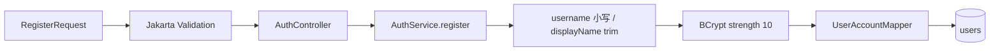
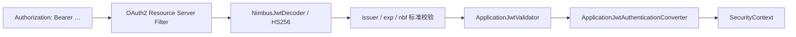
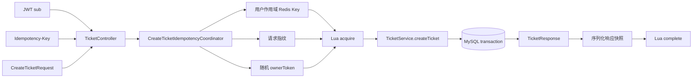
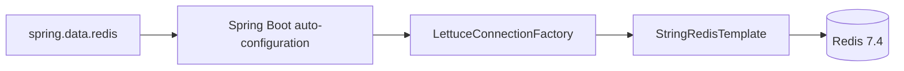
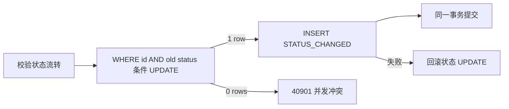
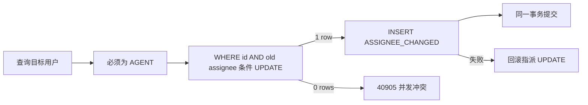
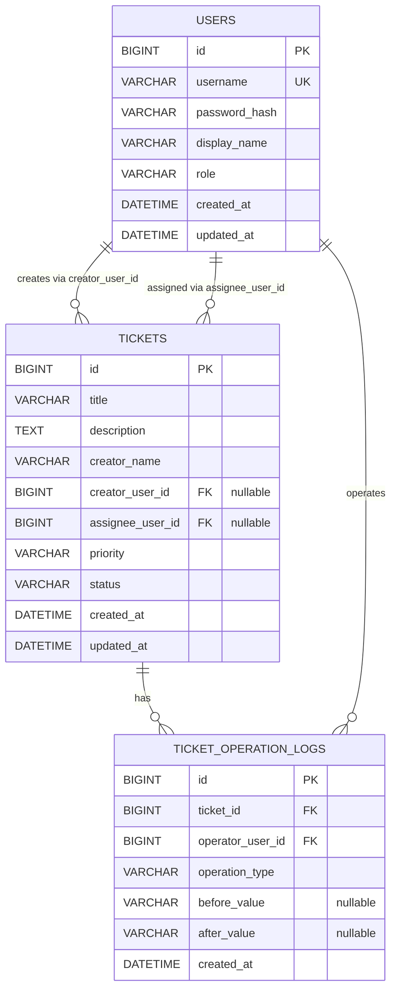

# 项目架构

本文只描述当前仓库 P0～P8 的真实实现。历史阶段的详细教学说明保留在已有 P1～P4 和 P7 复盘文档中。

当前 AI 扩展由同级仓库 `ai-ticket-ai-service` 提供。Java 是可信业务边界：负责认证、角色与对象授权、工单查询、事务和数据库；Python 只负责结构化 AI 建议、人工审核草稿、受控只读 Agent、RAG 和 MCP，不持有 Java 数据库凭证，也不直接修改工单。

## 1. 项目分层

| 层 | 当前职责 |
| --- | --- |
| Controller | 声明 HTTP 路径、绑定与校验参数、读取认证主体、选择成功状态码、封装 `ApiResponse` |
| Service | 实现注册、登录、查询、状态流转、指派、对象所有权和事务边界 |
| Mapper | 继承 MyBatis-Plus `BaseMapper`，执行实体持久化和条件查询/更新 |
| Entity | 映射 `users`、`tickets`、`ticket_operation_logs`，使用数据库自增主键 |
| DTO | 隔离 HTTP 契约与数据库实体；请求 DTO 承载 Validation |
| Security | Bearer Token 解析、JWT 验证、Authority 转换、401/403 JSON 输出 |
| Configuration | 密码编码器、JWT 编解码器、安全链、MyBatis-Plus 分页插件 |
| Redis infrastructure | Spring Boot 自动配置 Lettuce 连接、`StringRedisTemplate`，执行限流与幂等 Lua |
| Rate limit | 生成摘要 Key，按 IP 和规范化用户名执行登录固定窗口检查 |
| Idempotency | 用户作用域 Key、请求指纹、ownerToken、状态机与成功响应重放 |
| Migration | Flyway V1～V6 顺序维护数据库结构与历史数据兼容 |
| Test | 单元、MVC、Mapper、Service/MySQL、HTTP、安全与事务证据 |

基础包为 `com.xiaoyang.aiticketplatform`，启动类位于基础包根部，默认组件扫描覆盖上述子包。

## 2. 核心调用链

### 2.1 注册

注册只创建 `USER`，先做应用层用户名存在检查，同时依赖数据库唯一索引处理竞态。

### 2.2 登录

限流先检查 IP、再检查 trim 后以 `Locale.ROOT` 转小写的用户名；若用户名桶拒绝，本次请求已经消耗 IP 桶额度。每个维度只操作一个 Redis Key，Lua 在首次请求中同时建立计数和 TTL，正常后续请求不会刷新固定窗口 TTL。用户名不存在和密码错误统一映射为 `INVALID_CREDENTIALS`，成功和失败登录都会被计数；JSON 或 Validation 失败发生在进入 Controller 前，不计数。

### 2.3 Bearer 认证

应用 Validator 要求 `sub` 是正数 Long、`username` 非空、`role` 属于三种枚举、`jti` 非空。Converter 将角色映射为 `ROLE_<role>`，并令 `Authentication.getName()` 等于 JWT `sub`。

### 2.4 创建工单

请求中的 `creatorName` 只作为展示文本；可信创建者 ID 只能来自 JWT `sub`。协调器没有 `@Transactional`：`TicketService.createTicket` 的 MySQL 事务在 Service 正常返回前提交，随后才序列化并完成 Redis 状态。Redis 与 MySQL 不是同一事务。Service 成功后若序列化或 `complete` 失败，不释放 `PROCESSING`，避免客户端立即重新取得执行权并重复插入。

### 2.5 Redis 自动配置链

项目没有自定义通用 Object 序列化器，没有引入 Redisson，也没有编写连接池配置。业务对象只在幂等成功快照处由项目 `ObjectMapper` 显式序列化为字符串。

### 2.6 查询与所有权

USER 查询详情时，Service 使用 `id + creator_user_id` 组合条件。AGENT、ADMIN 使用 `selectById` 查看任意工单。USER 查询他人工单与查询不存在工单使用相同 404 协议。

`/api/tickets/mine` 无论角色如何，都用 JWT `sub` 限制 `creator_user_id`。全局分页只对 AGENT、ADMIN 开放。

### 2.7 状态更新和日志

日志记录真实 JWT 操作者、旧状态和新状态。日志成功后才更新内存实体并构造成功响应。

### 2.8 指派和日志

日志操作者是执行指派的 ADMIN，`after_value` 才是目标 AGENT ID。

## 3. 数据模型

### 3.1 Flyway 演进

| 版本 | 作用 |
| --- | --- |
| V1 | 创建 `tickets` 及状态、创建时间相关索引 |
| V2 | 将旧状态迁移为 Java 枚举值，加入 URGENT 说明并将默认状态改为 OPEN |
| V3 | 创建 `users`，用户名唯一，角色默认 USER |
| V4 | 为 `tickets` 增加可空 `creator_user_id`、索引与 RESTRICT 外键 |
| V5 | 增加可空 `assignee_user_id`、索引与 RESTRICT 外键 |
| V6 | 创建追加式 `ticket_operation_logs`、查询索引及两条 RESTRICT 外键 |

## 4. Redis 数据模型

### 4.1 登录限流 String

| 项目 | 当前结构 |
| --- | --- |
| Key | `<配置前缀>:ip:<SHA-256>` 或 `<配置前缀>:username:<SHA-256>` |
| Value | 当前固定窗口内的十进制计数器字符串 |
| TTL | 首次计数时建立；默认 60 秒，正常请求不刷新 |

原始 IP 和规范化用户名不会直接出现在 Key 中。SHA-256 摘要降低 Redis 运维界面的明文暴露，但无盐摘要不是强匿名化；低熵输入仍可能被枚举。

### 4.2 创建工单幂等 Hash

| 状态 | Hash 字段 | TTL |
| --- | --- | --- |
| `PROCESSING` | `state`、`fingerprint`、`ownerToken` | 默认 120 秒 |
| `SUCCEEDED` | `state`、`fingerprint`、`response` | 默认 86400 秒 |

`complete` 会删除 `ownerToken` 并写入序列化后的 `TicketResponse`。Redis 不保存完整创建请求、JWT、密码、原始客户端 Key、原始限流 IP 或用户名；保存的是指纹、所有权令牌和成功 DTO 快照。文档也不展示这些运行时敏感值。

## 5. 关键设计决策

### 5.1 为什么实体名为 UserAccount

`UserAccount` 明确表达它是认证账户持久化模型，并避免与领域中可能出现的普通“用户”概念、Java 或框架类型产生语义混淆。数据库表仍为 `users`。

### 5.2 为什么只保存 BCrypt 哈希

注册时通过 `PasswordEncoder.encode` 生成包含随机盐信息的 BCrypt 哈希；登录使用 `matches` 校验。生产响应 DTO 不包含 `passwordHash`。

### 5.3 为什么 creator_user_id 初始允许 NULL

V4 在已有 `tickets` 表上追加身份外键。允许 NULL 保留迁移前历史工单，避免虚构创建者。新建工单必须从 JWT 写入非空创建者 ID。

### 5.4 为什么 assignee_user_id 允许 NULL

未指派是合法初始状态。当前支持首次指派和重新指派，但没有取消指派功能。

### 5.5 为什么操作日志没有 updated_at

日志表达已经发生的事件，当前生产代码只 INSERT，不提供 UPDATE、DELETE 或查询 API。没有 `updated_at` 可减少“历史记录可被修改”的错误暗示。

### 5.6 为什么 Service 不读取 SecurityContext

Controller 从已认证的 `JwtAuthenticationToken` 提取最小身份数据并显式传入 Service，使 Service 的输入契约清晰，也便于纯单元测试。Service 不依赖 HTTP 或线程上下文。

### 5.7 为什么对象所有权放在 Service

请求级角色规则由 SecurityFilterChain 处理；“这个 USER 是否拥有这张具体工单”需要结合业务数据，放在 Service 查询条件中更接近领域和数据边界。

### 5.8 为什么 USER 访问他人工单返回 404

返回 404 可同时表达“当前主体看不到该资源”，避免向非所有者确认某个 ID 是否真实存在。

### 5.9 为什么日志与业务更新共享事务

本阶段要求强原子性：只有业务条件更新成功才记录日志；日志写入失败则业务更新回滚。没有使用异步、消息队列或 `REQUIRES_NEW`。

### 5.10 为什么使用 StringRedisTemplate

限流计数、Key 摘要、状态字段和响应 JSON 都有明确字符串协议，`StringRedisTemplate` 便于查看和测试，也避免引入通用 Java Object 序列化格式。它不是自动的领域对象缓存方案。

### 5.11 为什么使用单 Key Lua

限流需要原子完成首次计数和 TTL；幂等需要原子完成状态、指纹、owner 校验与转换。单 Key Lua 避免多个 Redis 命令在客户端分步执行时出现中间状态。该原子性只覆盖一次脚本中的 Redis 操作，不覆盖 MySQL。

### 5.12 为什么 IP 只使用 remoteAddr

当前没有配置可信反向代理名单和 Header 清洗边界，直接相信 `X-Forwarded-For` 会允许客户端伪造来源。因而 Controller 使用容器提供的 `remoteAddr`；部署到可信代理后应重新设计解析规则。

### 5.13 为什么 Redis Key 使用 SHA-256 摘要

摘要避免把 IP、用户名、用户 ID 和客户端幂等 Key 原文直接放进 Redis Key。它不是加密或匿名化，也不替代 Redis 访问控制、网络隔离和数据保留策略。

### 5.14 为什么幂等需要用户作用域、请求指纹和 ownerToken

- 用户作用域避免不同认证用户碰巧选择相同客户端 Key 时相互阻塞或重放；
- 请求指纹避免同一用户把相同 Key 用于不同创建请求；
- ownerToken 防止旧处理者在 Key 过期并被新请求占用后错误完成或释放新状态。

### 5.15 为什么成功响应直接重放

第一次成功时保存的是当时的 `TicketResponse`。重复请求直接反序列化该快照，不再次调用 Service，也不查询可能已经发生后续状态变化的工单，从而保持“重放第一次创建结果”的语义。

### 5.16 为什么协调器没有外层数据库事务

若协调器开启外层事务，Service 可能加入该事务，Redis 先标记成功后 MySQL 才在协调器返回时提交；最终提交失败会留下 Redis 成功但数据库无工单的状态。当前让 Service 自己完成 MySQL 事务，再执行 Redis `complete`，并如实接受跨存储窗口。

### 5.17 为什么当前保留有限窗口幂等

当前普通创建接口可接受明确披露的 TTL 和故障窗口，引入独立 MySQL 幂等记录表会扩大事务占用、清理和响应版本复杂度。持久防重、长期重放或不可逆外部副作用出现时再升级。详细决策见 [P8 创建工单幂等架构决策](p8_create_ticket_idempotency_decision.md)。

## 6. 当前限制

- 全局分页使用 OFFSET 分页，数据量很大时需要重新评估；
- `creator_name` 与真实账户显示名没有自动同步；
- 历史 `creator_user_id=NULL` 工单不能归属给 USER；
- 没有分配给我的工单、取消指派或主动领取；
- 操作日志没有生产查询接口，也不是数据库层物理防篡改审计；
- SecurityFilterChain 已采用显式 matcher 与 `anyRequest().denyAll()`，未来新增接口必须加入授权矩阵；`ERROR`/`FORWARD` dispatcher 单独处理；
- 没有多租户、用户停用、Token 撤销、消息通知或 AI 功能；
- 限流仅覆盖登录接口，不是账户锁定，也不是滑动窗口或令牌桶；
- 用户名限流使用 trim + `Locale.ROOT` 小写，而 `AuthService` 当前查询规范化仅小写，两者对首尾空格的语义存在差异；
- 未配置可信代理，限流只采用 `remoteAddr`；
- Redis 故障时登录和启用幂等的创建链路均 fail-closed；
- 创建幂等只有有限 TTL，不是 exactly-once，也没有 MySQL 持久化幂等记录；
- 当前测试证明了单节点环境下的真实 Redis/MySQL 行为，不代表多实例部署、跨存储原子性或高并发调度能力。
