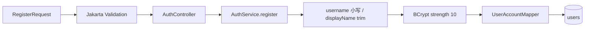
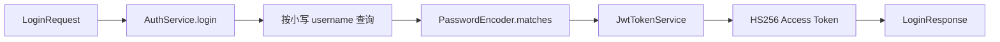
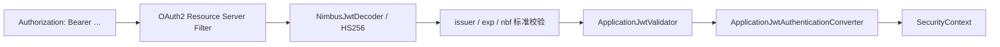
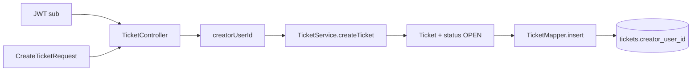
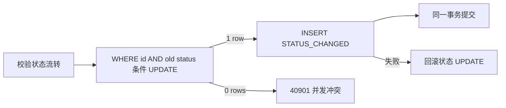
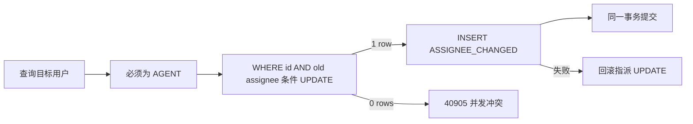
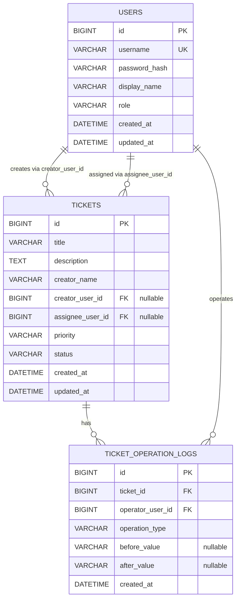

# 项目架构

本文只描述当前仓库 P0～P7-3-2 的真实实现。历史阶段的详细教学说明保留在已有 P1～P4 复盘文档中。

## 1. 项目分层

| 层 | 当前职责 |
| --- | --- |
| Controller | 声明 HTTP 路径、绑定与校验参数、读取认证主体、选择成功状态码、封装 `ApiResponse` |
| Service | 实现注册、登录、查询、状态流转、指派、对象所有权和事务边界 |
| Mapper | 继承 MyBatis-Plus `BaseMapper`，执行实体持久化和条件查询/更新 |
| Entity | 映射 `users`、`tickets`、`ticket_operation_logs`，使用数据库自增主键 |
| DTO | 隔离 HTTP 契约与数据库实体；请求 DTO 承载 Validation |
| Security | Bearer Token 解析、JWT 验证、Authority 转换、401/403 JSON 输出 |
| Configuration | 密码编码器、JWT 编解码器、安全链、MyBatis-Plus 分页插件 |
| Migration | Flyway V1～V6 顺序维护数据库结构与历史数据兼容 |
| Test | 单元、MVC、Mapper、Service/MySQL、HTTP、安全与事务证据 |

基础包为 `com.xiaoyang.aiticketplatform`，启动类位于基础包根部，默认组件扫描覆盖上述子包。

## 2. 核心调用链

### 2.1 注册

注册只创建 `USER`，先做应用层用户名存在检查，同时依赖数据库唯一索引处理竞态。

### 2.2 登录

用户名不存在和密码错误统一映射为 `INVALID_CREDENTIALS`，不向客户端区分具体原因。

### 2.3 Bearer 认证

应用 Validator 要求 `sub` 是正数 Long、`username` 非空、`role` 属于三种枚举、`jti` 非空。Converter 将角色映射为 `ROLE_<role>`，并令 `Authentication.getName()` 等于 JWT `sub`。

### 2.4 创建工单

请求中的 `creatorName` 只作为展示文本；可信创建者 ID 只能来自 JWT `sub`。

### 2.5 查询与所有权

USER 查询详情时，Service 使用 `id + creator_user_id` 组合条件。AGENT、ADMIN 使用 `selectById` 查看任意工单。USER 查询他人工单与查询不存在工单使用相同 404 协议。

`/api/tickets/mine` 无论角色如何，都用 JWT `sub` 限制 `creator_user_id`。全局分页只对 AGENT、ADMIN 开放。

### 2.6 状态更新和日志

日志记录真实 JWT 操作者、旧状态和新状态。日志成功后才更新内存实体并构造成功响应。

### 2.7 指派和日志

日志操作者是执行指派的 ADMIN，`after_value` 才是目标 AGENT ID。

## 3. 数据模型

### 3.1 Flyway 演进

| 版本 | 作用 |
| --- | --- |
| V1 | 创建 `tickets` 及状态、创建时间相关索引 |
| V2 | 将旧状态迁移为 Java 枚举值，加入 URGENT 说明并将默认状态改为 OPEN |
| V3 | 创建 `users`，用户名唯一，角色默认 USER |
| V4 | 为 `tickets` 增加可空 `creator_user_id`、索引与 RESTRICT 外键 |
| V5 | 增加可空 `assignee_user_id`、索引与 RESTRICT 外键 |
| V6 | 创建追加式 `ticket_operation_logs`、查询索引及两条 RESTRICT 外键 |

## 4. 关键设计决策

### 4.1 为什么实体名为 UserAccount

`UserAccount` 明确表达它是认证账户持久化模型，并避免与领域中可能出现的普通“用户”概念、Java 或框架类型产生语义混淆。数据库表仍为 `users`。

### 4.2 为什么只保存 BCrypt 哈希

注册时通过 `PasswordEncoder.encode` 生成包含随机盐信息的 BCrypt 哈希；登录使用 `matches` 校验。生产响应 DTO 不包含 `passwordHash`。

### 4.3 为什么 creator_user_id 初始允许 NULL

V4 在已有 `tickets` 表上追加身份外键。允许 NULL 保留迁移前历史工单，避免虚构创建者。新建工单必须从 JWT 写入非空创建者 ID。

### 4.4 为什么 assignee_user_id 允许 NULL

未指派是合法初始状态。当前支持首次指派和重新指派，但没有取消指派功能。

### 4.5 为什么操作日志没有 updated_at

日志表达已经发生的事件，当前生产代码只 INSERT，不提供 UPDATE、DELETE 或查询 API。没有 `updated_at` 可减少“历史记录可被修改”的错误暗示。

### 4.6 为什么 Service 不读取 SecurityContext

Controller 从已认证的 `JwtAuthenticationToken` 提取最小身份数据并显式传入 Service，使 Service 的输入契约清晰，也便于纯单元测试。Service 不依赖 HTTP 或线程上下文。

### 4.7 为什么对象所有权放在 Service

请求级角色规则由 SecurityFilterChain 处理；“这个 USER 是否拥有这张具体工单”需要结合业务数据，放在 Service 查询条件中更接近领域和数据边界。

### 4.8 为什么 USER 访问他人工单返回 404

返回 404 可同时表达“当前主体看不到该资源”，避免向非所有者确认某个 ID 是否真实存在。

### 4.9 为什么日志与业务更新共享事务

本阶段要求强原子性：只有业务条件更新成功才记录日志；日志写入失败则业务更新回滚。没有使用异步、消息队列或 `REQUIRES_NEW`。

## 5. 当前限制

- 全局分页使用 OFFSET 分页，数据量很大时需要重新评估；
- `creator_name` 与真实账户显示名没有自动同步；
- 历史 `creator_user_id=NULL` 工单不能归属给 USER；
- 没有分配给我的工单、取消指派或主动领取；
- 操作日志没有生产查询接口，也不是数据库层物理防篡改审计；
- `anyRequest().permitAll()` 要求未来新增接口时同步补充显式安全规则，否则可能意外公开；
- 没有多租户、用户停用、Token 撤销、限流、幂等、消息通知或 AI 功能；
- 当前测试证明了单节点、单数据库事务行为，不代表多节点一致性或高并发调度能力。
